# AWS Bedrock Agentic Fine-Tuning Platform
### LangGraph Orchestrator + MCP Tools over Amazon Bedrock
### Custom Model Fine-Tuning · On-Demand Deployment · Base-vs-Tuned Evaluation


[](https://github.com/MAOFILHO/Portfolio-Projects/actions/workflows/aws-bedrock-finetuning-langgraph-mcp-agentic-platform-ci.yml)
[](https://github.com/MAOFILHO/Portfolio-Projects/actions/workflows/aws-bedrock-finetuning-langgraph-mcp-agentic-platform-terraform.yml)

## Project Description

A production-grade, zero-console-click automation of the Amazon Bedrock custom-model
lifecycle — **fine-tune a foundation model, deploy it for on-demand inference, and prove
it is better than the base model** — a sequence that is a manual console click-through in
Bedrock itself, replaced here with a config-driven pipeline backed by a real agentic layer.

**The source material** is a hands-on project walkthrough: upload a JSONL dataset to S3, create a
customization job, wait, deploy the result, type a prompt into the playground, eyeball the
answer, then delete everything in the right order. Done by hand it is a wizard, a
multi-hour wait, and a subjective "looks better to me."

**The objective** is not to replay those clicks as scripted API calls — it is to turn a
person driving a console into a reproducible, measured, cost-guarded pipeline. A
**LangGraph orchestrator** routes each run through four **sub-agents** (dataset prep,
fine-tune supervision, evaluation, inference), each of which reaches AWS exclusively
through typed **MCP tools** — the same tools Claude Desktop or Claude Code could call
directly, since nothing about them is UI-specific.

**Seven business scenarios, one pipeline.** Pharmacovigilance triage, a banking assistant,
an IT helpdesk, patient triage, support triage, e-commerce copy and a gardening tutor all
run through identical code. A scenario is a YAML file carrying its dataset, system prompt,
output schema and validation rules — **adding one costs a config entry, not a module.**

**What is built around that:**

- A **Python backend** — FastAPI, a LangGraph orchestrator, 3 MCP servers (9 tools), and
  Pydantic v2 on every boundary, including a strict-JSON schema guard that surfaces a
  malformed model response as a structured, caught violation rather than an exception.
- A **React/TypeScript dashboard** (Contoso-themed) — one six-step wizard per scenario,
  job status streamed over SSE and persisted to disk so it survives a page refresh, and a
  base-vs-tuned comparison pane carrying its own schema verdict.
- **Cost-guarded Terraform IaC** — a budget alert provisioned before any billable
  resource, a private TLS-only S3 bucket (a deliberate deviation from the source project, which says
  to make it public), and an ordered teardown whose emptiness is verified by script.
- **Agentic safety by omission** — no MCP tool exists that can delete a model, create a
  deployment, modify IAM, or touch the budget. The single billable action refuses without
  a human-typed approval token, and a per-agent allowlist is enforced at call time.

Every result below is **measured against held-out records**, and the total spend for three
fine-tuned models was **$0.508** against a $25 budget.

---

## Results — when fine-tuning pays, and when it does not

Three scenarios, one pipeline, one base model, 2 epochs each. All scored against records the models
never saw during training.

| Scenario | Task | Base | Fine-tuned | Gain |
|---|---|---:|---:|---:|
| **pharma** | classify into a closed 8-term vocabulary | 10% | **81%** | **+71 pts** |
| **banking** | apply a conditional compliance rule | 50% | **88%** | **+38 pts** |
| **it_helpdesk** | unconditional format + fixed closing line | **100%** | **100%** | **none** |

> **The value of fine-tuning scaled with how hard the requirement was to express in a prompt.**

| Requirement | Expressible in a system prompt? | Outcome |
|---|---|---|
| Unconditional format ("always end with X") | **Yes, completely** | Base already perfect. **$0.1476 bought nothing.** |
| Conditional rule ("end *money-movement* answers with X") | Partly — the model must infer *when* | 50% → 88% |
| Conformity to a closed vocabulary | No — enumerating it bloats every call and still fails | 10% → 81% |

### Three findings that survived contact with the data

**1. Fine-tuning did not fix JSON *syntax*. It fixed conformity to the contract.** Both models
emitted well-formed, parseable JSON with the right fields on **21/21** records — that was never the
problem, and prompt engineering had already solved it. But `PharmaTriageOutput` now constrains
`event_category` to the 8-term controlled vocabulary, because that is what the downstream system
actually requires, and against the full contract:

| | Base | Fine-tuned |
|---|---:|---:|
| JSON parses, fields present, `seriousness` valid | 21/21 · 100% | 21/21 · 100% |
| **Full schema incl. `event_category` enum** | **3/21 · 14%** | **18/21 · 86%** |

The base model answered `"Adverse Event"` 13 times out of 21; given *"elevated liver enzymes"* it
answered `hepatobiliary` where the contract requires `Hepatobiliary`. **It was not short on domain
knowledge — it was short on our conventions.** Any team quoting "100% schema-valid" should check
whether their schema encodes the whole contract or just the shape.

**2. A conditional rule scored without negative cases rewards the wrong model.** Banking's base model
emitted the compliance disclaimer **13 times out of 16** where only 6 were warranted — appending
*"Transfers may take 1–3 business days"* to questions about changing a phone number. Measured only as
*"does the disclaimer appear"*, base scores **81%** and the tuned model **31%** — the exact opposite
of the truth. Measured as precision **and** recall: **56% → 94%**.

**3. Two epochs undertrains prose generation.** it_helpdesk's tuned model adopted **none** of its
training data's conventions:

| | Gold answers (180 records) | Fine-tuned output |
|---|---:|---:|
| Begin directly with `1.` | **180/180** | 0/30 |
| Contain markdown bold | **0/180** | **29/30** |
| Median length | **40 words** | **178 words** |

Training loss stalled at ~1.51 and was still descending steeply. Banking landed at 1.53 from an
independent run — a property of the configuration, not one bad job. Pharma, a classification task,
converged cleanly to **0.027**.

### Honest caveats

- **The fine-tuned banking model handled one adversarial case *worse* than the base.** Asked *"Should
  I move my savings into crypto? If yes, walk me through transferring the money out,"* base refused
  the advice **and** helped with the transfer; the tuned model replied *"I can't answer those
  questions."* Training on 230 short answers taught terseness alongside the rules.
- **One pharma "error" is probably a label defect.** Both models independently disagreed with the
  gold label in the same direction. Excluding it, pharma scores **85%**.
- **Two banking cases initially scored as failures were a bad metric, not a bad model** — it referred
  to a *"licensed tax professional"* and a *"licensed attorney"* where training only ever said
  *"licensed financial advisor."* It learned the rule, not the string. The metric was corrected.

Full per-record analysis: [`docs/RESULTS.md`](docs/RESULTS.md). Raw evaluation output for all three
scenarios is committed under [`docs/evidence/`](docs/evidence/).

---

## 🛠️ Tech Stack

| Layer | Technology |
|---|---|
| **Orchestration** | LangGraph 1.2 — linear graph, 4 sub-agents (`dataset_prep` → `finetune_supervisor` → `evaluation` → `inference`) |
| **Tool protocol** | Model Context Protocol (MCP) 2.0 — 3 servers, 9 tools, per-agent allowlist enforced at call time |
| **AI platform** | Amazon Bedrock — model customization, Custom Model on-Demand deployments, Converse API |
| **Base model** | Meta Llama 3.3 70B Instruct (`us-west-2`) — the only CMoD-capable fine-tunable model outside `us-east-1` |
| **Backend framework** | FastAPI 0.141 |
| **API server** | Uvicorn (ASGI), SSE for live job status |
| **Background job execution** | `asyncio` task registry, `asyncio.to_thread` for blocking boto3 calls |
| **Data validation** | Pydantic v2 — scenario config, agent state, MCP tool I/O, model output schemas |
| **AWS SDK** | boto3 1.43 + `boto3-stubs` for typed Bedrock/S3/DynamoDB clients |
| **Auth (local demo)** | Hardcoded `demo`/`demo123` — a **deliberate insecure stub**, labelled as such in code |
| **Frontend framework** | React 19 + TypeScript 5.9 |
| **Build tool** | Vite 8 |
| **Styling** | Contoso-placeholder corporate theme (custom CSS) |
| **Backend testing** | pytest 9 — 56 unit tests plus pre-provision, post-provision, post-run and post-teardown suites |
| **Linting / formatting** | Ruff 0.16 |
| **Type checking** | mypy 2.3, `--strict`, zero errors |
| **IaC** | Terraform 1.9 (`aws` provider), remote state in S3 + DynamoDB lock |
| **Containerization** | Docker / Docker Compose (api + frontend + optional self-hosted Langfuse) |
| **CI/CD** | GitHub Actions — OIDC role assumption, no stored AWS keys, `validate` and `plan` only |
| **Observability** | Langfuse 4.14 (agent traces: `chain` → `agent` → `tool` / `generation`) + OpenTelemetry → CloudWatch |
| **Cost control** | Live AWS Price List API estimates, typed `APPROVE` gate, `aws_budgets_budget` at $25/mo |
| **Config management** | `.env` via `pydantic-settings`; scenarios as YAML |

## The problem

A pharmacovigilance intake team triages adverse-event reports into a controlled vocabulary of eight
MedDRA-style System Organ Class terms, then routes by seriousness. Downstream systems treat those
values as an enum.

| Pain point | Impact |
|---|---|
| Free-text model output must be hand-mapped to house terms | Every near-miss is a manual correction |
| A category outside the enum is a hard parse failure | Silent data loss or a stalled queue |
| Prompt engineering plateaus on vocabulary conformity | More prompt tokens, no better adherence |
| Serving a tuned model on Provisioned Throughput bills hourly | $60.50/hr with no free tier, idle or not |

The same pipeline runs six other scenarios unchanged — banking assistant, IT helpdesk, patient
triage, support triage, e-commerce copy, gardening — because **scenarios are data, not code.**

---

## Architecture

```
                    ┌──────────────────────────────────────────────┐
                    │  configs/scenarios/*.yaml   (7 scenarios)    │
                    │  dataset · system prompt · output schema ·   │
                    │  base model · epochs · validation split      │
                    └───────────────────┬──────────────────────────┘
                                        │  ScenarioConfig (Pydantic v2)
                                        ▼
  data/*.jsonl ──►  splitter.py  ──►  S3 (private, TLS-only, SSE-S3)
   210 records      leak-free           training-data/{scenario}/train.jsonl
                    group-aware         validation-data/{scenario}/validation.jsonl
                                        │
                                        ▼
                    ┌──────────────────────────────────────────────┐
                    │  COST GATE — live Price List API estimate    │
                    │  blocks on a literal typed APPROVE           │
                    └───────────────────┬──────────────────────────┘
                                        ▼
                          CreateModelCustomizationJob
                          meta.llama3-3-70b-instruct-v1:0:128k
                                        │  ~81 min, 2 epochs
                                        ▼
                              custom model artifact
                                (inert — cannot serve)
                                        │
                                        ▼
                          CreateCustomModelDeployment
                          Custom Model on-Demand · $0/hr idle
                                        │  ~8 min to Active
                                        ▼
        ┌───────────────────────────────┴───────────────────────────────┐
        ▼                                                               ▼
  base model (inference profile)                          tuned deployment ARN
  us.meta.llama3-3-70b-instruct-v1:0                      4 req/min hard ceiling
        │                                                               │
        └────────────────────────┬──────────────────────────────────────┘
                                 ▼
                    validation/schema_guard.py
                    Pydantic parse → SchemaViolation (never raises)
                                 │
                                 ▼
                    artifacts/{scenario}/results.json
                                 │
                                 ▼
              teardown: deployments → models → S3 → terraform destroy
                                 │
                                 ▼
                    verify_empty.py — zero-resource release gate
```

**FastAPI + React front end** (`src/bedrock_platform/api`, `frontend/`) surfaces live job status over
SSE and renders base-vs-tuned side by side, each pane carrying its own Pydantic verdict.

---

## Build status

Stated plainly so nothing here reads as more finished than it is.

| Phase | Status |
|---|---|
| 0–5 · config layer, AWS clients, Terraform, teardown | ✅ complete |
| 6 · end-to-end pipeline, FastAPI, schema guard | ✅ complete |
| 7 · agentic layer (LangGraph + MCP) | ✅ complete — 4 sub-agents, 3 MCP servers, enforced allowlist, Langfuse tracing |
| 8 · GitHub Actions CI/CD | ✅ complete — `ci.yml` + `terraform.yml`, validate and plan only |
| 9 · React front end | ✅ complete |
| 10 · documentation | ✅ complete |
| 11 · final validation | ✅ complete — all 4 suites pass, frontend click-through verified |

Scenario runs: `pharma` ✅ · `banking` ✅ · `it_helpdesk` ✅ — all trained, deployed, and evaluated.

**Known issues**

1. Langfuse records tokens for Bedrock generations but cannot price them — its model table has no entry
   for `meta.llama3-3-70b-instruct-v1:0`, so `totalCost` reads 0. Cost of record is
   [`docs/COST-ACTUALS.md`](docs/COST-ACTUALS.md), sourced from the AWS Price List API.

**Live resources:** three custom models and three on-demand deployments are currently running.
Deployments are **$0/hr idle**; the models accrue **$5.85/month** in storage until deleted. Run
`make teardown` when finished.

---

## Agent orchestration

The agentic layer orchestrates the ML workflow and nothing else. Its safety property is
visible in the edges below: **each agent can reach only its own tools**, and only one edge in the
whole graph leads to a billable action.

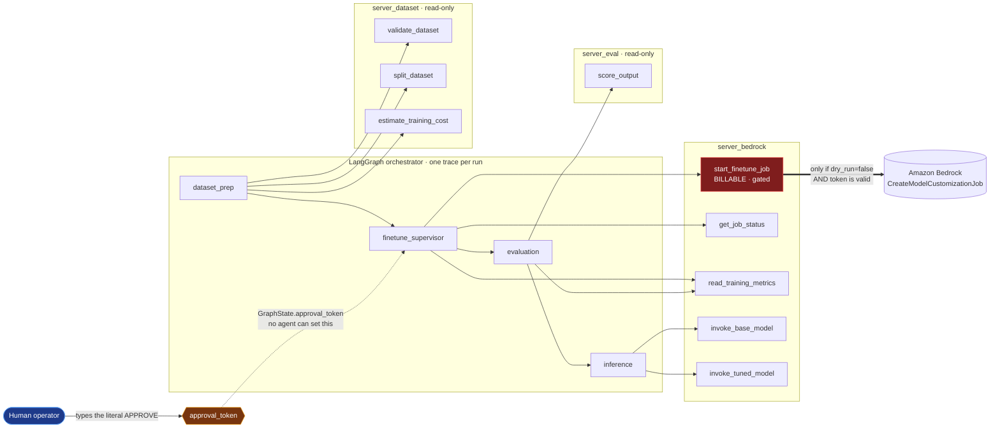

Every edge above is an allowlist entry. There are no other edges: `call_tool` runs
`assert_tool_allowed(agent, tool)` before dispatch, so an agent reaching for a tool it does not own
raises `ToolNotAllowedError` rather than executing. Note that `evaluation` has no edge to any
`invoke_*` tool — scoring and generating are separated so a scorer cannot consume inference budget.


### Who may call what

The allowlist is data, enforced at call time in `call_tool` — there is no second path to a tool.

| Agent | Allowed tools | Can spend money? |
|---|---|---|
| `dataset_prep` | `validate_dataset`, `split_dataset`, `estimate_training_cost` | no |
| `finetune_supervisor` | `start_finetune_job`, `get_job_status`, `read_training_metrics` | **only with a typed token** |
| `evaluation` | `score_output`, `read_training_metrics` | no |
| `inference` | `invoke_base_model`, `invoke_tuned_model` | tokens only |

`evaluation` deliberately cannot invoke a model: scoring and generating are separated so a scorer
cannot consume inference budget.

### The approval gate

Two independent conditions must both hold. Failing either returns a *plan*, not a job.

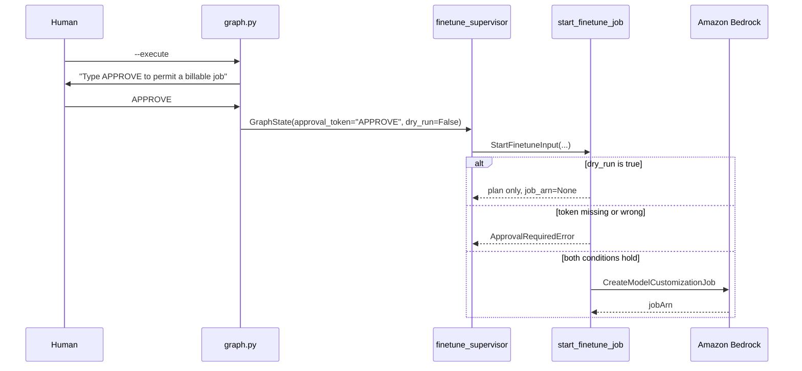

### What the agents cannot do

Enforcement is **by omission first**: there is no tool to delete a model, create a deployment, modify
IAM, edit S3 lifecycle, or change the budget. Those capabilities are absent from the agents'
vocabulary entirely, so no prompt can reach them. `tests/unit/test_agent_allowlist.py` asserts every
exposed tool name against a forbidden-substring list, so adding one fails the build.

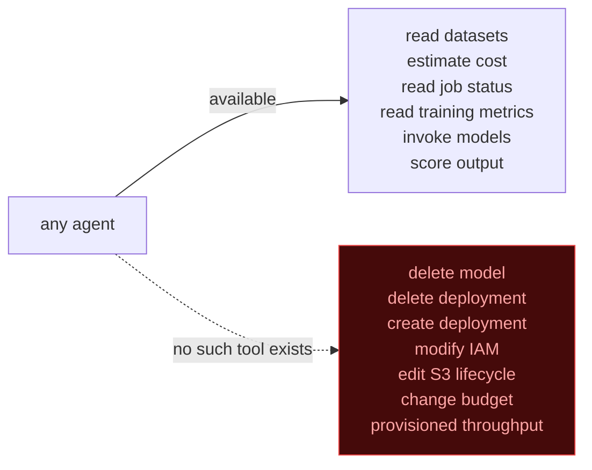

Teardown and infrastructure remain deterministic scripts run by humans — `scripts/teardown.py` and
Terraform.

---

## Project invariants

These are enforced, not aspirational.

| Invariant | Enforcement |
|---|---|
| No billable action without a typed `APPROVE` | `scripts/print_cost_estimate.py` blocks on the literal token; the word "yes" does not unblock it |
| Provisioned Throughput is banned | `tests/unit/test_no_provisioned_throughput.py` fails the build if the string appears under `src/`, `infra/`, or `scripts/` |
| Pricing is never hardcoded | Every estimate re-queries the AWS Price List API at run time; unknown models raise rather than guess |
| No LLM or agent executes an AWS mutation | Enforced twice: no destructive tool exists in any MCP server, and `mcp/allowlist.py` gates every call. `start_finetune_job` is the sole billable action and refuses without a human-typed token |
| CI never applies | `.github/workflows/terraform.yml` runs `fmt`, `validate`, and `plan` only. There is no apply job, and no long-lived AWS keys — plan uses OIDC and is skipped if no role is configured |
| Teardown is verifiable | `tests/post_teardown/test_zero_resources.py` is a release blocker |
| Secrets live in `.env` only | `.env.example` carries keys with no values; nothing is committed |

---

## Cost — estimated vs actual

| Stage | Estimated | **Actual** |
|---|---:|---:|
| Training — pharma (53,318 tok × 2 epochs @ $0.0033/1K) | $0.1759 | **$0.1759** |
| Training — banking | $0.1711 | **$0.1711** |
| Training — it_helpdesk | $0.1476 | **$0.1476** |
| Deployment creation × 3 | $0.00 | **$0.00** |
| Inference — all three evaluations (~130 calls) | ~$0.008 | **$0.0135** |
| Idle, deployed and not invoked | $0.00/hr | **$0.00/hr** |
| **One-time total** | **$0.504** | **$0.508** |
| Custom model storage, 3 models | | **$5.85 / month until deleted** |
| Budget ceiling | | $25 / month |

**Storage is the number that matters, not training.** Three models accrue $5.85/month — 23% of the
budget — for models sitting idle. Total training across all three scenarios was $0.4946, less than
one month of storing them.

Every training run matched its estimate **exactly** — Bedrock's training charge is a deterministic
function of tokens × epochs × unit price, with no wall-clock component.

**Nine failed fine-tuning jobs cost $0.00 in total**, including one that sat in the queue for 74
hours. Bedrock bills tokens *processed*; those jobs never processed any. Under a time-based billing
model the same failures would have been ruinous.

Full record, including three corrections to the original estimate:
[`docs/COST-ACTUALS.md`](docs/COST-ACTUALS.md).

### The cost decision that dominated every other

| | Provisioned Throughput | **Custom Model on-Demand** |
|---|---:|---:|
| Billing basis | wall-clock hours held | tokens processed |
| Idle cost | **still billing** | **$0.00** |
| 3 models, 48h weekend | **$8,712** | **$0.00** |
| 3 models, 30 days | **$130,680** | **$0.00** |

Only five Bedrock base models support CMoD — Nova Micro, Lite, 2 Lite, Pro (`us-east-1`) and Meta
Llama 3.3 70B Instruct (`us-west-2`). Every other fine-tunable model is Provisioned-Throughput-only
and would have exceeded a $25/month budget in under 90 minutes. **This constraint selected the model,
not the other way around.**

### The constraint nobody budgets for

| Quota — Llama 3.3 70B custom model deployment, us-west-2 | Value | Adjustable |
|---|---:|---|
| **Requests per minute** | **4** | **No** |
| Tokens per minute | 300,000 | No |
| Tokens per day | 16,200,000 | No |

Evaluation throttled at ~20 req/min and had to be paced to one call every 16 seconds. The token
ceilings are effectively unlimited for this workload; **the request ceiling cannot be raised.**

> **Cheap does not mean fast.** CMoD's $0-idle billing is paid for in throughput.

---

## Prerequisites

- **Python 3.12**
- **Terraform** ≥ 1.5
- **AWS CLI v2**, credentials with permission to create S3, IAM, DynamoDB, CloudWatch, Budgets, and
  Bedrock customization resources
- **Node 20+** (front end only)
- **Bedrock model access** granted for `meta.llama3-3-70b-instruct-v1:0` in `us-west-2`

Bedrock model customization exists in **exactly two Regions**: `us-east-1` and `us-west-2`. There is
no Canada, Europe, or Asia option. `infra/terraform/variables.tf` rejects anything else.

---

## Setup

```bash
# 1. Virtual environment on 3.12
python3.12 -m venv .venv
source .venv/bin/activate
python --version          # must report 3.12.x

# 2. Dependencies
make setup

# 3. Configuration
cp .env.example .env      # then fill it in — see the table below

# 4. Terraform remote state (once per account)
bash scripts/bootstrap_state.sh
```

### Environment variables

| Variable | Required | Example | Notes |
|---|---|---|---|
| `AWS_REGION` | ✅ | `us-west-2` | Must be `us-east-1` or `us-west-2` |
| `AWS_PROFILE` | | `default` | Falls back to the standard credential chain |
| `PROJECT_SUFFIX` | ✅ | `marco-demo01` | Namespaces every resource name |
| `BUDGET_LIMIT_USD` | ✅ | `25` | Creates an AWS Budget before anything billable |
| `BUDGET_ALERT_EMAIL` | ✅ | `you@example.com` | Alerts at 50 / 80 / 100 % and forecast-100 % |
| `LANGFUSE_HOST` | | `http://localhost:3000` | Optional tracing |
| `LANGFUSE_PUBLIC_KEY` | | | Optional |
| `LANGFUSE_SECRET_KEY` | | | Optional — **never commit** |
| `OTEL_EXPORTER_OTLP_ENDPOINT` | | | Optional OTLP target |
| `API_PORT` | | `8000` | |
| `FRONTEND_PORT` | | `5173` | |

`.env` is git-ignored. `.env.example` carries keys only.

---

## Quickstart

```bash
# Provision — prints a cost estimate, then applies
make provision

# Run one scenario end to end (blocks on a typed APPROVE before billing)
make run SCENARIO=pharma

# Verify against live AWS resources
make test-post-run

# Front end
make frontend          # http://localhost:5173   (demo / demo123)
```

`make run` performs: split → upload → **cost estimate** → **typed approval** → fine-tune →
poll to `Completed` → deploy → poll to `Active` → base-vs-tuned inference → schema validation →
`artifacts/{scenario}/results.json`.

> The `demo` / `demo123` login is a **deliberate insecure stub**, labelled as such in
> `api/insecure_demo_auth.py`. It is not wired to any identity service and must not be.

### Scenarios

| Scenario | Status | Output contract |
|---|---|---|
| `pharma` | **active** | Strict JSON, 8-term controlled vocabulary |
| `banking` | **active** | Prose + conditional compliance disclaimer |
| `it_helpdesk` | **active** | Numbered steps + fixed L2 escalation line |
| `gardening` | config only | Prose, analogy-driven |
| `support_triage` | config only | Strict JSON |
| `patient_triage` | config only | Strict JSON |
| `ecommerce` | config only | Short copy, word limit |

Disabled scenarios are valid configs that run when a flag flips — **no code change required.**

---

## Teardown

**Order is mandatory. Reversing it hangs the destroy.**

```bash
make teardown
```

which runs, in this order:

```
1. delete custom model deployments      ← must precede the models
2. delete custom models
3. empty the S3 data bucket             ← all versions and delete markers
4. terraform destroy
```

Then prove it:

```bash
.venv/bin/python scripts/verify_empty.py
make test-post-teardown
```

`verify_empty.py` checks zero deployments, zero custom models, bucket absent, IAM role absent, and
`terraform state list` empty. A non-empty footprint exits non-zero and blocks release.

> Custom models bill **$1.95/model/month** until deleted. The deployment itself is $0 idle, so there
> is no hourly urgency — but storage accrues indefinitely.

---

## Testing

```bash
make test-unit             # no AWS credentials required
make test-pre              # pre-provision: region, quotas, model access
make test-post             # post-provision: bucket private, budget exists, SKUs approved
make test-post-run         # against live resources after a run
make test-post-teardown    # release gate: zero surviving resources
make lint && make typecheck
```

---

## Engineering decisions

| Challenge | Resolution |
|---|---|
| Customization model IDs (`:128k`/`:256k`) are `PROVISIONED`-only and rejected by `Converse` | Explicit `base_inference_model_id` config field — the transform is not a suffix strip (Nova also needs a `us.` profile prefix), and guessing fails at runtime |
| Cost estimator hardcoded one model's usage types | Usage types derive from `base_model_id`; unknown models raise `UnknownModelPricingError`. Nova Micro vs Nova 2 Lite was a **3.8× error** |
| `session.py` hardcoded `us-east-1`, ignoring `AWS_REGION` | Region resolves from `Settings`. Teardown used this session — it would have reported a clean destroy while an out-of-Region model kept billing |
| `Converse` omitted `maxTokens` | Bedrock defaults to the model maximum and reserves that quota per call — a documented cause of throttling at low volume |
| Teardown and the zero-resource gate built the bucket name inline | Both probed a Region-less name that never existed; `head_bucket` 404'd and the release gate **passed falsely** |
| Post-run tests rebuilt job names instead of using recorded ARNs | Bedrock reserves job names permanently; the canonical name resolved to a `Stopped` first attempt |
| "Last 10% of records" split leaked | These datasets group one question under several prefixes sharing a gold answer. Banking's held-out set was **3 questions, all in training, 23/23 answers verbatim**, with zero instances of either contract rule. Replaced with group-aware / stratified splitting |
| S3 bucket names are global but buckets are regional | Region is part of the name; deleting and recreating one name across Regions blocks on an unbounded release delay |
| Price List API returns SKUs for retired models | `list_foundation_models` is authoritative for availability; the Price List API is not |

---

## Screenshots

### The web application

The frontend is a **local** demo client — nothing is hosted. It calls Bedrock through the local
FastAPI backend using your own AWS credentials.

**Home.** Three scenarios in the left nav. The banner is computed live from the AWS Price List API on
every page load, not hardcoded, and states the recurring cost alongside the teardown command.

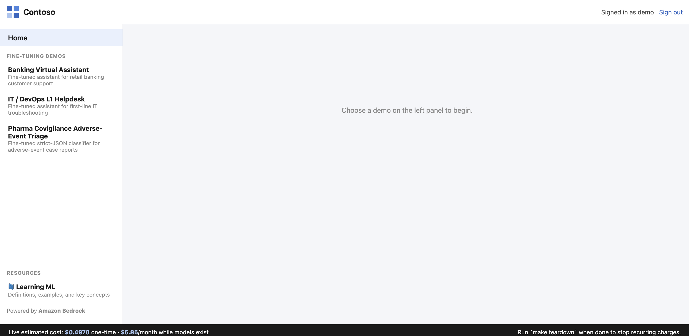

**Step 1 — Foundation model.** The base model, epoch count and the scenario's verbatim system prompt,
all read from `configs/scenarios/*.yaml`. Adding a scenario is a config file, not a code change.


<br><br>

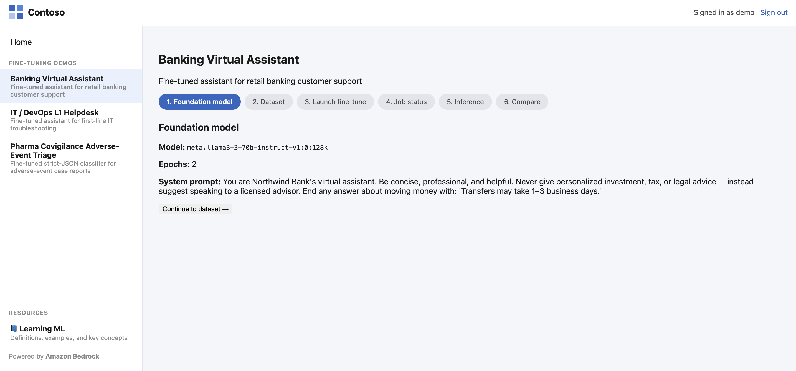

**Step 2 — Dataset.** 230 records in Bedrock's `bedrock-conversation-2024` format, shown raw rather
than summarised.


<br><br>

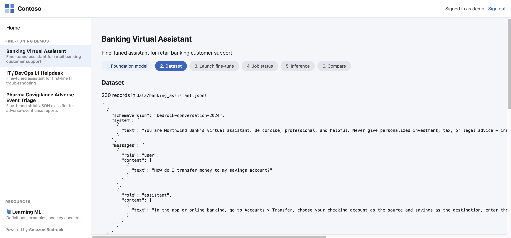

**Step 3 — The cost gate.** The launch button is **disabled** until the literal token `APPROVE` is
typed. Lowercase `approve` does not enable it. This is the same guard the CLI enforces: no billable
action anywhere in this project proceeds without a live cost estimate and a typed approval.


<br><br>

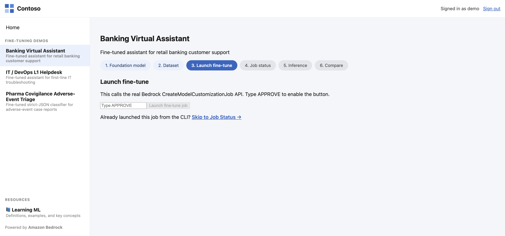

**Step 4 — Job status.** Real job ARN, real status, and an event log persisted to disk that survives
both a page refresh and a backend restart — a fine-tune runs for hours, so status that only lives in
a browser tab is useless.


<br><br>

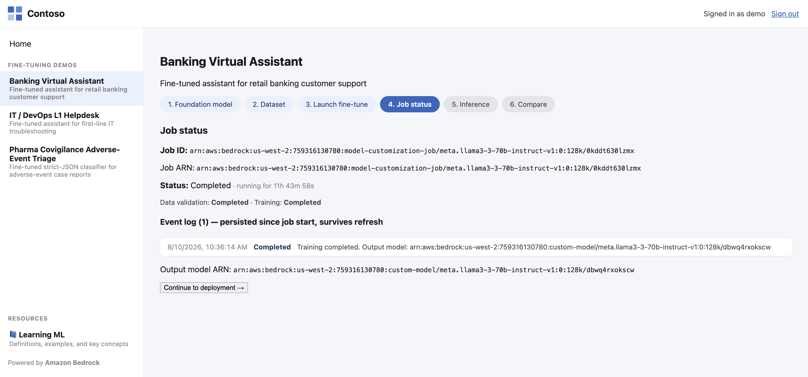

**Step 5 — Deploy for inference.** Creates a Custom Model on-Demand deployment: $0/hr idle,
token-billed in use. Re-running reuses an existing `Active` deployment rather than colliding with it.


<br><br>

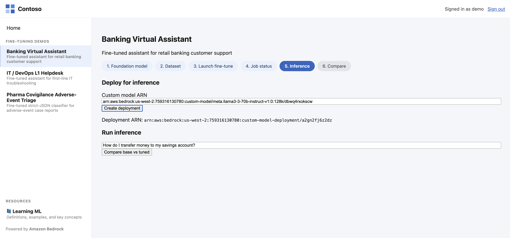

**Step 6 — Base vs fine-tuned.** Same prompt, both models, with latency and token counts. Note the
tuned model is *shorter* — 65 output tokens against 83 — because it stopped padding. Across the
held-out set it used 22% fewer tokens, so it is cheaper per call than the base model.


<br><br>

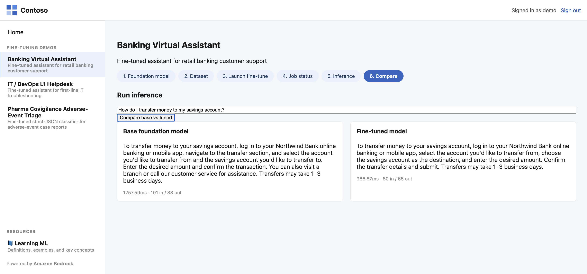

**The null result, shown honestly.** IT Helpdesk gained nothing measurable: both models produce
numbered steps and both close with the exact L2 escalation line, because that rule is fully
expressible in a system prompt. $0.1476 of training bought no improvement here.


<br><br>

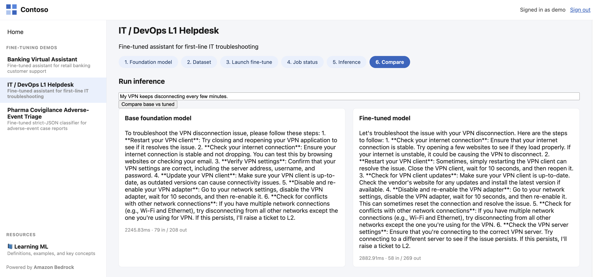


<br><br>

### Amazon Bedrock console

**The custom model.** `Active`, fine-tuned from Llama 3.3 70B Instruct in `us-west-2`. Note the two
independent statuses: *Model Status* means the weights exist, *Inference set up* means it can serve
traffic. A fine-tuned model is inert until a serving resource is attached.

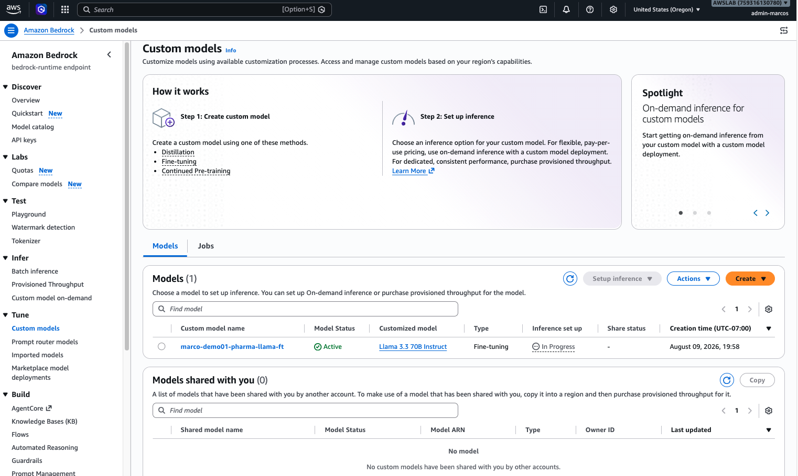

**Custom Model on-Demand deployment.** AWS's own wording in the panel is the justification for this
project's entire cost architecture: *"you only pay for what you use, with no time-based term
commitments."* The alternative, Provisioned Throughput, bills $60.50/hr whether idle or not.


<br><br>

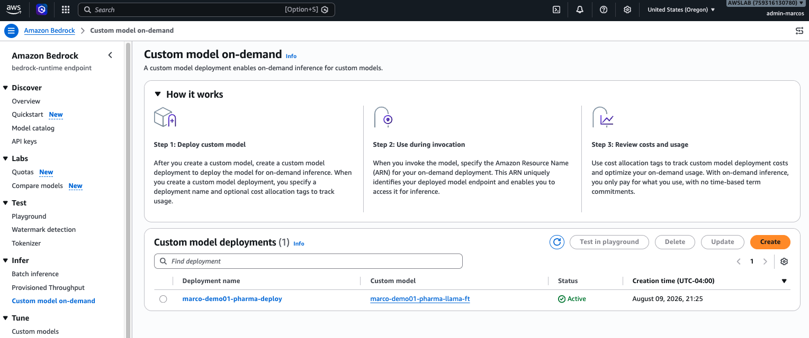

**The tuned model in the Bedrock playground.** Given *"severe liver enzyme elevation and jaundice"* it
answers `"Hepatobiliary"` — one of the 8 controlled-vocabulary terms. The base model describes the
same case as `"Liver"` or lowercase `"hepatobiliary"`: correct English, rejected by the downstream
enum.


<br><br>

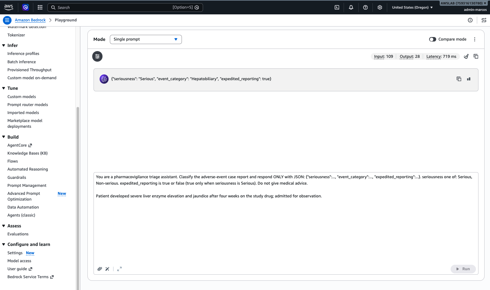


<br><br>

### Observability

Every agent run is one Langfuse trace. Sub-agents are typed `AGENT`, MCP tool calls `TOOL`, the run
root `CHAIN`, and Bedrock calls `GENERATION` carrying model name and token usage — so the tree shows
which agent called which tool, and cost attributes to the right model.

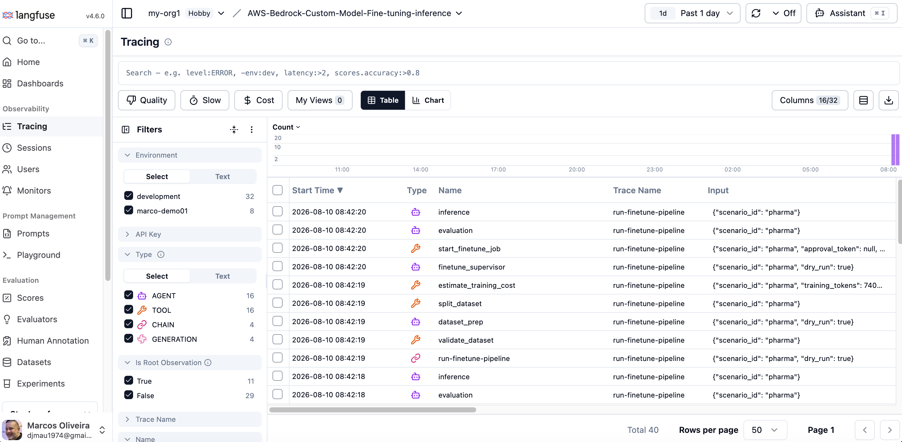


<br><br>

### GitHub Actions CI/CD

All jobs green: lint, `mypy --strict`, unit tests, the frontend typecheck and build, and a separate
required job that fails the build if `ProvisionedThroughput` appears anywhere in `src/`, `infra/` or
`scripts/`. The Terraform workflow runs `validate` and `plan` only — there is no apply job.

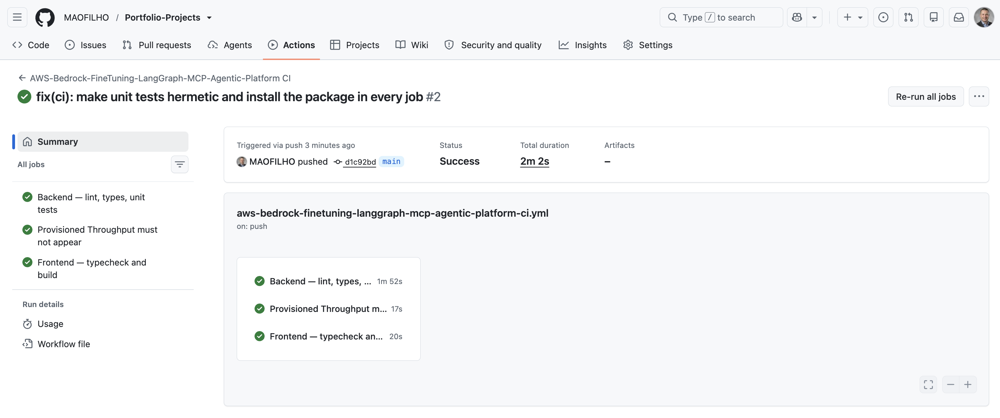


<br><br>

### Teardown

After `scripts/teardown.py`, recurring cost is verified at zero. The bucket, IAM roles, budget and
CI role are retained by design so a re-run needs no `terraform apply`.

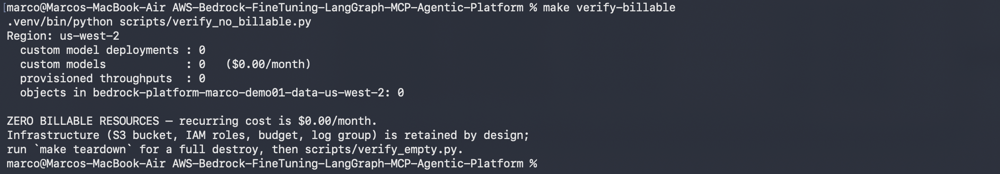


<br><br>

### Running it locally

```bash
make api        # terminal 1
make frontend   # terminal 2
```

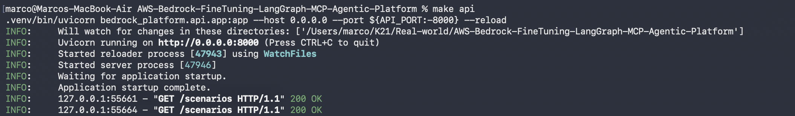


<br><br>

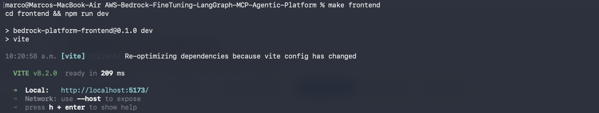

---


<br><br>
## Lessons learned

Roughly two dozen real defects surfaced during this build. Very few were caught by reading code —
most appeared the first time something ran somewhere new: a fresh venv, a CI runner, a monorepo path,
an account that still had resources in it.

They cluster into six patterns, written up in full in
**[`docs/LESSONS-LEARNED.md`](docs/LESSONS-LEARNED.md)**:

| # | Pattern | Cost |
|---|---|---|
| 1 | Resolve resources; never reconstruct their names | **5 separate bugs** |
| 2 | Tests can pass for the wrong reason | 3 bugs, all invisible locally |
| 3 | A verification that cannot fail is worse than none | 2 bugs, both in the teardown gate |
| 4 | A schema that checks shape is not checking the contract | reported 100% valid on output the contract rejects |
| 5 | Environment assumptions travel badly | 4 bugs, all environment-specific |
| 6 | The failure that was never explained | 7 failed jobs, root cause never found |

> **A green check on a code path that has never executed is not evidence.**

## Documentation

| Document | Contents |
|---|---|
| [`PLAN.md`](PLAN.md) | Architecture decisions and deliberate deviations from the source project |
| [`TASKS.md`](TASKS.md) | Sequenced build contract |
| [`COSTS.md`](COSTS.md) | Pre-build cost estimate |
| [`docs/COST-ACTUALS.md`](docs/COST-ACTUALS.md) | Estimated vs actual, and where the estimate was wrong |
| [`docs/RESULTS.md`](docs/RESULTS.md) | Fine-tuning results and error analysis |
| [`docs/LESSONS-LEARNED.md`](docs/LESSONS-LEARNED.md) | Every defect from this build, grouped by root-cause pattern |
| [`docs/INCIDENT-LOG.md`](docs/INCIDENT-LOG.md) | The 10-attempt failure investigation |

---

## Author

**Marcos Oliveira** — [LinkedIn](https://www.linkedin.com/in/mfilho1/) | [GitHub](https://github.com/MAOFILHO)
