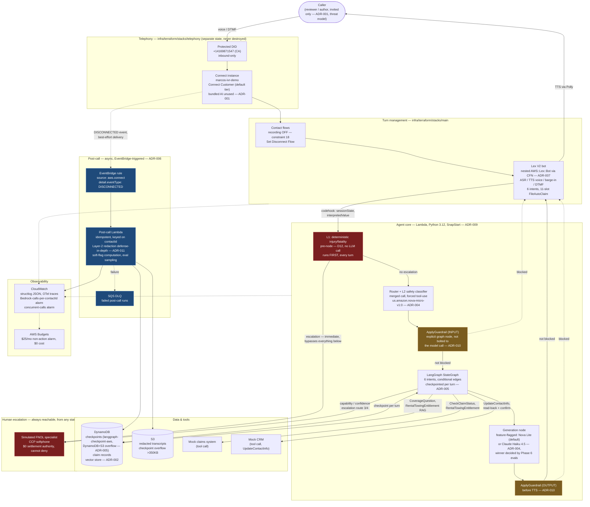
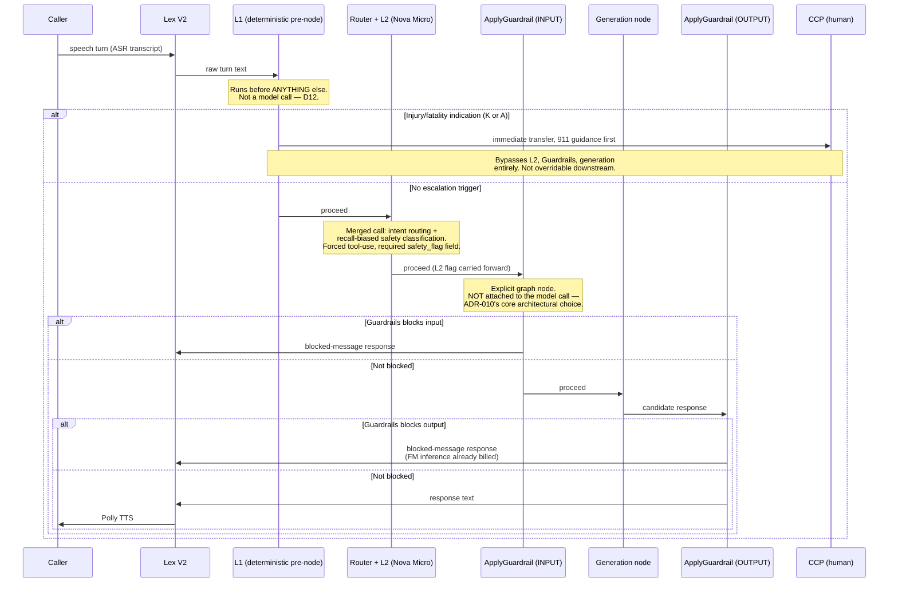

# Architecture — Phase 2

Two diagrams: the system end-to-end, and the per-turn safety-ordering sequence that `ADR-010` specifically
requires be visible in the architecture, not buried in code.

---

## System architecture

**Reading the color coding:** red nodes are the safety path (deterministic, union-semantics, cannot be
vetoed downstream — `D12`/`D15`). Amber nodes are Guardrails, explicitly sequenced as their own graph nodes
rather than bolted onto a model call (`ADR-010`). Blue nodes are the async post-call pipeline, fully
decoupled from the per-turn latency budget by construction (`ADR-006`).

---

## Per-turn safety ordering — the sequence `ADR-010` requires be visible

**Why this specific ordering is load-bearing, restated from `ADR-010`:** a general-purpose content filter has
no concept of this project's escalation requirement — it could legitimately block a graphic injury
description as violent content. L1 must see the caller's actual words before any filter has a chance to
intercept them. This is why L1 sits before the merged router+L2 call, and why Guardrails is driven explicitly
via `ApplyGuardrail` rather than attached to the model invocation, which the current AWS documentation
confirms is the intended, decoupled integration pattern for exactly this kind of ordering requirement.

## Sources

Diagram content reflects decisions already accepted in `docs/adr/ADR-001` through `ADR-011`, plus verified
facts in `PROJECT_STATE.md` (Connect instance/DID identifiers, `OutboundCallsEnabled: false`). No new external
research was required to draw this diagram — it is a synthesis of already-cited sources, not a new claim.
