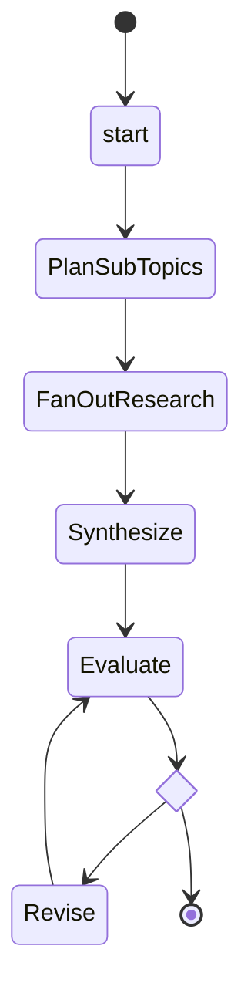
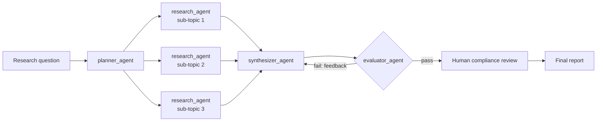
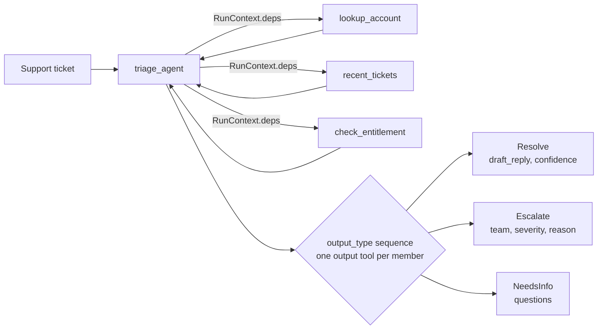
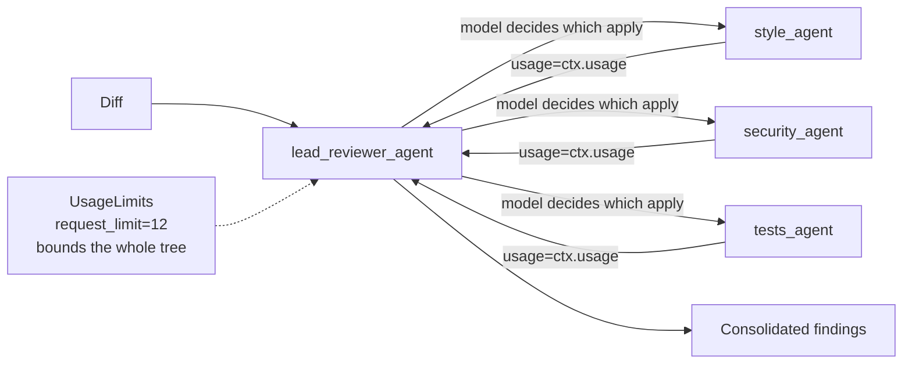
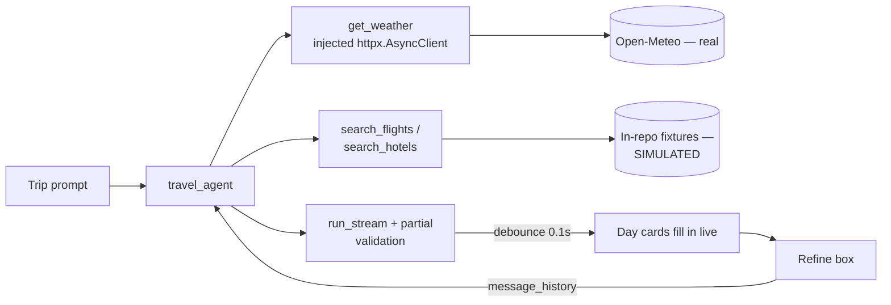

# Pydantic AI Agent Framework on AWS

**Four Agent Patterns, One Fargate Deployment**


An umbrella application built with **[Pydantic AI](https://ai.pydantic.dev/)** — Pydantic's
provider-agnostic agent framework — that runs four self-contained demos behind one Contoso-branded
sign-in screen and one permanent left-hand nav. Each demo isn't a variation on the same chatbot; each
one exists specifically to isolate a **different framework mechanism**, so the collection reads as a
curriculum on agent architecture rather than four copies of the same app with different prompts.


## The Problem: A Single-Demo Portfolio Piece

| Pain point | Impact |
|---|---|
| One demo shows one slice of the framework | A reviewer sees graph orchestration and nothing else — DI, delegation, and streaming are invisible |
| Four separate deployments to show four ideas | 4x the AWS footprint, 4x the idle-cost risk, 4x the URLs to keep alive for a demo session |
| No corporate "look and feel" | A raw dev UI doesn't read as production-shaped to a non-technical reviewer |
| Public demo endpoints with no gate | Anyone who finds the ALB DNS name can spend real OpenAI tokens |

## The Solution: One Shell, Four Mechanisms, Zero Extra Infrastructure

- A **permanent left nav** (`GET /api/demos`) lists all four demos above a **Home** link back to the
  blank landing state (*"Choose a project on the left panel to begin"*); selecting a demo swaps it in
  via a native dynamic `import()` — no bundler, no build step
- A **`Demo` registry** (`app/demos/base.py`) is the only thing `app/main.py` and the frontend nav
  know about — adding a fifth demo means writing its package and appending it to `DEMOS`, with no
  changes to the shell
- **One container, one ECS service, one ALB** — all four demos share the same Fargate task; the AWS
  footprint does not grow as demos are added
- A **demo sign-in gate** (`app/auth.py`) — one static account, no user directory, no SSO — enforced
  server-side via a signed session cookie on every `/api/*` route, not just hidden behind client-side
  routing


## Why This Isn't Just a Demo Repo

- **Four demos, four distinct mechanisms** — a `pydantic_graph` pipeline, dependency-injected tools
  with a discriminated-union output, agent-as-tool delegation under a usage budget, and streamed
  structured output — chosen so each one teaches something the others don't
- **A real corporate shell, honestly labelled** — a Contoso sign-in screen gates every demo endpoint
  server-side (not just hidden client-side), because the ALB is public and every demo spends real
  OpenAI tokens; the login page says outright that it's a static demo credential, not SSO
- **Full type-safety, zero `Any` leaks in the public surface** — Pyright strict across `app`, `tests`,
  and `evals`; discriminated unions round-trip through JSON as the correct branch, not a bag of
  optional fields
- **100% offline test suite** — 41 tests pass with **no** `OPENAI_API_KEY` set; every agent is
  overridden with `TestModel`/`FunctionModel`, and `ALLOW_MODEL_REQUESTS=False` fails loudly if a test
  ever tries a real request
- **Deploy-on-demand infrastructure** — Terraform-managed AWS ECS Fargate behind an ALB, sized to the
  cheapest viable SKU, spun up for a demo session and torn down after — no idle cloud bill
- **A real DI seam for the one demo with a genuine outbound call** — Travel Planner's weather tool
  takes an injected `httpx.AsyncClient`, so it's tested against `httpx.MockTransport` instead of the
  real Open-Meteo API, with zero changes to the tool itself
- **A live progress trail on every demo, not just a spinner** — each demo streams "agent did X" lines
  with that step's own real duration, ending in a `Total time` line, so a viewer sees the actual
  model/tool calls (and where the latency goes) instead of a canned "processing..." message

## The Four Demos

| Demo | Framework mechanism | Why it's here |
|---|---|---|
| **Research Analyst** | `pydantic_graph` pipeline: parallel fan-out, an evaluate/revise loop, human-in-the-loop as an HTTP boundary | Explicit graph orchestration — the control flow is *yours*, not the model's |
| **Support Triage Copilot** | `deps_type` dependency injection + tools reading `RunContext.deps` + a discriminated-union output type | Typed branching output; each outcome (`Resolve`/`Escalate`/`NeedsInfo`) carries exactly the fields it needs |
| **Code Review Assistant** | Agent-as-tool delegation + `UsageLimits` | The deliberate counterpoint to the graph: the *same* fan-out shape, but which specialists run is the model's call, capped by a shared request budget |
| **Travel Itinerary Planner** | Streaming structured output (`run_stream`, partial validation) + `message_history` | The only demo where a Pydantic model visibly fills in field-by-field in the browser, then gets refined across turns |

The non-obvious thing worth taking away: **when do you reach for a graph versus agent delegation?**
Research Analyst and Code Review Assistant solve structurally similar problems — plan, fan out to
specialists, consolidate — but one expresses that as an explicit `pydantic_graph` and the other as
tool calls a lead agent chooses to make. A graph is right when the control flow is fixed and you want
it inspectable, diagrammable, and testable without a model in the loop. Delegation is right when
*which* specialists to consult, and whether to consult any at all, is itself the judgment call you're
paying the model to make — at the cost of a bounded-but-real request budget instead of a deterministic
step count.

## Architecture

Research Analyst's pipeline is a real `pydantic_graph` graph — this diagram is generated directly
from the running graph (`print(research_pipeline)`), so it can't drift from the code:



The umbrella app around it:

```
Browser
   │
   ▼  GET /             → (shell HTML, Cache-Control: no-store)
   ▼  GET /api/session  → { username | null }
   │
   ├─ not signed in ──► sign-in form ──► POST /api/login (static credential check)
   │                                        └─► signed HMAC session cookie
   │
   └─ signed in ──► GET /api/demos  → [{ id, title, mechanism, blurb }, ...]
                        │
                        ▼  nav renders; user picks a demo
                        ▼  dynamic import("/static/demos/{id}.js")
                        │
        ┌───────────────┼────────────────┬───────────────────┐
        ▼               ▼                ▼                   ▼
  /api/research/*  /api/triage/*   /api/review/*       /api/travel/*
  (SSE progress)   (SSE progress)  (SSE progress)       (SSE progress
        │               │                │               + partials)
        ▼               ▼                ▼                    │
  pydantic_graph    deps_type DI    agent delegation          ▼
  pipeline          + union output  + UsageLimits        run_stream +
                                                           message_history
                                                              │
                                                              ▼
                                                     httpx.AsyncClient
                                                     (injected) → Open-Meteo

Every demo streams the same progress-log wire format (app/shared/sse.py, app/static/demos/
progress-log.js): each line is a real model/tool call with that step's own duration, ending
in a Total time line — Research's pipeline reports it directly; Triage and Review report it
via a `progress` callback on their deps, drained alongside `.run()` with `drain_progress`;
Travel reports it via `event_stream_handler` running concurrently with its partial-output stream.

Every /api/* route sits behind `require_session` (app/auth.py) — the ALB is public,
so the gate has to be server-side, not a client-side route guard.
```

## Project Structure

```
app/
  auth.py                            # Minimal demo sign-in gate: static credential, HMAC session cookie
  main.py                            # Shell: GET /, GET /api/demos, login/logout, mounts every demo router
  demos/
    base.py                          # The Demo descriptor every demo package exports
    research/                        # pydantic_graph pipeline demo
      agents.py pipeline.py models.py router.py
    triage/                          # Typed DI + discriminated-union output demo
      agents.py fixtures.py models.py router.py
    review/                          # Agent-delegation + UsageLimits demo
      agents.py fixtures.py models.py router.py
    travel/                          # Streaming structured output demo
      agents.py fixtures.py models.py router.py
  shared/
    config.py                        # Shared model config (FAST_MODEL default for every demo)
    sse.py                           # SSE encoding + progress-queue draining, shared by streaming demos
    cache.py                         # Tiny exact-match result cache, shared by every demo
  static/
    index.html theme.css             # The Contoso shell: sign-in, top bar, permanent left nav + Home link
    demos/*.js                       # One ES module per demo, loaded via dynamic import()
    demos/progress-log.js            # Shared progress-trail widget every demo module renders
tests/                               # TestModel/FunctionModel + httpx.MockTransport — green with no API key
evals/                               # pydantic_evals: structural suite (research) + labelled suite (triage)
terraform/                           # AWS ECS Fargate deploy target
```

This project's GitHub Actions workflows live outside this folder, at the repo root's
`.github/workflows/` — see [Infrastructure (Terraform)](#infrastructure-terraform) below:

```
../.github/workflows/
  aws-pydanticai-showcase-ci.yml      # lint + typecheck + test on every push touching this folder
  aws-pydanticai-showcase-deploy.yml  # workflow_dispatch: build, push to ECR, roll the ECS service
```


## Four Demos, In Depth

Every demo below renders the same progress-log widget (`app/static/demos/progress-log.js`) at the
very end of its panel: a live trail of "agent did X" lines, each showing that step's own duration
(written in once the *next* step starts, not a running total), ending in a `Total time` line that's
the sum of everything above it — real evidence of where the latency goes, not a spinner.

## Tech Stack

| Layer | Technology |
|---|---|
| **Agent framework** | [Pydantic AI](https://ai.pydantic.dev/) (`pydantic-ai-slim[openai,duckduckgo]`) |
| **Graph orchestration** | `pydantic_graph` — Research Analyst's plan/fan-out/synthesize/evaluate loop |
| **LLM provider** | OpenAI (`gpt-5.2` for Research Analyst's research/writing at `reasoning_effort="low"`; `gpt-5-mini` at `"minimal"` everywhere else) |
| **Backend** | FastAPI + Uvicorn, Server-Sent Events for streaming demos |
| **Frontend** | Vanilla JS, native ES modules, no bundler — dynamic `import()` per demo |
| **Auth** | A minimal HMAC-signed session cookie (`app/auth.py`) — explicitly not production SSO |
| **Evals** | `pydantic_evals` — a structural-invariant suite for Research Analyst, a labelled-ground-truth suite for Triage |
| **Testing** | `pytest` + `pytest-asyncio`, `TestModel`/`FunctionModel` everywhere, `httpx.MockTransport` for the one real outbound call |
| **Typing** | Pyright strict (`app`, `tests`, `evals`) |
| **Linting** | Ruff (`check` + `format`) |
| **Package management** | `uv` |
| **Container** | Docker, ARM64/Graviton base image |
| **Infrastructure** | Terraform — ECS Fargate, ALB, ECR, Secrets Manager, IAM, default VPC (no NAT Gateway) |
| **CI/CD** | GitHub Actions (repo-root `.github/workflows/`) — CI on every push touching this folder (offline, no API key), Deploy manual `workflow_dispatch` |

See [Infrastructure (Terraform)](#infrastructure-terraform) below for what each AWS service does and
how to provision/tear down the stack.

## Prerequisites

- Python 3.13, [`uv`](https://docs.astral.sh/uv/getting-started/installation/)
- An OpenAI API key
- Docker (for building the deploy image) — this repo builds locally via [colima](https://github.com/abiosoft/colima) since Docker Desktop isn't required
- AWS CLI configured, if deploying

## Setup

```bash
git clone <this-repo>
cd AWS-PydanticAi-Showcase
make install               # uv sync --group dev
cp .env.example .env       # fill in OPENAI_API_KEY
make run                   # uvicorn app.main:app --reload, http://localhost:8000
```

Sign in with the demo credential from `.env.example` (`SHOWCASE_DEMO_USER` /
`SHOWCASE_DEMO_PASSWORD`, defaults `demo@contoso.com` / `contoso`).

## Running the Project

```bash
make lint       # ruff check
make format     # ruff format
make typecheck  # pyright app tests evals
make test       # pytest — passes with no API key set; every agent is overridden with
                # TestModel/FunctionModel, and ALLOW_MODEL_REQUESTS=False fails loudly
                # if a test ever tries a real request
```

`uv run python -m evals.dataset` and `uv run python -m evals.triage` run the `pydantic_evals` suites
(also offline).

### Docker

```bash
make docker-build
make docker-run   # reads .env
# or: docker compose up --build
```

## Infrastructure (Terraform)

Everything in `terraform/` provisions a **deploy-on-demand** AWS stack from a clean account: one
`terraform apply` stands up the whole thing, one `terraform destroy` removes it completely, and
nothing is meant to sit running between demo sessions. Every choice in the config is the lowest-cost
option that still behaves like a real deployment:

- **Fargate**: 0.25 vCPU / 0.5 GB — the smallest task size AWS offers, shared by all four demos
- **No NAT Gateway**: reuses the account's default VPC and gives the task a public IP directly (locked
  down by security group to only accept traffic from the ALB) — avoids ~$32/month
- **No ACM/Route 53**: HTTP-only ALB listener, so this doesn't require owning a domain
- **7-day CloudWatch log retention**, **ECR lifecycle policy** capping untagged image storage,
  **`recovery_window_in_days = 0`** on both Secrets Manager secrets so `destroy` deletes them
  immediately instead of holding them (and their cost) for 7–30 days
- **`force_delete = true`** on the ECR repository, so `destroy` doesn't fail with
  `RepositoryNotEmptyException` once more than one image tag has been pushed (every deploy pushes
  both `:latest` and a `:<sha>` tag)
- **GitHub Actions deploys via OIDC** — no long-lived AWS access keys stored as a repo secret

The one cost that *does* run continuously while the stack exists is the ALB (a flat hourly charge
regardless of traffic) — that's why `terraform destroy` between sessions is the default recommendation
rather than leaving the stack up.

### What it provisions

| Service | Purpose |
|---|---|
| **ECS Fargate** | Runs the single container hosting all four demos (0.25 vCPU / 0.5 GB, the smallest Fargate SKU) |
| **Application Load Balancer** | Public HTTP entry point; the one cost that runs continuously while the stack exists |
| **ECR** | Container image registry (ARM64) |
| **Secrets Manager** | `OPENAI_API_KEY` and the demo sign-in password — never in the task definition or plaintext state output |
| **CloudWatch Logs** | 7-day retention, keeping log storage cost near zero for a demo deployment |
| **IAM** | Execution/task roles, plus a GitHub Actions OIDC role (no long-lived AWS keys as a repo secret) |
| **Default VPC** | Reused instead of a dedicated VPC; tasks get a public IP directly, locked down by security group to accept traffic only from the ALB — no NAT Gateway |

### Configuration

All variables live in `terraform/variables.tf`. Only `openai_api_key` is required; everything else
has a sensible default:

| Variable | Default | Purpose |
|---|---|---|
| `openai_api_key` | *(required, sensitive)* | Stored in Secrets Manager, never in the task definition or state-visible plaintext output |
| `github_repository` | `""` | `"owner/repo"`, scopes the GitHub Actions OIDC trust policy. Leave blank to skip creating the OIDC role entirely |
| `aws_region` | `us-east-1` | Typically the cheapest region for Fargate on-demand pricing |
| `project_name` | `pydantic-ai-showcase` | Used to name/tag every resource |
| `fargate_cpu` / `fargate_memory` | `256` / `512` | Smallest Fargate task size (0.25 vCPU / 0.5 GB); bump only if the shared task OOMs |
| `desired_count` | `1` | Number of running tasks — set to `0` to stop compute billing without destroying the stack |
| `research_model` | `openai:gpt-5.2` | Used only by Research Analyst's web-research/report-writing steps |
| `fast_model` | `openai:gpt-5-mini` | Default model for every other demo, and Research Analyst's own planning/evaluation |
| `max_revisions` | `1` | Caps Research Analyst's evaluate/revise loop |
| `log_retention_days` | `7` | Keeps CloudWatch Logs cost near zero |
| `demo_username` / `demo_password` | `demo@contoso.com` / `contoso` | The single demo sign-in account (see `app/auth.py`) — not real authentication |

### Setup and key commands

```bash
cd terraform
terraform init
terraform plan  -var="openai_api_key=$OPENAI_API_KEY" -var="github_repository=<you>/<repo>"
terraform apply -var="openai_api_key=$OPENAI_API_KEY" -var="github_repository=<you>/<repo>"

# get the public URL
terraform output alb_dns_name

# see every output (ECR repo, cluster/service names, GitHub OIDC role ARN)
terraform output
```

After the first `apply`, set these as GitHub repo variables/secrets (prefixed `SHOWCASE_` since this
repo hosts multiple projects' deploy workflows) so `aws-pydanticai-showcase-deploy.yml` can find the
stack: `SHOWCASE_AWS_REGION`, `SHOWCASE_ECR_REPOSITORY`, `SHOWCASE_ECS_CLUSTER`, `SHOWCASE_ECS_SERVICE`
(all from `terraform output`), and `SHOWCASE_AWS_DEPLOY_ROLE_ARN` (from
`terraform output github_deploy_role_arn`). Then trigger the `AWS-PydanticAi-Showcase Deploy` workflow
manually from the Actions tab — it never runs on push.

Both workflows live at the **repo root's** `.github/workflows/` (not inside this project folder) —
GitHub Actions only discovers workflow files there, which matters in a monorepo like this one. Each
is scoped to this project with a `paths: ["AWS-PydanticAi-Showcase/**"]` trigger filter and a
`working-directory` default, the same pattern the repo's other projects use.

### Pausing vs. tearing down

```bash
# pause: stop the Fargate task without deleting anything else (ALB keeps billing)
terraform apply -var="desired_count=0" -var="openai_api_key=$OPENAI_API_KEY"

# resume
terraform apply -var="desired_count=1" -var="openai_api_key=$OPENAI_API_KEY"

# full teardown — this is what actually stops the ALB's hourly charge
terraform destroy -var="openai_api_key=$OPENAI_API_KEY" -var="github_repository=<you>/<repo>"
```

`desired_count=0` is useful mid-session (stop paying for compute without losing the ALB/ECR/IAM setup
and having to re-provision), but only `terraform destroy` stops the ALB charge — see
[Cost Estimate](#cost-estimate) below.

## GitHub Actions CI/CD (Deploy-on-Demand)

Continuous Integration (CI) and Continuous Deployment (CD) are deliberately separated into two distinct workflows: an automatic, offline **CI** pipeline for rapid quality control, and a manual, on-demand **Deploy** pipeline for AWS infrastructure.

> **Architectural Note on "CD":** Rather than textbook Continuous Deployment (auto-releasing every commit) or strict Continuous Delivery (building image artifacts continuously), this project implements **on-demand deployment automation**. Deployments require an explicit human trigger (`workflow_dispatch`), ensuring real AWS resources (Fargate, ECR) are provisioned only when needed—eliminating standing cloud charges.


### CI Workflow — `aws-pydanticai-showcase-ci.yml`

A green CI run signals that code is structurally and logically sound for deployment, without touching live cloud resources.

* **Trigger:** Pushes or Pull Requests to `main` touching `AWS-PydanticAi-Showcase/**`, or manual `workflow_dispatch`.
* **AWS Impact:** **None** (100% offline; uses dummy `OPENAI_API_KEY` and test stubs).
* **Runtime:** ~35–40s on `ubuntu-latest`.

| Step | Action / Command | Purpose |
| :--- | :--- | :--- |
| **Checkout** | `actions/checkout` | Clones repository at triggering commit. |
| **Setup `uv`** | `astral-sh/setup-uv` | Configures `uv` package manager with dependency caching. |
| **Install** | `uv sync --group dev` | Installs development dependencies. |
| **Lint** | `ruff check .` | Checks for code style violations and common bugs. |
| **Format** | `ruff format --check .` | Ensures formatting compliance (including README Python blocks). |
| **Typecheck** | `pyright app tests evals` | Enforces Pyright strict typing (zero `Any` leaks in public surface). |
| **Test** | `pytest -v` | Runs 41-test offline suite (`ALLOW_MODEL_REQUESTS=False` blocks real API calls). |


### Deploy Workflow — `aws-pydanticai-showcase-deploy.yml`

Builds the production container image, pushes it to ECR, and executes a zero-downtime rolling update on AWS ECS Fargate.

* **Trigger:** Manual execution only (`workflow_dispatch` via GitHub Actions tab or `gh workflow run`).
* **AWS Impact:** **Active** (Builds/pushes ARM64 ECR image and updates live ECS service).
* **Runtime:** ~5–6 minutes (includes ARM64 cross-compilation).

| Step | Action / Command | Purpose |
| :--- | :--- | :--- |
| **Checkout** | `actions/checkout` | Clones repository at triggering commit. |
| **AWS Auth** | OIDC Role Assumption | Assumes `SHOWCASE_AWS_DEPLOY_ROLE_ARN` (no long-lived AWS keys stored in secrets). |
| **ECR Login** | `amazon-ecr-login` | Authenticates Docker client against ECR registry. |
| **Buildx Setup** | QEMU + Docker Buildx | Prepares cross-compilation environment for ARM64 architecture. |
| **Build & Push** | `docker buildx build` | Compiles for `linux/arm64`; tags as `:latest` and `:<commit-sha>`. |
| **Roll Service** | `aws ecs update-service` | Triggers `--force-new-deployment` on the target ECS service. |
| **Stabilize** | `aws ecs wait services-stable` | Blocks until new Fargate task passes health checks and old task drains. |


<br>


<br>


<br>

> **Technical Insight — ARM64 Cross-Compilation:**
> The ECS task runs on ARM64/Graviton for ~20% lower Fargate compute costs, but default GitHub runners are x86_64. Standard `docker build` commands produce an amd64 image that crashes on startup (`exec format error`). Configuring QEMU and Buildx guarantees cross-architecture compatibility, while ECS rolling updates preserve live traffic on the healthy task until the new container stabilizes.


## Cost Estimate

Running the full stack for a few hours of demoing (four short/cheap demos on `gpt-5-mini`, plus
Research Analyst's heavier research/writing on `gpt-5.2`):

| Resource | Estimated cost |
|---|---|
| ALB (flat hourly, regardless of traffic) | ~$0.02/hour |
| Fargate task (0.25 vCPU / 0.5 GB, ARM64) | ~$0.01/hour |
| OpenAI usage (a handful of runs across all four demos) | ~$0.50–2.00 |
| CloudWatch Logs, Secrets Manager, ECR storage | ~$0.01 |
| **Total for a demo session (a few hours)** | **~$1–3 USD** |

Every agent's `model_settings` caps `openai_reasoning_effort` explicitly (`"minimal"` on the
`gpt-5-mini` agents, `"low"` on Research Analyst's `gpt-5.2` agents) — GPT-5-family models spend
variable, billed "thinking" time before producing output, and left unset it defaults higher than a
short, structured demo task needs. This was the single biggest lever on real spend: four one-off runs
(one per demo) cost about $2 in OpenAI credit before these were set, and noticeably less after.

Always tear down when done — see [Pausing vs. tearing down](#pausing-vs-tearing-down) above.

## Research Analyst — `pydantic_graph` pipeline

An orchestrator plans 2–4 sub-topics, specialist workers research each one in parallel with a
`WebSearch` capability, a synthesizer drafts the report, an evaluator gates a bounded revision loop,
and a human compliance officer approves or annotates before anything is final.

| Stage | What it is | Framework mechanism |
|---|---|---|
| **Orchestrator** (`PlanSubTopics`) | Plans 2–4 sub-topics from the question | `planner_agent`, structured output |
| **Specialist workers** (`FanOutResearch`) | Research each sub-topic concurrently | `research_agent` + `WebSearch`, `asyncio.gather` |
| **Synthesizer** (`Synthesize`) | Drafts the report from findings | `synthesizer_agent`, structured output |
| **Evaluator** (`Evaluate`) | Checks the draft against its findings; loops back on failure | `evaluator_agent` |
| **Revision** (`Revise`) | Re-synthesizes with the evaluator's feedback | same `synthesizer_agent`, called again |
| **Compliance review** | A human approves the draft, or annotates it | `POST /api/research/reviews/{id}/decision` |

Human sign-off is deliberately **not** a paused graph node — a real approval is an async boundary that
can take minutes or days and arrives in a separate HTTP request, so it's handled as an explicit
two-step API instead of faking an in-process pause. See `app/demos/research/pipeline.py`.



## Support Triage Copilot — typed DI + union output

One agent, three tools (`lookup_account`, `recent_tickets`, `check_entitlement`) that only ever touch
`RunContext.deps` — never a module-level global — and a discriminated-union output type:

```python
class Resolve(BaseModel):
    action: Literal["resolve"] = "resolve"
    draft_reply: str
    confidence: float


class Escalate(BaseModel):
    action: Literal["escalate"] = "escalate"
    team: Literal["billing", "security", "infrastructure", "account-management"]
    severity: Literal["low", "medium", "high", "critical"]
    reason: str


class NeedsInfo(BaseModel):
    action: Literal["needs_info"] = "needs_info"
    questions: list[str]
```

The agent's `output_type` passes these as a **sequence**, not `Resolve | Escalate | NeedsInfo` — a
union isn't a valid `output_type` on its own, but a sequence of candidate types is, and Pydantic AI
turns it into one output tool per member, so the model commits to a branch by *choosing a tool*. The
`Annotated[..., Field(discriminator="action")]` form is used on the *return* leg instead, where the
decision gets serialized to JSON and parsed back — that's where a discriminator earns its keep, so
overlapping shapes can't be mis-parsed. The UI's "tools the agent called" trace replays
`result.all_messages()` filtered to an explicit allowlist of real tool names, since a union output
type generates multiple `final_result_*` tools that must not be mistaken for lookups the agent chose
to make.



## Code Review Assistant — agent delegation + usage limits

A lead reviewer consults up to three specialist sub-agents (style, security, tests) as tools, deciding
for itself which ones apply to a given diff:

```python
async def _delegate(ctx, agent) -> SpecialistFindings:
    result = await agent.run(
        f"Review this diff:\n\n{ctx.deps.diff}", deps=ctx.deps, usage=ctx.usage
    )
    return result.output
```

`usage=ctx.usage` is the load-bearing argument — without it, each delegated sub-agent run would keep
its own tally, and the `UsageLimits(request_limit=12)` the caller sets on the outer run would only
ever bound the lead reviewer's own turns. The UI surfaces the actual request/token count used, so the
budget is a visible, demonstrable guardrail rather than an assertion in a docstring. A sample diff
(a string-concatenated SQL query, a duplicated helper, and an untested error path) is one click away,
so the demo reliably has all three severities to show.



## Travel Itinerary Planner — streaming structured output

```python
async with agent.run_stream(prompt, deps=deps) as result:
    async for partial in result.stream_output(debounce_by=0.1):
        yield sse({"type": "partial", "itinerary": partial.model_dump(mode="json")})
```

Day cards materialize live in the browser as `Itinerary` is validated in
[partial mode](https://docs.pydantic.dev/dev/concepts/experimental/#partial-validation) straight off
the token stream — the only demo where a Pydantic model visibly fills in rather than arriving whole.
`get_weather` is a genuinely real tool call: it hits Open-Meteo's free, keyless geocoding + forecast
API through an `httpx.AsyncClient` **injected via `TravelDeps`**, which is also what makes it testable
offline with `httpx.MockTransport`. `search_flights`/`search_hotels` read small in-repo fixtures —
there's no equivalently free flight/hotel API — and both the tool docstrings and the UI label that
inventory `[SIMULATED]` rather than passing it off as real. A "refine" box re-runs the agent with
`message_history=result.all_messages()`, so "make it cheaper" edits the itinerary already on screen
instead of starting a fresh conversation.



## Web App screenshots


<br>


<br>


<br>


<br>


<br>


<br>


<br>


<br>


<br>


<br>


## Key Engineering Decisions

| Challenge | Solution |
|---|---|
| A union isn't a valid `Agent(output_type=...)` on its own | Pass the members as a sequence (`[Resolve, Escalate, NeedsInfo]`); Pydantic AI generates one output tool per member, and the model commits to a branch by choosing a tool |
| A discriminated union *is* needed for the return leg | `Annotated[Resolve \| Escalate \| NeedsInfo, Field(discriminator="action")]` on the API response model, not the agent's `output_type` |
| A union output type generates multiple `final_result_*` tools | The "tools the agent called" trace filters against an explicit allowlist of real tool names, not an exclusion of one well-known name |
| Delegated sub-agent usage wasn't billing to the caller's budget | Pass `usage=ctx.usage` on every delegated `agent.run()` call, so `UsageLimits` on the outer run actually bounds the whole tree |
| A leftover `white-space: pre-wrap` rule broke button/description spacing | Found via `getBoundingClientRect()` numeric measurement, not visual inspection — `getComputedStyle()` showed the intended margins were correctly applied, but the rendered gap was still wrong, which pointed at inherited whitespace rendering rather than a margin bug |
| Local UI-stub overrides silently reverted mid-session | Bare `agent.override(model=...).__enter__()` calls in a loop let the temporary context manager get garbage-collected once the loop's tuple went out of scope — CPython's generator cleanup runs the context manager's `finally` block (undoing the override) on GC. Fixed by holding every override on a `contextlib.ExitStack` kept alive for the process |
| `TestModel` needed to satisfy a discriminated-union schema offline | `TestModel` deterministically returns the *first* candidate in a sequence `output_type`, which is honest but means an eval evaluator that checks label-correctness can't score 1.0 offline by design — documented in `evals/triage.py`, and the offline test asserts the dataset *runs*, not that the score is perfect |
| No free, keyless flight/hotel search API exists | Simulated inventory, but honestly labelled everywhere it's surfaced (tool docstring, API response, and the UI) rather than passed off as real |
| The GitHub Actions deploy workflow lived where GitHub never looked | This repo is a monorepo; GitHub Actions only discovers workflow files at the repo root's `.github/workflows/`, not inside a project's own folder — `ci.yml`/`deploy.yml` had never actually run. Moved both to the root with a `paths:` trigger filter and a `working-directory` default, matching this repo's other projects |
| The deploy workflow crashed every task with `exec format error` | ECS runs on ARM64/Graviton for the cheaper Fargate pricing, but `ubuntu-latest` GitHub runners are x86_64 — a plain `docker build` there silently produces an amd64 image that can't execute on the task. `docker/setup-qemu-action` + `buildx build --platform linux/arm64` cross-builds the correct architecture; the already-running task kept serving traffic throughout, since ECS won't route to a task that fails to start |
| The sign-in screen stayed visible after a successful login | `.signin`/`.shell` each set their own `display`, which beats the browser's default `[hidden] { display: none }` rule in the cascade — the session/DOM state was correct the whole time, but nothing visually reflected it. Fixed with an explicit `[hidden] { display: none !important; }` rule |
| A redeploy could silently keep serving old JS/CSS | `StaticFiles` sends no `Cache-Control` of its own, so browsers apply heuristic caching to `/static/*`. Given `Cache-Control: no-store` on those responses too, matching the shell HTML, which already had it for the same reason |
| `run_stream_events()` requires the model to support streaming | Converting Triage/Review's progress log to it broke their `FunctionModel(function=...)` test doubles (no `stream_function`). Reused Research's own pattern instead — a `progress` callback on `TriageDeps`/`ReviewDeps` that the tools call as they run, drained alongside the agent's plain `.run()` with a generalized `drain_progress` — so the tests never had to change how they mock the model |
| Progress-log timing looked cumulative, not per-step | Each line's elapsed time was time-since-run-start; now it's written in when the line is *finalized* (the next step starts, or the run ends), so it's that step's own duration, and `Total time` is a real sum of the lines above it |
| Two `gpt-5.2` agents ran at OpenAI's default reasoning effort | `research_agent` and `synthesizer_agent` had no `model_settings` at all — the most expensive model in the app, run 3× in parallel plus again on every revision, with no cap on hidden reasoning-token spend. Capped to `reasoning_effort="low"`, which cut real per-run OpenAI cost noticeably without downgrading the model |

## Author

**Marcos Oliveira** — [LinkedIn](https://www.linkedin.com/in/mfilho1/) | [GitHub](https://github.com/MAOFILHO)
