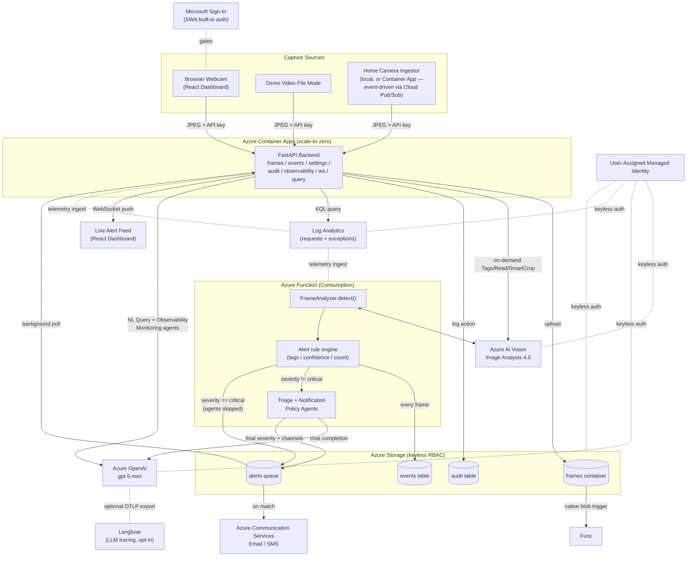
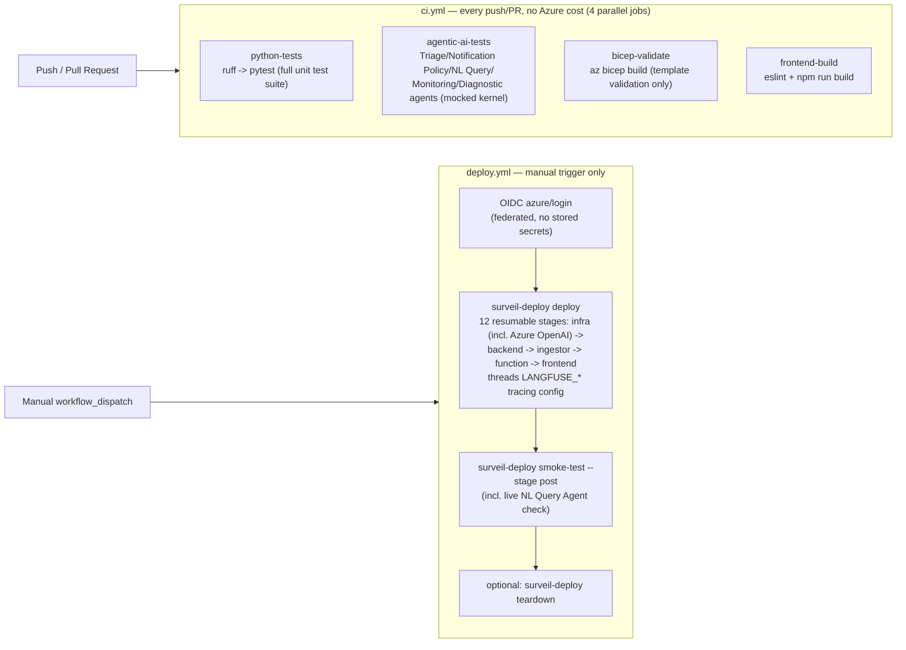
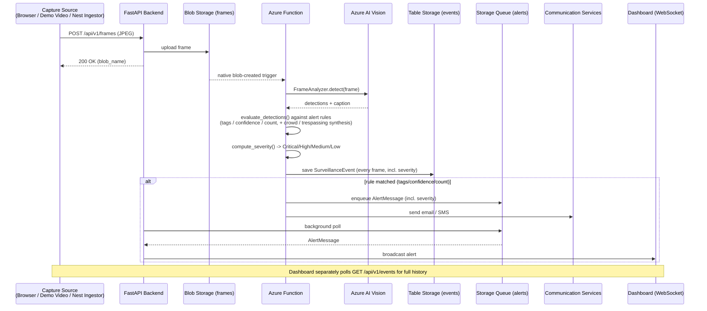
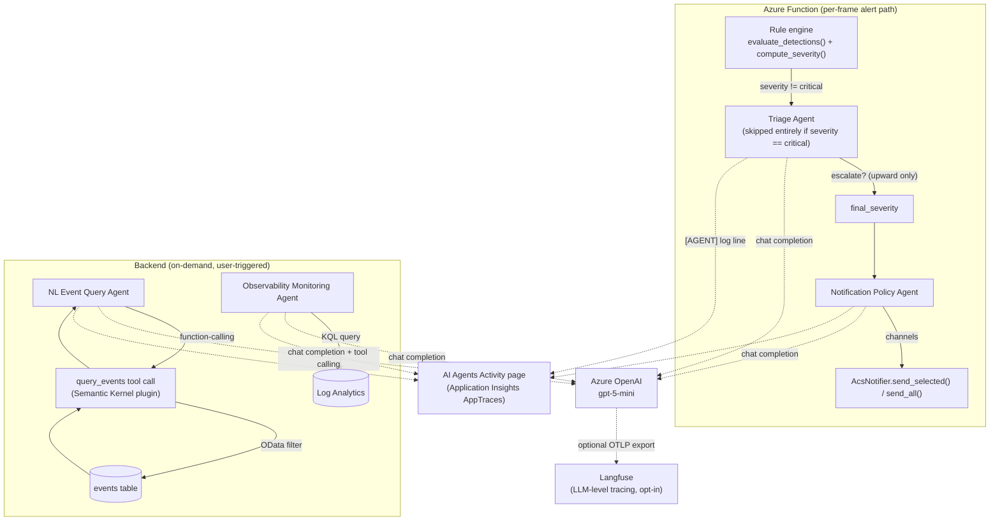
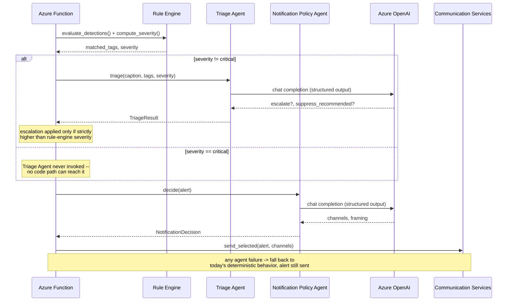

# Azure Agentic Video Surveillance

### Real-Time Camera Surveillance, Agentic AI Reasoning & Alerting on Azure AI

A cost-aware, end-to-end **real-time video surveillance system** built on **Azure AI Vision**, deployed via a fully automated **Python CLI** with **zero Azure Portal clicks**. A **React + TypeScript** dashboard — gated behind Microsoft sign-in via Static Web Apps' built-in authentication — captures webcam frames (or ingests a real Google Nest camera), an **Azure Function** analyzes each frame with **Azure AI Vision Image Analysis 4.0**, and alerts are pushed live over **WebSocket** plus optional **email/SMS** via **Azure Communication Services**. Layered on top of that deterministic pipeline, five **Semantic Kernel** agents backed by **Azure OpenAI** add judgment and natural-language capability — triaging detections, deciding notification channels, answering plain-English questions about event history, and flagging observability anomalies — without ever being able to override what the rule engine already decided (see [Agentic AI Architecture](#agentic-ai-architecture)). An in-app Observability page queries Application Insights directly for live request/error telemetry, and an Audit Trail records user-facing actions — no separate ops tooling required.


## Project Description

A browser (or an IP/security camera) captures frames and uploads them to Blob Storage via a **FastAPI** backend on **Azure Container Apps** (scale-to-zero). An **Azure Function** analyzes each frame asynchronously with **Azure AI Vision**, and any match against configurable alert rules (watched tags, confidence, count) fires in two ways — instantly to the dashboard over **WebSocket**, and optionally via **email/SMS** through Azure Communication Services. Every analyzed frame (alert or not) is recorded in Table Storage for the event history view. The entire system — infrastructure, backend, Function, and frontend — deploys through one resumable Python CLI with **zero Azure Portal clicks**. See [docs/architecture.md](docs/architecture.md) for full architectural rationale.

The detection backend is deliberately pluggable (`FrameAnalyzer` protocol in `shared/surveil_core/analyzer.py`) so a future Custom Vision or YOLOv4 object detector can be dropped in without touching capture, alerting, or the deployment pipeline — see [docs/extending-phase2.md](docs/extending-phase2.md).

## The Business Case: Why This Matters

**Problem:** Small sites (a garage, a storefront, a home office) want camera-based intrusion/threat alerting without paying for an enterprise video-analytics platform or hiring someone to watch a feed all day.

**The Challenge:** Off-the-shelf security cameras either lock you into a vendor's cloud or require standing up expensive always-on infrastructure (GPU inference clusters, managed video-indexing services) that costs far more than the problem justifies.

**The Solution:** A serverless-first architecture where the only components that run continuously are a Storage account and a Cognitive Services resource — the compute (Container App, Function) scales to zero when nothing is happening, and detection uses a pay-per-call Vision API instead of a dedicated model-serving cluster. The whole system deploys and tears down on demand via one CLI.


## Feature Scope

### Capture Sources

| Source | Description |
|---|---|
| Browser webcam | React dashboard captures frames via `getUserMedia`, throttled to a configurable interval (default 3s), JPEG-encoded. |
| Demo/video-file mode | Plays a bundled sample video instead of a live webcam, for demoing without hardware. |
| Video Upload & Analysis | Batch-analyzes a video file you already have, separate from live capture. Frames are extracted client-side by seeking to a series of timestamps (not real-time playback) and posted through the same `POST /api/v1/frames` path as live capture. A configurable extraction interval caps frame count — and billed Vision calls — per upload. |
| Home security camera (`ingestors/nest/`) | Watches real Google Nest cameras via Cloud Pub/Sub (event-driven, not polling), forwarding each event's frame into the same ingest endpoint as browser capture. Extraction adapts per camera: a fast clip-preview path, or a **WebRTC** fallback (SDP/ICE/RTP) for live-stream-only cameras. Duplicate Pub/Sub redeliveries (common — one doorbell press is often redelivered 2-4 times) are de-duplicated in-process. |

### Google Nest ingestor notes:
- **Runs locally (laptop/Pi/NAS, zero Azure cost** — the original design) or as an opt-in always-on Container App (`NEST_INGESTOR_ENABLED=true`). Unlike the backend/Function (scale-to-zero), it's fixed at `minReplicas=maxReplicas=1` since it holds a persistent Pub/Sub connection — a real, unavoidable ~$10-15/month cost (see [docs/cost.md](docs/cost.md)).
- **Confirmed on real multi-camera hardware:** only the doorbell reliably produces frames end-to-end. Other models 400 on the direct clip-preview command and correctly fall back to WebRTC — which connects fully (ICE/DTLS/audio all healthy) but never receives a single video RTP packet, even with an immediate RTCP PLI keyframe request. This points to a Google-side limitation specific to **WebRTC** video for these models via the public SDM API, not a signalling bug — confirmed against real hardware, not inferred. Full root-cause writeup: [ingestors/nest/README.md](ingestors/nest/README.md).

### Analysis & Alerting

| Capability | Description |
|---|---|
| Detection | Azure AI Vision Image Analysis 4.0 (objects, people, captions) behind a swappable analyzer interface. Runs in `eastus` (Captions available free there on `F0`), independent of `AZURE_LOCATION` for everything else. |
| Alert rules | Configurable watched tags, minimum confidence, minimum object count. |
| Severity levels | Critical/High/Medium/Low via a configurable tag→severity map (`weapon`/`gun`/`knife`→critical, `trespassing`→high, `crowd`→medium, `person`→low by default), shown as colour-coded badges. |
| Crowd rule | Synthesizes a `crowd` tag (medium) when person count meets `ALERT_CROWD_THRESHOLD`. Disabled by default. |
| Trespassing rule | Synthesizes a `trespassing` tag (high) when a person's bounding-box center falls inside a configured normalized zone (`ALERT_RESTRICTED_ZONE`). Disabled by default. |
| Alert delivery | Instant WebSocket push to connected dashboards, plus optional email/SMS. |
| Event history | Every analyzed frame (matched or not) is queryable, with a thumbnail and click-to-expand bounding-box view. |
| On-demand analysis | Tags / Read (OCR) / Smart Crop, triggered per-frame from the dashboard — separate, billed calls distinct from the automatic per-frame alerting. |

*(Crowd/trespassing rules build entirely on existing detector output — no additional model training required.)*

### Email/SMS Alerting via Azure Communication Services

Both channels are backed by one Azure Communication Services (ACS) resource ([`infra/modules/communication.bicep`](infra/modules/communication.bicep)) and one `AcsNotifier` client ([`shared/surveil_core/notify.py`](shared/surveil_core/notify.py)):

- **Email** uses ACS's free, Azure-managed sender domain (`DoNotReply@<guid>.azurecomm.net`) — no custom domain verification needed to get started. Provisioning the ACS resource is free; cost is per-email/per-SMS send only.
- **SMS** requires a phone number purchased separately in the ACS resource (a manual, one-time step — see [docs/deployment.md](docs/deployment.md)); the resource and connection string are provisioned either way, so SMS can be turned on later without redeploying infra.
- Each channel independently no-ops (rather than erroring) when its own config is missing — `ALERT_EMAIL_TO`/`ALERT_SMS_TO` unset means that channel is simply skipped, so email-only, SMS-only, or neither all work without special-casing at call sites.
- On a high-severity detection, the deterministic rule engine decides `is_alert`/`severity` first; the **Notification Policy Agent** (a Semantic Kernel agent, see [Agentic AI Architecture](#agentic-ai-architecture)) then chooses which of `["email", "sms"]` to actually send through and drafts a one-line framing note — it can only pick channels, never suppress a notification outright or change the severity. `critical` alerts default to every available channel; lower severities may go out on fewer channels to reduce notification fatigue. If the agent call fails or times out, delivery falls back to sending on every configured channel (`send_all`) — today's exact pre-agent behavior.
- Authentication to ACS uses a connection string threaded through as a deploy-time secret (Container App / Function `secretRef`), never written to disk or logs.

Example alert email as actually delivered by this pipeline:


<br><br>


<br><br>

### Dashboard & Access

| Feature | Description |
|---|---|
| Sign-in | Gated behind Azure Static Web Apps' built-in Microsoft auth — no passwords handled by this system's own code. |
| Navigation | Capture (webcam/demo + live alerts + event history), Profile, Settings, Observability, AI Agents, Audit Trail. |
| Capture page layout | 2x2 grid: Live Capture and Video Upload & Analysis side by side (matching fixed-height camera boxes via CSS Grid), Event History and a compact Live Alerts ticker below. |
| Settings | Read-only view of the live alert config this deployment is actually running with (watch tags, confidence, capture interval, crowd/trespassing rules, effective severity map). |
| Observability | Backend health, hourly request/failure chart, recent-exceptions table — queried live from Application Insights/Log Analytics, plus an AI-generated anomaly analysis from the Observability Monitoring Agent and a deep link to the Portal blade. |
| AI Agents | Live, auto-refreshing log of every agent invocation, tool call, orchestration decision, and error, across the Function and backend. See [Agentic AI Architecture](#agentic-ai-architecture). |
| Audit Trail | Sign-ins and on-demand analysis actions, logged to Table Storage. |

### Operational Tooling

| Tool | Description |
|---|---|
| Deploy CLI | `surveil-deploy` — a single, resumable 12-stage pipeline (infra → backend/ingestor/Function/frontend → health checks → e2e validation), one command. |
| Teardown | One command, including soft-deleted Cognitive Services account handling. |
| Tests | Unit test suite (no live Azure needed) plus a live end-to-end smoke test. |
| CI/CD | GitHub Actions: automatic lint/test/Bicep-validate/frontend-build on every push, plus a manual-only deploy workflow — see [CI/CD Pipelines](#cicd-pipelines). |

## Tech Stack

| Layer | Technology |
|---|---|
| Cloud platform | Microsoft Azure |
| Compute | Azure Container Apps (FastAPI backend), Azure Functions (Consumption, Python) |
| AI/ML | Azure AI Vision — Image Analysis 4.0 |
| Agentic AI | Azure OpenAI (`gpt-5-mini`) + Microsoft Semantic Kernel SDK — 5 agents (Triage, Notification Policy, NL Event Query, Observability Monitoring, Nest WebRTC Diagnostic); see [Agentic AI Architecture](#agentic-ai-architecture) |
| LLM/agent tracing | OpenTelemetry (OTLP) — optional dual-export to Langfuse, layered on the same Application Insights instrumentation |
| Storage | Azure Storage (Blob, Queue, Table) |
| Messaging/alerting | Azure Storage Queue, WebSocket, Azure Communication Services (email/SMS) |
| Frontend hosting | Azure Static Web Apps |
| Container registry | Azure Container Registry |
| Observability | Application Insights, Log Analytics — queried live and rendered in-app (`azure-monitor-query`), not just viewed in the Portal |
| Identity / Auth | Azure Managed Identity (user-assigned), RBAC — no credential keys in the core system; dashboard sign-in via Static Web Apps built-in auth (Microsoft identity provider) |
| Infrastructure as Code | Bicep (subscription-scoped, modular) |
| Backend | Python 3.12, FastAPI, Pydantic / Pydantic Settings, WebSockets, `azure-ai-vision-imageanalysis`, `azure-storage-*`, `azure-communication-*`, `semantic-kernel` SDKs |
| Deployment CLI | Python, Typer, Rich, streamed Azure CLI/Functions Core Tools/npm orchestration |
| Frontend | React 18, TypeScript, Vite |
| Home camera ingestion | Python, Google Cloud Pub/Sub, Smart Device Management API, OpenCV, `aiortc` (WebRTC) |
| Testing | pytest, `pytest-asyncio`, mocked Azure SDK clients |
| Linting | ruff (Python), ESLint + typescript-eslint (frontend) |
| CI/CD | GitHub Actions |


## Azure Architecture

High-level view of Azure services and how they connect.



## API & Storage Reference

Endpoint-level view of API routes, storage schema, and the analysis pipeline — for tracing a specific request end-to-end.

```
                     Browser (React + TS, Azure Static Web Apps — Free)
                     Gated by Microsoft sign-in (SWA built-in auth) before anything loads
                     Capture: LiveCamera (getUserMedia) / Demo Video     Nav: Capture, Profile,
                                   |                                     Settings, Observability, Audit
                                   |  throttled frames (default every 3s)
                                   |  WebSocket (alerts) <----------------+
                                   v                                      |
        +-------------------------------------------------------------------------------------------------+
        | FastAPI  (Azure Container Apps, minReplicas=0)                                                  |
        |  POST /api/v1/frames                -> upload to Blob (API-key gated)                           |
        |  GET  /api/v1/frames/{cam}/{file}    -> proxy frame image (thumbnails)                          |
        |  POST /api/v1/frames/.../analyze     -> on-demand Vision (Tags/Read/SmartCrop, API-key gated)   |
        |  WS   /ws/alerts                     -> fan-out to dashboards                                   |
        |  GET  /api/v1/events                 -> recent events (Table)                                   |
        |  GET  /api/v1/settings               -> current alert config (read-only)                        |
        |  GET/POST /api/v1/audit              -> audit trail (Table, API-key gated writes)               |
        |  GET  /api/v1/observability/*        -> requests summary + exceptions (Log Analytics query)     |
        |  GET  /api/v1/health                                                                            |
        |  background task: reads 'alerts' queue -> WS                                                    |
        +---------------------+---------------------------------------------------------------------------+
                              | 
                              | frame blob upload (container: frames)
                              v
        +-------------------------------------------------------------------------+
        |     Azure Storage (StorageV2, Standard_LRS, Hot, keyless RBAC)          |
        |     containers: frames, events (annotated)                              |
        |     queue: alerts        tables: events, audit                          |
        |                          native blob trigger                            |
        +-------------------------------------------------------------------------+
                              |
                              |
                              v
        +-------------------------------------------------------------------------+
        | Azure Function (Python, Consumption plan)                               |  
        |  trigger: blob created in 'frames/{name}'                               |
        |  FrameAnalyzer.detect(frame) --------------------> Azure AI Vision      |
        |  evaluate_detections() -> alert rule engine        Image Analysis 4.0   |
        |  on alert: write event (Table) + annotated blob    (F0 free or S1)      |
        |            enqueue 'alerts' queue (-> WebSocket)                        |
        |            send Azure Communication Services email/SMS                  | 
        +-------------------------------------------------------------------------+

        Home Camera Ingestor (ingestors/nest/) — optional 2nd capture source
          Google Cloud Pub/Sub -> dedup -> WebRTC/clip-preview capture -> POST /api/v1/frames
          runs locally (free) OR as an always-on Container App (minReplicas=maxReplicas=1, ~$10-15/mo)

        Observability: Application Insights + Log Analytics (PerGB2018, 30d retention)
          queried directly by the backend's Observability page — not just the Azure Portal
        Identity: one user-assigned Managed Identity — keyless Blob/Queue/Table + Vision +
                  Log Analytics Reader access; no credentials anywhere in this system's own code
```

## Azure Resources

- **Azure Default Region** = `eastus2`, except Vision — see below):
- **Container Apps**: FastAPI backend (frame ingest, on-demand analysis, event/settings/audit/observability APIs, WebSocket alert fan-out)
- **Container Apps** (optional, `minReplicas=maxReplicas=1`): Nest ingestor, when `NEST_INGESTOR_ENABLED=true`
- **Azure Functions** (Consumption, Python): async frame analysis worker
- **Azure AI Vision** (Cognitive Services, `ComputerVision` kind), deployed in **`eastus`** (`VISION_LOCATION`, independent of `AZURE_LOCATION`) so Image Analysis 4.0 Captions are available on the free `F0` tier: objects, people, caption, tags, read, smart crops
- **Azure OpenAI** (Cognitive Services, `OpenAI` kind, `disableLocalAuth: true`): one `gpt-5-mini` GlobalStandard chat deployment backing all 5 Semantic Kernel agents, authenticated via the same user-assigned Managed Identity (RBAC only, no API keys) — see [Agentic AI Architecture](#agentic-ai-architecture)
- **Storage Account** (StorageV2, `Standard_LRS`): blob containers `frames`/`events`, queue `alerts`, tables `events`/`audit`
- **Azure Communication Services**: email (Azure-managed domain) + optional SMS alerting
- **Static Web Apps** (Free): React + TypeScript dashboard, gated by built-in Microsoft sign-in
- **Container Registry** (Basic): builds the backend/ingestor images via `az acr build` (no local Docker needed)
- **Application Insights + Log Analytics**: tracing/logging, queried live by the backend's Observability page (`Log Analytics Reader` RBAC) in addition to being viewable in the Portal
- **User-assigned Managed Identity**: the only credential in the system — no storage account keys anywhere

## CI/CD Pipelines

Two very different things in this project both get called "pipelines" — easy to conflate, so here's the distinction up front:

| Aspect | GitHub Actions (see [diagram](#github-actions-cicd)) | Video-Analysis Flow (see [Frame Lifecycle](#frame-lifecycle)) |
|---|---|---|
| Answers | "Did this code change break, and should it ship?" | "What happens when a frame arrives?" |
| Where it runs | GitHub-hosted runners | Azure (Container Apps + Function), continuously |
| Triggered by | A push (`ci.yml`) or a manual click (`deploy.yml`) | A blob upload |
| If removed | You'd deploy by hand via `surveil-deploy` <br> and the app keeps running | The product itself stops working |

In short: The CI/CD pipeline is how safe changes get *into* the running system; The Frame Lifecycle is what that system *does* once it's running.

### GitHub Workflows

| Workflow | Trigger | Touches Azure? | What it does |
|---|---|---|---|
| `ci.yml` | Every push/PR | No — free, fast correctness gate | 4 parallel jobs: `python-tests` (lint + full `pytest` suite), **`agentic-ai-tests`** (Triage/Notification Policy/NL Query/Monitoring/Diagnostic agents, mocked kernel — no live Azure OpenAI call), `bicep-validate`, `frontend-build` |
| `deploy.yml` | Manual only (`workflow_dispatch`) | Yes — real spend | OIDC login → 12-stage `surveil-deploy deploy` (provisions Azure OpenAI + threads `LANGFUSE_*` tracing config) → post-deploy smoke test (includes a live NL Query Agent check) → optional teardown |

`deploy.yml` is deliberately **manual-only**: provisioning real Azure resources costs money, so nothing triggers it on a push. It authenticates via OIDC federated credentials (no secrets stored in GitHub).

> **Status:** both workflows have been exercised for real against a GitHub remote (OIDC-federated Azure AD app registration for `azure/login`). `deploy.yml` briefly gained an automatic trigger during that testing, then was deliberately reverted to manual-only — GitHub's required-reviewer approval gate needs a paid plan for private repos, so removing the automatic trigger entirely is the free-tier equivalent: every real Azure spend is a deliberate action, never a side effect of a green CI run.

## GitHub Actions



> **Known gotcha:** `s03_deploy_infra` and `s07_deploy_function` are more tightly coupled than the stage numbering suggests — cherry-picking `s03` alone can silently break the Function's code reference. Full explanation in [Lessons Learned](docs/lessonslearned.md).


## Frame Lifecycle

What happens to a single frame, end to end:



### Notable Details

| Aspect | How it works |
|---|---|
| Function ↔ API coupling | They never talk to each other directly — the `alerts` Storage Queue is the only link, so either side can redeploy or be briefly unavailable without losing an alert. |
| Event history vs. alerts | Every frame gets a Table Storage record whether or not it triggers an alert — this powers the full Event History view, distinct from the Live Alert Feed (matches only). |
| On-demand analysis | A separate, synchronous path, not the automatic one above: `POST /api/v1/frames/{camera_id}/{file}/analyze` re-downloads the stored frame and calls Azure AI Vision directly (not via the Function) — a live, billed call per click, triggered by the Tags/Read/Smart Crop buttons, never cached or automatic. |
| Sign-in gate | Enforced before any of the above: Static Web Apps requires `allowedRoles: ["authenticated"]` on every route (`staticwebapp.config.json`), redirecting unauthenticated requests to `/.auth/login/aad`. The app treats "signed out" as a first-class UI state — an explicit screen with a re-authenticate link, not just a hidden nav bar. |

## Agentic AI Architecture

Layered on top of the deterministic Vision-based pipeline above (which stays the single source of truth for *what counts as an alert*), five agents built on **Microsoft's Semantic Kernel SDK** against **Azure OpenAI** add judgment and natural-language capability around that pipeline — they augment it, they never replace it. See `shared/surveil_core/agents/` for the full implementation.

| Agent | Runs in | Triggered by | What it does |
|---|---|---|---|
| **Triage Agent** | Azure Function | Every alert-worthy detection (unless already `critical`) | May recommend escalating severity upward, or recommend (never enact) suppression with a reason |
| **Notification Policy Agent** | Azure Function | Immediately before sending an alert | Chooses which channels (email/SMS) to notify through and how to frame the message — cannot change `is_alert` or `severity` |
| **NL Event Query Agent** | Backend (Container App) | `POST /api/v1/query` | Answers plain-English questions about event history by calling a `query_events` tool against Table Storage, then summarizes the results |
| **Observability Monitoring Agent** | Backend (Container App) | `GET /api/v1/observability/analysis` | Reasons over the same Application Insights data the Observability page charts, flagging anomalies in plain language |
| **Nest WebRTC Diagnostic Agent** | Local CLI only (`ingestors/nest/diagnose_webrtc.py`) | Run on demand by a developer | Reads a structured capture-session log and writes a plain-language root-cause report for the known WebRTC video limitation |

### Why Semantic Kernel, not LangChain/AutoGen/MCP

Chosen over LangGraph/AutoGen/a full Azure AI Foundry Agent Service deployment: it's Microsoft's actively-maintained production path (AutoGen was merged into it in 2025), integrates with Azure OpenAI via the same managed-identity/RBAC pattern as every other Azure client in this project (no API keys), and its function-calling/plugin model maps directly onto the tool ideas here without introducing a portal-managed Foundry resource — consistent with this project's "zero Azure Portal clicks" ethos.

**No MCP (Model Context Protocol) is used.** Tool calling here goes through Semantic Kernel's native plugin mechanism (`@kernel_function`-decorated Python methods, invoked via the underlying model's own function-calling API) — a single in-process tool (`query_events`), not a separate MCP server/client boundary. MCP earns its cost when tools need to be shared across multiple independent clients/processes; this project's tools are private implementation details of one plugin registered directly on the kernel, so that extra protocol layer isn't warranted here.

## Agent Orchestration flow



## Agent invocation during frame analysis (extends the Frame Lifecycle sequence above)



### Safety guardrail (non-negotiable)

A rule-engine `critical` severity classification (gun/knife/weapon) can **never** be silently downgraded or suppressed by an agent — this is enforced in code, not just prompted: `function_app.py` never even calls the Triage Agent when severity is already `critical`, so there is no code path where a critical alert could reach agent-suppression logic at all. If any agent call errors or times out, the pipeline falls back to today's deterministic behavior — never fails closed (alert lost) or open. Covered by `tests/test_function_app_agents.py`'s regression test, which simulates a maximally adversarial agent that always recommends suppression and asserts the alert still fires.

### Observing the agents

- **AI Agents Activity page** (dashboard nav) — a live, auto-refreshing log of every agent invocation, tool call, result, and orchestration decision, across both the Function and backend. Sourced from the same Application Insights instance as the Observability page: every agent call logs a structured `[AGENT] <agent> | <phase> | <details>` line (`shared/surveil_core/agents/activity_log.py`), and `GET /api/v1/agents/activity` queries Application Insights' `AppTraces` table for lines matching that tag — no new telemetry pipeline.
- **Langfuse (optional)** — setting `LANGFUSE_PUBLIC_KEY`/`LANGFUSE_SECRET_KEY` in `.env` additionally exports full LLM-level traces (prompts, completions, token counts, tool-call arguments/results, latency) via OpenTelemetry (OTLP) to Langfuse, layered on top of the Application Insights tracing already configured — both destinations receive every span, nothing about the existing wiring changes. Semantic Kernel's own OTel instrumentation for chat-completion and tool-call spans is enabled automatically whenever Langfuse tracing is turned on (`shared/surveil_core/agents/tracing.py`). See [Langfuse: LLM-Level Agent Tracing](#langfuse-llm-level-agent-tracing) below for details.

### Langfuse: LLM-Level Agent Tracing

Application Insights (above) answers "did this agent run, and what did it decide?" Langfuse answers the layer underneath that: "what did the model actually see and say, what did it cost, and how did this call fit into the rest of the request?" Both are opt-in-free to run without Langfuse configured — this entire integration is a no-op until `LANGFUSE_PUBLIC_KEY`/`LANGFUSE_SECRET_KEY` are set.

- **One span per agent decision, not a raw prompt dump.** Every agent call (`shared/surveil_core/agents/tracing.py`'s `agent_span()` context manager) opens an explicit, business-meaningful span — `triage-detection`, `notification-policy-decide`, `nl-event-query`, `monitoring-analysis` — tagged `langfuse.observation.type=agent` so it shows up as its own node in Langfuse's Agent Graph view, with a curated `input`/`output` (the actual business decision — detection tags in, escalate/channels/answer out) rather than raw function arguments.
- **Full nesting, not orphaned leaf spans.** Semantic Kernel's own `chat.completions <gpt-5-mini>` span — with the real prompt, completion, token usage, latency, and per-call cost — nests automatically underneath the parent agent span via standard OTel span-context propagation. Getting this right required fixing an initialization-order bug where the *first* agent span of a cold Function invocation could be created before the real Langfuse-aware `TracerProvider` was installed, orphaning its child span as an unrelated root trace instead of nesting it — see [docs/troubleshooting.md #21](docs/troubleshooting.md).
- **Cost is computed automatically**, per call and rolled up per trace, from Semantic Kernel's reported token usage against this deployment's registered `gpt-5-mini` pricing — no manual cost tracking needed to answer "what did this feature actually cost to run."
- **Isolated from other projects sharing the same Langfuse account.** Every span carries `service.name=azure-agentic-video-surveillance` and a `langfuse.environment` tag (`production` for the deployed Function/backend, override via `LANGFUSE_TRACING_ENVIRONMENT` for local runs) as OTel resource attributes, so this system's traces can be filtered out from any other, unrelated codebase reusing the same Langfuse project/API key.
- **Dual-export, not a replacement.** Nothing about the existing Application Insights instrumentation changes — every span still reaches Azure Monitor too; Langfuse is an additional destination for the LLM-specific detail Application Insights doesn't model well (prompts/completions as span *events*, not span input/output).

<!-- Langfuse trace screenshot goes here -->

### Deployment

One Azure OpenAI account (`infra/modules/openai.bicep`) is provisioned alongside Vision, with a `gpt-5-mini` GlobalStandard deployment and a dedicated "Cognitive Services OpenAI User" RBAC role granted to the same managed identity used everywhere else in this system — no new credential type, no API keys.

## Design Decisions

See [docs/design-decisions.md](docs/design-decisions.md).

## Prerequisites

| Tool | Version | Install (macOS) |
|------|---------|-----------------|
| **Python** | **3.12.x** | `brew install python@3.12` |
| Azure CLI | 2.60+ | `brew install azure-cli` |
| Node.js | 20+ LTS | `brew install node` |
| Azure Functions Core Tools | 4.x | `npm install -g azure-functions-core-tools@4 --unsafe-perm true` |
| Git | 2.40+ | `brew install git` |


**Azure subscription** with **Contributor** role is sufficient — unlike accelerators that provision cross-resource RBAC role assignments requiring Owner, this template's only role assignments are scoped to resources it creates itself (Storage, Cognitive Services, Container Registry), which Contributor can grant.

> The `brew tap azure/functions && brew install azure-functions-core-tools@4` route (Microsoft's other documented install path) can fail with `Refusing to load formula ... from untrusted tap` depending on your Homebrew version/config. The `npm install -g` route above is Microsoft's officially documented alternative and sidesteps that entirely — use it if you hit the brew tap error.

## Project Structure

```
azure-agentic-video-surveillance/
├── pyproject.toml                # surveil-deploy CLI package
├── Makefile                      # make deploy / teardown / test / smoke-pre / smoke-post
├── .env.example                  # all configuration knobs
├── README.md
│
├── src/surveil_deploy/           # DEPLOYMENT AUTOMATION (Python CLI)
│   ├── cli.py                    # Typer: deploy, teardown, status, smoke-test
│   ├── config.py                 # Pydantic settings <- .env
│   ├── console.py                # Rich terminal output (log_step / health rows / summary)
│   ├── state.py                  # resumable JSON checkpoint
│   ├── runner.py                 # streaming subprocess wrapper (az / func / npm)
│   ├── steps/                    # s00_preflight ... s12_teardown
│   └── smoke/                    # pre_deploy.py, post_deploy.py
│
├── shared/surveil_core/          # Detection, alert-rule, storage, notify logic
│   └── agents/                   # Semantic Kernel agents -- Triage, Notification Policy,
│                                 # NL Event Query, Observability Monitoring, Nest Diagnostic
│                                 # (shared verbatim by backend/ and function/)
├── backend/                      # FastAPI app (Azure Container Apps)
│   └── app/routes/               # frames, events, settings, audit, observability, agents, query, health, ws
├── function/                     # Azure Function analysis worker (runs Triage + Notification Policy agents)
├── frontend/                     # React + TypeScript dashboard (-> Static Web Apps)
│   └── src/pages/                # Profile, Settings, Observability, AI Agents Activity, Audit Trail
├── ingestors/nest/               # Optional: Google Nest camera event ingestor (local or Container App)
├── infra/                        # Bicep (main.bicep + modules/)
├── docs/                         # architecture, deployment, cost, troubleshooting, extending-phase2
├── sample_videos/                # demo footage for video-file capture mode
└── tests/                        # unit tests + tests/integration (live E2E)
```

## Cost Estimates

| Resource | Monthly cost (idle-heavy demo usage) |
|----------|-------------|
| Azure AI Vision (S1, pay-per-call) | ~$0.10-3 (per-transaction) |
| Azure OpenAI (`gpt-5-mini`, GlobalStandard, pay-per-token) | ~$0.05-1 (one small call per alert/query, not per frame) |
| Container Apps (Consumption, scale-to-zero) | ~$0-2 |
| Azure Functions (Consumption) | ~$0-1 |
| Storage Account (LRS, Hot) | ~$0.05-0.5 |
| Static Web Apps (Free) | Free |
| Container Registry (Basic) | ~$5 (flat, ~$0.17/day — the only always-on cost) |
| Application Insights + Log Analytics (PerGB2018, 30d) | ~$0.1-2 |
| Azure Communication Services | ~$0-1 (per email/SMS sent) |
| Nest ingestor Container App (optional, `NEST_INGESTOR_ENABLED=true`) | ~$10-15/month flat — fixed at `minReplicas=maxReplicas=1`, the one other always-on cost besides ACR |
| **Total** | **$1-10 for a short-lived deployment without the Nest ingestor; +$10-15/month if it's enabled** |

> Set `VISION_SKU=F0` in `.env` for the free Vision tier (1 per subscription, 20 calls/min) to cut Vision cost to $0 for light demo use. Tear down when done:
> ```bash
> surveil-deploy teardown
> ```

## Quick Start

### 1. Clone and Configure

```bash
cd azure-agentic-video-surveillance
make install                 # creates .venv, installs surveil-deploy + shared/surveil_core
cp .env.example .env
# edit .env — at minimum set AZURE_SUBSCRIPTION_ID
```

### 2. Log in to Azure

```bash
az login
```
(`surveil-deploy deploy` will also prompt for this automatically if you skip it.)

### 3. Deploy

```bash
surveil-deploy smoke-test --stage pre     # ~5s: verify local prerequisites
surveil-deploy deploy                     # ~10-20 min: full deployment (12 stages)
```


<br><br>


<br><br>


After deployment, the dashboard and API URLs are printed in the deployment summary.

## Configuration

Copy `.env.example` to `.env`. Key settings:

```bash
AZURE_SUBSCRIPTION_ID=<az account show --query id -o tsv>
AZURE_LOCATION=eastus2
VISION_LOCATION=eastus               # kept separate from AZURE_LOCATION — Captions require eastus on F0
AZURE_RESOURCE_GROUP=surveil-rg
VISION_SKU=S1                        # or F0 for the free tier
ALERT_WATCH_TAGS=person, knife, gun
ALERT_MIN_CONFIDENCE=0.6
ALERT_MIN_COUNT=1
ALERT_SEVERITY_MAP=                  # optional "tag: severity, tag: severity" override, e.g. dog: high — defaults built into alert_rules.py otherwise
ALERT_CROWD_THRESHOLD=0              # person-count that synthesizes a "crowd" alert tag; 0 disables the rule
ALERT_RESTRICTED_ZONE=               # "x_min,y_min,x_max,y_max" normalized 0.0-1.0 coords; empty disables the trespassing rule
ALERT_EMAIL_TO=you@example.com       # leave empty to skip email alerting
```

See `.env.example` for the full list, including SMS and image-build-mode options.

**Alert severity, crowd, and trespassing rules** — all three ship **disabled/safe by default** and are entirely opt-in:
- Severity uses a built-in default map (weapons → critical, trespassing → high, crowd → medium, person → low); override with `ALERT_SEVERITY_MAP` (JSON) if you want different rankings.
- Crowd alerting is off until you set `ALERT_CROWD_THRESHOLD` to a person count above zero.
- The trespassing/zone rule is off until you set `ALERT_RESTRICTED_ZONE` to real normalized coordinates for your camera's framing (e.g. `0.1,0.1,0.9,0.9` covers most of the frame, leaving a small border).

## Stage Details

| Stage | Purpose |
|---|---|
| `s00_preflight` | Checks Python 3.12, Azure CLI, Node 20+, Functions Core Tools, git |
| `s01_azure_login` | `az login` if needed, subscription selection, region validation |
| `s02_collect_secrets` | Reports which alert channels (email/SMS) are configured |
| `s03_deploy_infra` | `az deployment sub create` — provisions all Bicep resources |
| `s04_resolve_names` | Resolves/reuses deployed resource names and endpoints |
| `s05_build_backend` | `az acr build` (cloud build) the backend image, update + shift traffic |
| `s06_deploy_ingestor` | Opt-in (`NEST_INGESTOR_ENABLED=true`): builds and deploys the Nest ingestor Container App |
| `s07_deploy_function` | Vendors `shared/surveil_core` into `function/`, publishes via `func` |
| `s08_env_and_config` | Writes `frontend/.env.production` (API URL, WS URL, API key, App Insights portal link), restricts backend CORS to the SWA origin |
| `s09_deploy_frontend` | `npm ci && npm run build`, deploys to Static Web Apps |
| `s10_health_check` | Polls backend `/api/v1/health`, checks Function state, SWA reachability, ingestor Container App state |
| `s11_validate_e2e` | Uploads a test frame, confirms it's analyzed and (if matching) alerted |

## Running Tests

```bash
make test          # pytest unit suite (config, state, CLI, alert rules, analyzer, frame naming) — no Azure required
make smoke-pre      # local prerequisite check
make smoke-post     # live deployment validation (requires a completed `surveil-deploy deploy`)
make lint           # ruff
make bicep-validate # az bicep build --file infra/main.bicep
```

## CLI Commands

```bash
surveil-deploy deploy                # full deployment (resumable)
surveil-deploy deploy --fresh        # ignore previous state, start over
surveil-deploy deploy -g my-rg       # override resource group
surveil-deploy deploy -l westus2     # override region

surveil-deploy teardown              # delete all resources
surveil-deploy teardown -y --purge   # skip confirmation, also purge soft-deleted Vision accounts

surveil-deploy status                # show pipeline progress
surveil-deploy smoke-test --stage pre|post
```


## Teardown / Cleanup

```bash
surveil-deploy teardown             # delete the resource group
# or manually:
az group delete --name surveil-rg --yes --no-wait
```


Cognitive Services (Vision) accounts are soft-deleted for 48h by default. If you need the account name freed immediately for a same-name redeploy:
```bash
surveil-deploy teardown --purge
```


Purge calls are individually time-boxed (30s), so a slow purge can't stall the rest of teardown — see `src/surveil_deploy/steps/s12_teardown.py`.


## Web App Screenshots


<br><br>


<br><br>


<br><br>


<br><br>


<br><br>


<br><br>


<br><br>


<br><br>


<br><br>


<br><br>


<br><br>


<br><br>


<br><br>


<br><br>


<br><br>


<br><br>


<br><br>


<br><br>


<br><br>


<br><br>


## Troubleshooting

See [docs/troubleshooting.md](docs/troubleshooting.md).


## Lessons Learned

See [docs/lessonslearned.md](docs/lessonslearned.md).

## Disclaimer

This is a portfolio project, not a certified security or life-safety system. Detection accuracy depends entirely on Azure AI Vision's pretrained models; there is no guarantee of detecting all threats, and false negatives/positives should be expected. Do not rely on this system as a sole security measure.

## License

MIT License — see [LICENSE](LICENSE)


## Author

**Marcos Oliveira** — [LinkedIn](https://www.linkedin.com/in/mfilho1/) | [GitHub](https://github.com/MAOFILHO)
