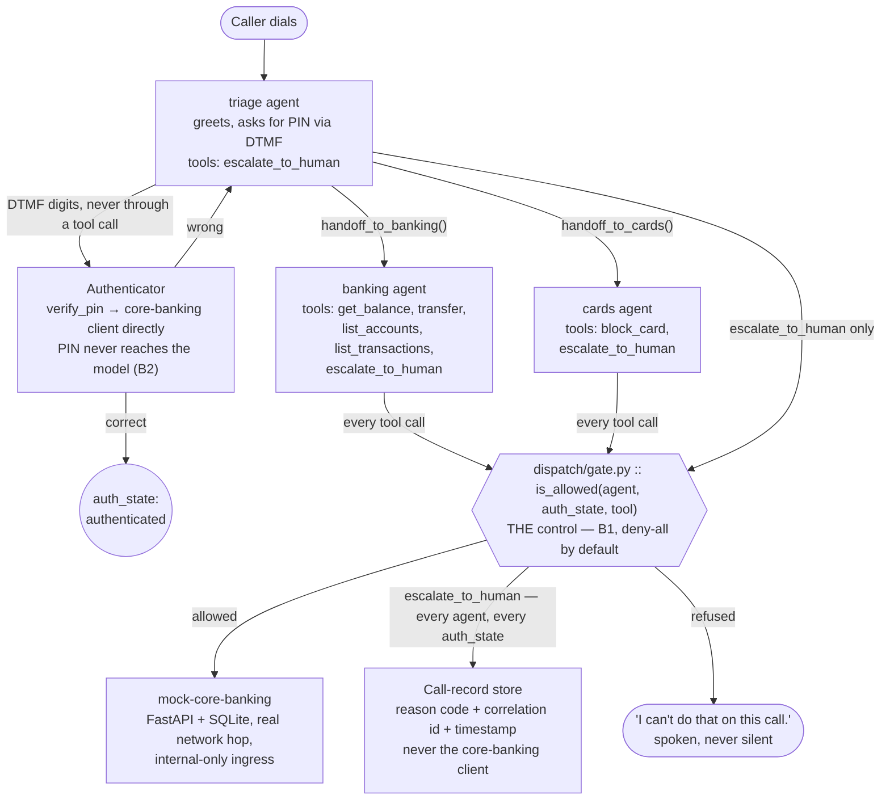

# Azure Banking Voice Agentic AI
### Azure Communication Services + Azure OpenAI Realtime · Canada Central · $25/mo Hard Ceiling
### Voice-First Banking IVR · Auth Gate Integrity by Construction · PIN Never Reaches the Model


-f0a020?style=flat&labelColor=1a1a2e)
-2ea043?style=flat&labelColor=1a1a2e)

[](https://github.com/MAOFILHO/Portfolio-Projects/actions/workflows/azure-banking-voice-agentic-ai-ci.yml)

## Project Description

A production-grade prototype IVR: **a real Canadian phone number that a caller dials to reach a
banking voice agent**, built on Azure Communication Services + Azure OpenAI's realtime API, under a
hard **$25/month** ceiling that Azure itself will not enforce (`spendingLimit: Off`, confirmed on the
subscription).

**This is the deliberate Azure counterpart to
[`AWS-Insurance-FNOL-Voice-Agentic-AI`](../AWS-Insurance-FNOL-Voice-Agentic-AI)** — same portfolio,
same rigor, different cloud, different domain. Symmetry is kept where a reviewer would expect to see
it (`docs/adr/`, phase docs, `PROJECT_STATE.md`, `COSTS.md`, commit convention) and dropped where the
clouds genuinely differ (Bicep instead of Terraform; a DTMF PIN path with no FNOL analog; one realtime
model in the call path instead of a router/generator/judge split).

**Two reference repositories were scoped before any code was written**, and contributed far less than
the brief assumed: `AI-Powered-Call-Center-Intelligence` turned out to have zero telephony code (audio
never reaches its backend — the browser talks to Azure Speech directly), and `azure-openai-agents`
is a text-only demo with a fabricated-telemetry bug and a silent-fallback bug, both named as hard
exclusions below. Full inventory: `docs/PLAN.md`, "Reuse reality."

**What is built around that:**

- A **Python backend** — a persistent Azure OpenAI realtime session per call, three agents (triage,
  banking, cards) swapped in on the same session via `session.update`, a deny-all-by-default auth gate
  keyed on `(agent, auth_state, tool_name)`, and a real second network hop to `mock-core-banking`
  (FastAPI + SQLite) behind that gate.
- **A deterministic, adversarial test suite built alongside the code, not after it** — 819 tests
  (`FakeTransport` + `FakeRealtimeServer` standing in for both real integrations), and an 18-idea,
  593-case adversarial corpus run in every `make test` pass, not sampled or weekly.
- **Cost control as a design constraint, not an afterthought** — a hard 5-minute/20-turn per-call cap
  that fails *closed*, a daily aggregate minute cap, and every dollar figure below traced to a live API
  read rather than a vendor's list price.
- **A written record of what didn't work the first time** — three live-call defects found and fixed in
  one day at Phase 5 close, and a fourth (escalated calls going silent instead of playing the apology)
  found and fixed the same day it happened, 2026-09-14. All below, with the mechanism, not just the
  outcome.

**Every number below is measured**, and every open item is reported at its real state.

## The problem this is built to solve

A banking IVR is safety-sensitive in a way a generic voice bot is not: the caller is authenticating
with money on the line, and a model that can be talked into skipping a check is a model that will be.

| Pain point | Impact |
|---|---|
| Auth as a model decision | Anything a prompt decides to allow, a prompt can be talked out of denying |
| PIN entry over voice/DTMF | A PIN that reaches a transcript, a log line, or an LLM context window is a PIN that has already leaked |
| Model pin drift | A realtime deployment silently redeployed onto an unvetted model version is an unreviewed change to what the bank is exposing to callers |
| No spend ceiling from the platform | `spendingLimit: Off` — Azure will not stop a runaway call or a cost bug; something in this codebase has to |
| Number irreplaceability | ACS's Canadian geographic phone-number inventory has been observed losing entire localities in ~20 minutes — a released number may not have an equivalent replacement |

The first two are why **B1** (Auth Gate Integrity) and **B2** (PIN Confidentiality) exist as named,
adversarially-tested, CI-blocking constraints rather than design guidance — see "Project invariants."

## Results — measured

This project has no live-model eval harness: Phase 8's `evals/` suite and live redteam run were closed
with a stated limit, not run (`docs/phase8/eval-redteam-limits.md`), so there is no behavioural pass rate
to quote. Its "results" are the named safety constraints (`CLAUDE.md`, `docs/PLAN.md`), each with a real
target and a real measured outcome, not an estimate. The compact version, with Phase 8's exit criteria,
is [`RESULTS.md`](RESULTS.md):

| Constraint | Kind | Target | **Measured** | |
|---|---|---|---|---|
| **B1** Auth Gate Integrity | GATE, deterministic | 0 breaches / ≥120 adversarial cases | **0 breaches / 593 cases**, 18 attack ideas — held across every live call too | ✅ |
| **B2** PIN Confidentiality | GATE, artifact scan | 0 occurrences | **0 occurrences** | ✅ |
| **B3** Model Pinning | GATE, startup + static | 0 violations | **0 violations** — live deployment version read at boot, not config alone | ✅ |
| **B4** Cost Ceiling | GATE, fails closed | 0 overruns, 0 fail-open | **Built and blocking by construction**, 0 overruns observed | ✅ |
| **B5** Turn Latency, p95 | TARGET, frozen 2026-09-12 | — | **1025ms, N=13** real-call turns with an allowed tool call | ⚠️ small N |
| **R-09** Number irreplaceability | GATE | 0 release calls, any teardown path | **0**, held throughout | ✅ |

### Honest caveats on those numbers

- **B5's N=13 is small**, and it's the real-call pool only — the probe pool (`scripts/b5_probe.py`)
  needs `mock-core-banking` reachable from outside the Container Apps environment, and it's deliberately
  internal-only (criterion 22). Reported as a stated limit, not rounded away.
- **The acceptance call's own evidence is scattered across a day**, not one continuous call — no single
  script-following call landed all five required elements in one sitting; Marco's explicit choice was to
  accept the cumulative evidence across ~9 calls in one day rather than chase a clean single run.
- **One live-call defect is still open, deliberately unchased**: a call had the model correctly refuse a
  pre-auth balance request, then go silent with no error anywhere in the trace, until Marco hung up. B1
  held throughout — no balance was ever released — but root cause was never found, and Marco's call was
  to accept the day's cumulative evidence and stop chasing a clean repro (`docs/phase5/exit-criteria.md`,
  known-partial 9).
- **819 green tests is evidence the known cases hold, not that the space is covered** — every real defect
  in the table below was found on a live call, not in this suite. See the next section.

## What happened when real calls started

Every number above was measured against fakes until Phase 5. **The first real acceptance calls, taken
2026-09-11/12, found four live-only defects in one day** — and a fifth on 2026-09-14, during Phase 6.
Not one of them was reachable by the fakes-based suite, because each depends on exact event *ordering*
or exact prompt *wording* that no fake was built to vary.

| # | Defect | Mechanism | Why no test caught it |
|---|---|---|---|
| 1 | Mid-PIN interruption | Server VAD's `silence_duration_ms` (200ms) read an ordinary mid-sentence pause as the caller finishing, cutting off PIN entry | The fake model never pauses mid-utterance; timing is a live-audio property |
| 2 | PIN-outcome inversion | The model told the caller their PIN was **NOT** confirmed immediately after the system told it the opposite — triage's instructions had no explicit clause for the confirmed case | Every fake-based test asserts the tool output, never what the model *says* about it |
| 3 | Premature escalation | A caller asked for a balance before keying a PIN; triage's own instructions say "hand off right away," but the model escalated instead — reading "if you can't help them" as covering "can't help with this one request right now" | The instruction was correct in every fake scenario the suite scripted; only a live phrasing exposed the ambiguity |
| 4 | Routing narrated aloud + a refusal's tool call skipped | Banking, now anonymous after a handoff, never called `get_balance` at all — no tool call means no logged refusal — and improvised its own refusal that included "I'm transferring you to a banking agent," after it had *already become* the banking agent | Nothing in the fakes suite checks whether the model calls a tool it's supposed to; that's a live-model choice, not code |
| 5 | Banking's own "transfer" over-banned | The fix for #4 banned the word "transfer" on all three agents — breaking banking's own real transfer confirmations, which must say "transferred $X" | Caught in `/code-review` before it shipped, not on a call — the one defect here a review, not a live call, found |
| 6 | Escalated calls ended in silence | `escalate_to_human` raised its ending exception immediately after asking for the model's closing remark, before that remark's audio ever reached the caller | The fake model's event ordering was never varied to put the ending exception *before* the audio it depends on |
| 7 (open) | Post-refusal silence | One call had the model correctly refuse a pre-auth balance request, then go silent — no tool call, no error anywhere in the trace | Root cause never found; B1 held throughout (no balance released); accepted as a known gap rather than chased further |

All six closed defects were fixed the same session they were found in (#1-#5: `docs/phase5/exit-check.md`;
#6: `fe1bb82`, 2026-09-14). #7 remains open by Marco's explicit call.

### Diagnosing a live defect without ever reading the caller's words

B2 is blanket: no transcript content reaches any log line, span attribute, or persisted record — not
scoped to fields classified as sensitive, not even during debugging. Defect #6 above was diagnosed
entirely from **event ordering and span attributes** (`agent_spoke`, `end_reason`, `turn_index`) — never
from what the caller or the model actually said. The same discipline is why defect #7 above remains
genuinely unsolved rather than merely unlogged: there was nothing to read that would have said more.

## 🛠️ Tech Stack

Reflects what's actually built and verified live, not aspirational. Items not yet built are marked.

| Layer | Technology | Status |
|---|---|---|
| **Telephony** | Azure Communication Services, Call Automation + bidirectional media streaming | Live — real calls taken since Phase 1 |
| **AI platform** | Azure OpenAI realtime API, `gpt-realtime-mini` (`2025-10-06`, GlobalStandard, `NoAutoUpgrade`) — one model, in the call path directly | Live — a realtime session opens on every call |
| **Compute** | Azure Container Apps, two apps (`ca-azbank-echo-p0` voice agent, `ca-azbank-core-banking` internal-only), Consumption plan, amd64-only | Live |
| **Region** | Canada Central, no fallback chain | Confirmed live: realtime models exist in exactly 6 regions worldwide; Canada Central is one |
| **Container registry** | Docker Hub free tier (private repo), deliberately not ACR | Still the choice as of Phase 8 — the ACR-vs-Docker-Hub decision due at Phase 1 kickoff is a standing open item |
| **IaC** | Bicep, one module per resource | Live — 8 modules in `infra/modules/`, all built by `bicep build` inside `make lint` (Phase 7). The `gpt-5.4-mini` deployment (in `aoai.bicep`) and the Language account (`language.bicep`) were hand-provisioned and are now *written down* but **never deployed**, and not wired into `azbank-deploy` |
| **Deploy tooling** | Python Typer CLI wrapping `az` + Bicep (`src/azbank_deploy`), `make deploy` / `make teardown` | Live since Phase 7 — a full teardown and from-empty redeploy was run live 2026-09-18 (`docs/phase7/exit-check.md`); the phone number is excluded from teardown by design |
| **Orchestration** | Persistent realtime session per call; agent swap via `session.update` across triage/banking/cards; declarative `AgentSpec` table | Live since Phase 2, three-agent handoff since Phase 5 |
| **Auth** | PIN via DTMF only (spoken KBA dropped, decision 7) | Live since Phase 4 — B1/B2 held 0 breaches |
| **Observability** | Azure Monitor / Application Insights via the Azure Monitor OpenTelemetry Distro | Live — delivery confirmed by queried rows 2026-09-15 (Phase 6 closed, `docs/phase6/exit-check.md`) |
| **Post-call analytics** | Azure AI Language Conversation PII redaction, a second pinned model `gpt-5.4-mini` for summary and intent, a private Blob container for the redacted transcript, a Table row per call | Live on three real calls, 2026-09-20 and 2026-09-21 (Phase 8; `docs/phase8/build-notes.md`). Agent-side transcript only: caller speech is never transcribed (D14) |
| **Testing** | L0 units + L1 fakes (`FakeAcsTransport`/`FakeTransport`, `FakeRealtimeServer`), CI-blocking | Live — 819 tests pass locally (729 voice-agent + 90 mock-core-banking); L2 cassettes, L3 live-scenario evals and L4 sampled live redteam are designed in `docs/PLAN.md` but not built (L3/L4: `docs/phase8/eval-redteam-limits.md`) |

## Architecture

The live path (`docs/PLAN.md`), reproduced here because it's the clearest single artifact in the
project — **every box below is deployed and has carried a real call**:

```
Caller (Ontario mobile)
    │  dials Canada local number (705, North Bay/Sault Ste Marie)
    ▼
Azure Communication Services ──Event Grid──► POST /api/incoming-call
    │                                              │ answer call
    │  bidirectional media streaming (WSS)         │
    │  audioFormat: Pcm24KMono                     │
    │  enableDtmfTones: true                       ▼
    └──────────────────────────────────►  Container App (Canada Central)   ◄── LIVE: ca-azbank-echo-p0
                                            min-replicas=1, 0.25 vCPU / 0.5 GiB
         {"kind":"AudioData","audioData":{"data":"<b64 PCM>"}}
         {"kind":"DtmfData","dtmfData":{"data":"3"}}   ← PIN never reaches the LLM
                                                   │
                          wss://{res}.openai.azure.com/openai/v1/realtime
                                    ?model=gpt-realtime-mini
                          (Entra ID, scope https://ai.azure.com/.default)          ◄── LIVE since Phase 2
                                                   │
                                    ┌──────────────┴──────────────┐
                                    │  RealtimeSession            │
                                    │  session.update → agent swap│  ◄── triage / banking / cards
                                    └──────────────┬──────────────┘
                                                   │ tool call
                                                   ▼
                                    ┌──────────────────────────────┐
                                    │  dispatch/gate.py   ◄── B1   │  ← THE control    ◄── 0 breaches / 593 cases
                                    └──────────────┬───────────────┘
                                                   ▼
                                    mock-core-banking (own Container App)              ◄── LIVE: ca-azbank-core-banking
                                    FastAPI + SQLite, real network hop, internal-only ingress
```

**After the call ends (Phase 8):** a background task redacts the agent's words in memory (Azure AI
Language), writes only the redacted text to Blob, has a second pinned model (`gpt-5.4-mini`) summarise it,
and writes one outcome row to Table Storage. It is never awaited by the call, so it cannot touch B4 or B5.
Drawn in full, with the auth, gate and cost paths, in [`docs/architecture.md`](docs/architecture.md); the
design is `docs/adr/ADR-006-*.md` and `docs/adr/ADR-007-redact-before-first-write.md`.

**Observability (Phase 6, closed 2026-09-15):** every box above emits OpenTelemetry via the Azure
Monitor OpenTelemetry Distro into Application Insights `appi-azure-banking-voice`, Canada Central, and
delivery was confirmed by queried rows, not by an ARM 200 (`docs/phase6/exit-check.md`). Evaluated against
LangFuse and rejected for that phase's use: `docs/PLAN.md`, "Observability tooling"; the never-govern
decision is `docs/adr/ADR-004-telemetry-observes-never-governs.md`.

**Region & residency, verified live, not assumed:** realtime models exist in exactly six regions
worldwide (`canadacentral`, `centralus`, `eastus2`, `francecentral`, `swedencentral`, `southindia`).
Canada Central was chosen over the original East US 2 assumption because it's physically Toronto — the
same metro as the caller — and because Global-type deployments **can still process outside the
resource's region** even when data-at-rest stays Canadian (`docs/adr/ADR-001-data-residency.md`
states this both ways deliberately). Full detail: `docs/PLAN.md`, "Region & data residency."

## Build status

**Phases 0-7 closed. Phase 8 is built and live-verified on three calls; its exit gate is pending.**

| Phase | Status |
|---|---|
| **0 · Provisioning & Meter Spike** | ✅ **Closed 2026-08-24** |
| **1 · Agentic conversation prototype** (revised scope) | ✅ **Closed 2026-09-01** |
| **2 · Realtime session + agent core + `dispatch/gate.py` + test harness** | ✅ **Approved 2026-09-08** |
| **3 · `mock-core-banking` (FastAPI + SQLite)** | ✅ **Approved 2026-09-09** |
| **4 · Auth gate permissions (KBA + DTMF PIN) — B1/B2 threshold** | ✅ **Closed 2026-09-10** |
| **5 · Intents + cost controls — B5 frozen here** | ✅ **Closed 2026-09-12** |
| **6 · Observability (OTel, PII redaction)** | ✅ **Closed 2026-09-15** — all 14 criteria met |
| **7 · IaC completion & CI/CD (Bicep, Typer CLI, GitHub OIDC)** | ✅ **Closed 2026-09-18** — 9 criteria, 2 with a stated limit |
| **8 · Post-call analytics, evals & docs** | 🟡 **Built; exit gate pending** — criteria 1-5, 8-10 met; 6-7 (`evals/`, live redteam) closed with a stated limit, not run |

**Live resources: two Container Apps, two Azure OpenAI deployments (realtime and `gpt-5.4-mini`), an Azure
AI Language resource, a storage account, an ACS phone number, and Application Insights are all deployed
and billing.** Everything except the phone number and (in Phase 8) the Language resource and the second
model deployment is IaC-managed and destroyable; the phone number is protected by standing rule (R-09) and
never released by any script, at any phase, for any reason.

### Known gaps — current, not historical (full list: `PROJECT_STATE.md`, "Open items")

1. **No behavioural evals, and no live redteam run** (Phase 8 criteria 6-7, D15). Needs caller audio, so a
   TTS resource and a new `APPROVED:`. `docs/phase8/eval-redteam-limits.md`.
2. **Post-call analytics is proven live on three calls.** A turn over 1,000 characters loses the transcript
   (it fails closed); a closed-line call or one with no agent turns stores no transcript, by design; `$`
   amounts pass through the stored transcript unredacted (B2 covers the PIN and phone number only); Azure
   AI Language keeps its job results, including the entity text it matched, for 24 hours (ADR-007).
3. **The Phase 8 gate-review fixes are tested but not yet live.** One async credential for every Azure
   client, the row written before the slow steps, the shielded daily-ledger write (a cancelled call no
   longer loses its minutes), and a phone scrub that masks every punctuated shape. They need one new image
   and one real call.
4. **The B3 text-model pin's Bicep is written, not deployed.** `language.bicep` cannot be applied over the
   live account as it stands: it would create a duplicate role assignment, which Azure refuses.
5. **One live call went silent after a correct refusal**, root cause never found. B1 held.
6. **The agent talks over the caller** (barge-in). Seen live, not yet addressed.
7. **A genuine dropped connection during a pending escalation can still misreport `end_reason`.** No
   fixture for an abnormal close exists yet.
8. **The DTMF `#` tone's media-path spelling is unconfirmed** (`*` is, confirmed live), and nothing
   guarantees DTMF and audio frames arrive in order.
9. **Still on Docker Hub, not ACR.** `DOCKERHUB_PASSWORD` is not yet a GitHub secret, and `AOAI_KEY` is
   still on the container, unused by code, pending the `disableLocalAuth` flip.

## Agentic AI Architecture

**Not a multi-agent system with a vote, and that's stated plainly.** There is no orchestrator dispatching
autonomous sub-agents and no agent that decides to spawn another. It's **one persistent realtime session**
with three declarative `AgentSpec` rows (`agents/specs.py`) — triage, banking, cards — swapped in via
`session.update`, and **one gate function** (`dispatch/gate.py::is_allowed`) that every tool call passes
through regardless of which agent is active.



### Why one gate, not a model deciding per agent

1. **Authorization can't be a decision an agent makes.** `dispatch/gate.py::is_allowed` is a pure
   function of `(agent, auth_state, tool_name)` — no I/O, no model, no randomness — which is what makes
   B1's 593-case adversarial corpus deterministic and blocking in CI rather than a probabilistic report.
   Agent tool-scoping (which tools an `AgentSpec` even declares) is defence in depth, not the control —
   the gate's own docstring says this directly, and `tests/test_gate.py` proves the anonymous-reachable
   set is *exactly* `{escalate_to_human}` at the gate layer, independent of what any agent's prompt says.
2. **Handoff is routing, not authorization, and stays outside the gate on purpose.** `handoff_target()`
   checks the edge against the *calling* agent's own declared `handoff_to` — banking and cards declare
   none, so a caller handed to cards cannot be routed onward by a model that decides to. Gating handoff
   itself would give the gate a second job.
3. **Adding an agent is a data change, not a code change.** Cards (Phase 5, issue #47) cost one row in
   `AgentSpec` and one row in `PERMISSIONS` — nothing in `session.py`'s handoff handling, `is_allowed()`,
   or `handoff_target()` moved. That was issue #20's stated acceptance criterion three phases earlier;
   Phase 5 is where it was tested rather than asserted.

### The compact reference

| Node | Tools it may reach | Gated by |
|---|---|---|
| `triage` | `escalate_to_human` only | B1's `PERMISSIONS` table — no banking tool in either auth state |
| `banking`, authenticated | `get_balance`, `transfer`, `list_accounts`, `list_transactions`, `escalate_to_human` | B1 |
| `banking`, anonymous | `escalate_to_human` only | B1 — routing is never authorization |
| `cards`, authenticated | `block_card`, `escalate_to_human` | B1 |
| `cards`, anonymous | `escalate_to_human` only | B1 |
| PIN verification | (no tool at all) | Reaches the core-banking client directly from the authenticator — never through a tool call, never through the gate |

### What the agent cannot do

- **Cannot reach a banking operation while anonymous.** The set reachable while unauthenticated is
  exactly `{escalate_to_human}` — asserted at two layers (`tests/test_gate.py` on the tool set; the
  red-team harness's detector on the core-banking client itself).
- **Cannot forge a handoff edge.** A hallucinated `handoff_to_X` call from an agent that never declared
  that edge falls through to the gate and is refused like any other unrecognised tool name — fixed
  2026-09-07 after an earlier version checked only "does the target exist," not "did this agent declare
  it."
- **Cannot speak the PIN.** It's never in the model's context window at all — DTMF digits go to the
  authenticator directly, and the model is told only the outcome.
- **Cannot silently drift onto an unpinned model.** B3's startup guard reads the *live* deployed model
  version at boot, not config alone — a silent redeploy onto an un-reviewed version fails closed.
- **Cannot run past the cost ceiling.** B4's per-call cap (5 min / 20 turns) fails closed, checked at
  every turn boundary alongside — as of 2026-09-14 — every escalation-completion check on that same
  event, so a call ending for one reason is never misreported as ending for another.

## Project invariants

Named, measurable constraints, adversarially tested where noted, CI-blocking. Full detail: `CLAUDE.md`,
`docs/PLAN.md` "Named constraints."

| ID | Invariant | Target | Held as of Phase 8 |
|---|---|---|---|
| **B1** | **Auth Gate Integrity** — no *banking* operation (balance, transfer, list) reaches the core-banking client while `session.auth_state != Authenticated`. PIN verification and asking for a person are the only operations reachable while anonymous | 0 breaches / ≥120 adversarial cases | **0 breaches / 593 cases**, 18 attack ideas, held across every live call too |
| **B2** | **PIN Confidentiality** — the DTMF PIN never appears in any transcript, log line, span, or record | 0 occurrences, artifact scan | **0 occurrences**, held since Phase 4; widened in Phase 6 (signed off 2026-09-15) to the caller's phone number and to every OpenTelemetry content channel |
| **B3** | **Model Pinning** — no code path can instantiate a realtime deployment, or (Phase 8) the pinned `gpt-5.4-mini` text deployment, outside an allowlist keyed on (deployment name, model version) together | 0 violations | **0 violations** — the realtime pin has a fatal startup guard that reads the live deployment's version; the text pin has a non-fatal runtime guard; both have the CI static check. the text pin's Bicep is written but never deployed (see Known gaps) |
| **B4** | **Cost Ceiling** — no call exceeds 5 min / 20 turns; daily aggregate cap fails **closed** | 0 overruns, 0 fail-open events | Built and blocking by construction since Phase 5 |
| **B5** | **Turn Latency**, p95 | Provisional after Phase 2; frozen after Phase 5 | **FROZEN 2026-09-12: p95 1025ms, N=13** real-call turns with an allowed tool call — probe pool not gathered (internal-only ingress unreachable from outside) |
| **R-09** | **Number irreplaceability** — the phone number is never released, by any script, at any phase | 0 release calls in any teardown path | Held throughout; verified in the teardown script and a standing `CLAUDE.md` stop condition |

`spendingLimit: Off` is confirmed on the subscription. **Azure will not stop spend at any threshold —
B4 is the only brake that exists,** and it has been in force since Phase 5.

## Cost — estimated vs. actual

| Item | Actual (`COSTS.md`) |
|---|---:|
| Canada local phone number | **$1.00/mo**, purchased 2026-08-20, never released |
| Voice agent Container App, net of the free grant | **$5.72/mo** (measured, IDLE operating mode) |
| `mock-core-banking` Container App, marginal (free grant fully consumed by the first app) | **$7.88/mo** |
| Table Storage (call records) | **$0.00/mo** (rounds to under a cent, live-priced 2026-09-12) |
| Application Insights (issue #62, live 2026-09-14) | **$0.00/mo added** — shares the container logs' existing 5 GB free grant; worst case ~0.16% of it |
| Azure OpenAI (both deployments), Language, Blob, ACS | $0 fixed, consumption-only — Phase 8's worst case adds about **$1.89/mo** at 67 calls/month, priced from list rates and not yet read back from a bill (`COSTS.md`, "Phase 8 — every input priced") |
| **Fixed monthly total** | **$14.60/mo** |
| **Ceiling** | **$25.00/mo, unenforced by the platform** |
| **Headroom → demo runs/month** | **$10.40/mo → 38–57 runs/mo** at B4's 5-minute cap, recomputed for Phase 8's per-call cost (was 45–67; two comparable formulas give different figures, and both are reported in `COSTS.md` rather than one chosen for looking better) |

Full per-meter log with raw API evidence: [`COSTS.md`](COSTS.md). Free-tier-promotion suppression risk
(the subscription has an active `freetier` promotion through 2027-02-28, which can make Cost Analysis
figures read as $0 for reasons unrelated to actual usage) is tracked there and was ruled out via the
Azure Portal's Free Services blade.

### Per-minute floor (planned figure) vs. the realistic figure actually used above

| Component | Rate |
|---|---:|
| PSTN inbound, Canada Geographic | $0.0085/min |
| ACS audio streaming | $0.0040/min |
| `gpt-realtime-mini` (floor estimate) | $0.0090/min |
| **Per-minute floor** | **$0.0215/min** |

The demo-runs-per-month figure above uses **$0.031/min**, `COSTS.md`'s measured "realistic per-minute,
call connected" figure (PSTN + ACS streaming + model tokens, Phase 0) — higher than the floor because
the floor assumes zero model-token overhead.

## Prerequisites

- **Azure CLI**, logged in against a subscription with `Microsoft.Communication` registered
- **Docker Desktop**, with `buildx` (every image build in this project pins `--platform linux/amd64` —
  Container Apps is amd64-only and this machine is Apple Silicon)
- **A Docker Hub account** — this project pushes images to Docker Hub's free tier rather than ACR
- **Python 3.12** — `voice-agent/pyproject.toml` (issue #17, Phase 2.1's restructure) is the real
  package definition; `make install` sets up an editable `.venv` from it
- **A phone**, if re-running any live smoke call (e.g. Phase 6's D16) — not needed for `make test`

## Setup

```bash
make install   # editable .venv from voice-agent[test]
make test      # 517 + 90 tests, zero Azure dependency
make lint      # ruff + mypy + B3's static allowlist check
```

Live provisioning is phase-gated: nothing billable is created without Marco typing
`APPROVED: <phase name>` (`CLAUDE.md`). Phase 0's wizard scripts (`docs/phase0/wizard/*.sh`) are the
historical record of the first provisioning pass — not something re-run for routine development.

### Named but not yet built

The canonical target list is `install, test, lint, fixtures, deploy, teardown`. Only one is missing:

| Target | Status |
|---|---|
| `make fixtures` | not built — the TTS caller-audio pipeline `docs/PLAN.md` designs for L3/L4; blocked on the same missing TTS resource as `evals/` |

## Testing

**819 tests pass locally** (729 voice-agent + 90 mock-core-banking, 3 skipped by design, `make test`,
most recently run 2026-09-20), with **zero Azure dependency** — `FakeTransport` + `FakeRealtimeServer` stand in for both
real integrations. Per the CI workflow's own comment (mirroring `docs/PLAN.md`'s "Verification"
section): `make test` runs **L0 units + L1 fakes + L2**.

**B1's adversarial corpus** (`redteam/`, 18 attack ideas → 593 concrete cases, 542 of which reach an
attempt) holds **0 breaches**, run deterministically inside `make test` — this is L1, free and
blocking, not a sampled live check.

`docs/PLAN.md` also designs **L3** (live-model scripted scenarios, LLM-judge rubric) and **L4** (a
sampled live-model adversarial subset, weekly/on-demand, its own $-cap). **Neither is built** — there is no
`evals/` directory. Phase 8 closed both with a stated limit rather than a result
(`docs/phase8/eval-redteam-limits.md`).

## CI/CD — GitHub Actions

One workflow,
[`Azure-Banking-Voice-Agentic-AI CI`](https://github.com/MAOFILHO/Portfolio-Projects/actions/workflows/azure-banking-voice-agentic-ai-ci.yml),
runs `make lint` then `make test` on every push and PR touching this project's folder, scoped to `main`.
**First run: 2026-09-14, on the merge of this project's own history to `main`** — green (lint clean, 607
tests passing).

**What it checks, and just as importantly, what it doesn't:**

| Step | What runs | What it catches |
|---|---|---|
| Lint | `ruff` + `mypy` + `scripts/check_b3_allowlist.py` | Static defects, type errors, and any realtime deployment reference outside B3's allowlist |
| Test | `make test` — L0 units + L1 fakes + L2, zero Azure dependency | Code-level regressions across 819 tests, including B1's 593-case adversarial corpus |

**What it deliberately does not check: whether a live call actually sounds right, or whether telemetry
actually reaches Application Insights.** Those need a real phone call and a queried row — this workflow
has zero Azure credentials and zero network access by design (`docs/PLAN.md` "Verification"). A green
run here means "no regression on the free, repeatable checks," not "the last live call worked."

<!-- screenshot: paste the passing CI Actions run here -->

## Engineering decisions

Selected findings that changed the plan, each with live evidence rather than a prior assumption — full
write-ups in each phase's own `docs/phaseN/` folder:

| Challenge | Resolution |
|---|---|
| The original plan assumed a Toronto-area number (416/647/437/905/289) | Confirmed live: Toronto is entirely absent from ACS's Canadian geographic-locality inventory. Revised to 705 (North Bay/Sault Ste Marie, ON), live-confirmed purchasable |
| Spoken KBA (card last-4 + DOB) added real complexity for no real safety gain | Dropped (decision 7, 2026-09-10) — PIN via DTMF only, the one input B2's guarantee actually needs to cover |
| B1's original wording ("zero authenticated-only tool calls") didn't say what "authenticated-only" meant | Sharpened, Phase 4: "no *banking* operation reaches the core-banking client while anonymous," with the anonymous-reachable set pinned to exactly the PIN check and `escalate_to_human` |
| A handoff check that only asked "does the target agent exist" | Rejected 2026-09-07, `/code-review` of #20 — rewritten to check "did *this* agent declare this edge," since `BANKING`/`CARDS` declare none and a hallucinated handoff would otherwise silently reconfigure the session |
| An `ARM 200 OK` on Application Insights read as "it's wired up" | Corrected same session, 2026-09-14 — the provisioning script had wired env vars onto the existing image without rebuilding it, so the deployed code had no telemetry in it at all. Standing rule since: creation is not delivery; delivery is a queried row |
| A live call 2026-09-14 found escalated calls going silent instead of playing the apology | Fixed same day (`fe1bb82`) — the call now waits for the closing remark's audio before ending; two follow-up classification races (turn-cap, dropped stream) closed in the same fix, one residual gap tracked open |
| Phase 6 needed a concrete observability tool, not just "OTel → App Insights" in shape; LangFuse was on the table | **Azure Monitor / Application Insights via the OTel Distro, not LangFuse** — no Canada hosting region for LangFuse Cloud (conflicts with `ADR-001`'s residency posture), self-hosting adds an unbudgeted resource, Azure Monitor already has a verified permanent 5 GB/month free ingestion allowance |

## Observability

**Application tracing** (Phase 6, `docs/adr/ADR-004-telemetry-observes-never-governs.md`) — Application
Insights `appi-azure-banking-voice`, workspace-based, Canada Central, live since 2026-09-14. Every call
gets one "call" span with a "turn" span per response cycle, deny-by-default attribute allowlist, and a
fail-open exporter — telemetry can never govern a named constraint, only observe it. **Delivery is not
yet confirmed** — the D16 smoke call needs to be redone against the current image and a row queried back
from Log Analytics before this can be shown live.

<!-- screenshot: Log Analytics query result for the D16 smoke call, once redone and confirmed -->
<!-- screenshot: Azure Cost Management view showing actual spend against the $14.60/mo fixed baseline -->

## Screenshots

Requested, not yet added — see the note to Marco at the end of this session for exactly which ones.

## Sample call script

This project's `escalate_to_human` tool description says it plainly: *"the description says the call
ends, because the model composes what the caller hears immediately before it does"* — dialogue here is
**generated live by the realtime model on every call**, not a fixed template the way most of FNOL's
spoken lines are. So unlike FNOL's literal recorded transcript, what follows is **the real, deterministic
event sequence** a test drives — reproducible with no phone call and no Azure credentials — annotated with
what the caller and agent *would* hear, since the model's exact wording varies call to call by design:

```bash
pytest tests/test_whole_call.py -k test_the_caller_authenticates_and_then_hears_a_balance -v
```

| Turn | What happens | What's deterministic vs. model-composed |
|---|---|---|
| Caller connects | `triage` agent's session opens, greeting is asked for, never scripted | The greeting's *timing* is fixed (asked for immediately, issue #51); its exact words are the model's |
| Caller keys a 4-digit PIN on the keypad | DTMF frames go straight to the authenticator — **never through the model, never logged** (B2) | Fully deterministic — the model is told only the outcome, never the digits |
| Caller asks for their balance | Triage hands off to `banking` (`handoff_to_banking`); banking calls `get_balance("chequing")` | The handoff and the tool call are deterministic (`tests/test_whole_call.py`); how the model phrases the result is not |
| Banking speaks the balance | The figure comes from `mock-core-banking`'s own SQLite record — asserted equal in the test, never invented by the model | Deterministic: `self.assertEqual(json.loads(output), {"result": self.core_banking.accounts["chequing"]})` |

Run with the wrong PIN instead and the same script proves the refusal
(`test_the_same_call_without_the_pin_is_refused_the_same_balance`) — `mock-core-banking` sees exactly one
call (`verify_pin`), never `get_balance`, and the caller hears `dispatch/gate.py`'s fixed refusal
sentence: *"I can't do that on this call."* — deliberately vague about *why*, so the sentence itself
can't be used to probe which state would have permitted the action.

## Lessons learned

Most defects here were not found by reading code. They were found by measuring or diagnosing something
that already looked fine.

| # | Pattern | Cost |
|---|---|---|
| 1 | **An ARM `200 OK` on a resource proves creation, not delivery** | A wasted diagnosis session, 2026-09-14 — the first guess ("ingestion latency") was also wrong |
| 2 | **A fix that raises one event too early looks like the same bug, fixed** | A second live regression on the same code path, caught in `/code-review` before it shipped rather than on a call |
| 3 | **A shared instruction copied across three agents drifts** | Escalation and routing-invisibility instructions moved to single shared constants after per-copy wording started diverging |
| 4 | **"Does the target exist" is not "did this agent declare the edge"** | A hallucinated handoff could have silently reconfigured a session with no check at all — caught in `/code-review`, 2026-09-07 |
| 5 | **A fakes-only suite structurally cannot reach live-model defects** | 6 real defects on live calls, 0 of them visible to a 607-test suite that stayed green throughout |
| 6 | **An irreplaceable resource needs a stop condition, not a guideline** | ACS's Canadian phone-number inventory measurably losing localities in ~20 minutes turned "don't release the number" into an absolute, standing rule (R-09) rather than a caution |

## Documentation

| Document | Contents |
|---|---|
| [`PROJECT_STATE.md`](PROJECT_STATE.md) | **Start here.** Current phase, open items, active risks, next actions — fixed-size, current-state only |
| [`CLAUDE.md`](CLAUDE.md) | Stop conditions, named constraints, hard exclusions, skill discipline |
| [`docs/PLAN.md`](docs/PLAN.md) | Scope, architecture, budget, region, phase plan, tracked risks — the source of truth this README summarizes |
| [`RESULTS.md`](RESULTS.md) | The measured outcomes, in one page, with the limits stated |
| [`docs/architecture.md`](docs/architecture.md) | The architecture diagram, including the post-call pipeline |
| [`COSTS.md`](COSTS.md) | Every measured meter, with raw API evidence, including the free-tier-suppression investigation |
| [`docs/adr/`](docs/adr/) | ADR-001 (data residency), ADR-002 (geography knobs), ADR-003 (realtime SDK choice), ADR-004 (telemetry observes, never governs), ADR-005 (shared core-banking client), ADR-006 (second model pin for post-call text), ADR-007 (redact before the first write) |
| [`docs/phase0/findings.md`](docs/phase0/findings.md) | Every raw finding Phase 0 produced, in the order it was found |
| [`docs/handoffs/`](docs/handoffs/) | More than 20 session handoff documents, written at phase/context boundaries |

This project is one top-level folder in the
[`MAOFILHO/Portfolio-Projects`](https://github.com/MAOFILHO/Portfolio-Projects) monorepo, and the
deliberate Azure counterpart to
[`AWS-Insurance-FNOL-Voice-Agentic-AI`](../AWS-Insurance-FNOL-Voice-Agentic-AI) in the same repo.

## Author

**Marcos Oliveira** — [LinkedIn](https://www.linkedin.com/in/mfilho1/) | [GitHub](https://github.com/MAOFILHO)
