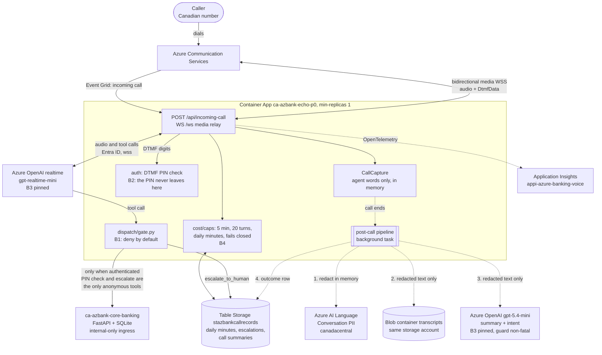

# Architecture

Every box is deployed in `rg-azure-banking-voice-agentic-ai`, Canada Central. The solid path is the live
call; the dashed path is Phase 8's post-call pipeline, which starts only after the call has ended and is
never awaited by it (ADR-006 Decision 4). Written 2026-09-20, against image `p8a`. Confirm the live
resources against the Azure API before relying on it (`CLAUDE.md`, Resume discipline).

## Reading it

- **B1** is one function of (agent, auth state, tool). No banking operation reaches `ca-azbank-core-banking`
  while the caller is anonymous. **B2**: a PIN arrives as DTMF and is checked in `auth`; it never reaches
  the model, a log line, a span or a stored record. **B4** is the only spend brake, because the subscription
  has `spendingLimit: Off`.
- **The post-call path redacts before it writes** (ADR-007). A transcript that cannot be redacted is never
  written raw: the call gets a row saying so, and no transcript and no summary. Both the blob and the
  summary take only the redacted text.
- **Every post-call step can fail on its own** and costs one field of one row. The row is written last.
- **Auth to every Azure service is a managed identity token**, with no keys in code. The storage account has
  shared-key access off.
- Not drawn: the phone number `+17059100383` (an ACS resource, never released by any script), the Event Grid
  subscription, and the deploy CLI (`make deploy`, `make teardown`).

Related: `docs/PLAN.md` (source of truth for scope and budget), `docs/adr/`, `CONTEXT.md` (glossary).
