# Microsoft Foundry Agentic FineTuning Platform

**Live:** [black-bay-02b703b0f.7.azurestaticapps.net](https://black-bay-02b703b0f.7.azurestaticapps.net) (Microsoft sign-in required — see [Live deployment](#live-deployment))

A production-grade, zero-console-click replacement for two Microsoft Foundry
hands-on lab guides ("Explore and compare models" and "Fine-tune a language
model") — both 100% portal click-throughs in their original form. This
project automates every step behind a LangGraph orchestrator over Model
Context Protocol (MCP) tools, a FastAPI backend, a Contoso-themed React UI,
and cost-guarded Terraform IaC.

## Business case

The two source labs teach the same underlying workflow — deploy a model,
evaluate it, fine-tune it, compare it — entirely through manual portal
clicks: browse the model catalog, read a leaderboard, click through a
fine-tuning wizard, babysit a 60-minute training job, eyeball two chat
responses side by side. None of that is reproducible, testable, or
automatable as written.

This project turns that into three one-click workflows backed by a real agentic
pipeline: an **Orchestrator Agent** routes each request to one of three
**Sub-Agents** (Discovery, Fine-Tune, Comparison), each of which talks to
Azure exclusively through typed **MCP tools** — the same tools Claude
Desktop/Code could call directly, since nothing here is UI-specific. The
whole thing runs at **$0** by default (`DEMO_MODE=mock`, fixture-backed, no
Azure account needed) and switches to real Azure Foundry calls with one
environment variable.

## Architecture

```
                        React + TypeScript (Contoso theme)
              fixed 18% sidebar · static auth demo/demo123 · 3 workflow triggers
                                      │ REST
                        ┌─────────────▼─────────────┐
                        │   FastAPI  (src/app)      │
                        │  /catalog /finetune       │
                        │  /inference /agent /auth  │
                        └─────────────┬─────────────┘
                                      │
                        ┌─────────────▼─────────────┐
                        │  LangGraph Orchestrator   │  ← supervisor, routes by intent
                        └──┬──────────┬──────────┬──┘
                           │          │          │
                  ┌────────▼──┐ ┌─────▼─────┐ ┌──▼──────────┐
                  │ Discovery │ │ FineTune  │ │ Comparison  │   sub-agents
                  │  Agent    │ │  Agent    │ │   Agent     │
                  └────────┬──┘ └─────┬─────┘ └──┬──────────┘
                           │  MCP (stdio/JSON-RPC)│
                  ┌────────▼──┐ ┌─────▼─────┐ ┌──▼──────────┐
                  │mcp-catalog│ │mcp-finetune│ │mcp-inference│  3 MCP servers, 19 tools
                  └────────┬──┘ └─────┬─────┘ └──┬──────────┘
                           └──────────┼──────────┘
                                      │ mock fixtures  ⇄  live Azure SDK
                        ┌─────────────▼─────────────┐
                        │  Azure AI Foundry (eastus2)│
                        └───────────────────────────┘
```

**Why MCP servers and not plain functions:** the same three servers
(`mcp_servers/foundry_{catalog,finetune,inference}`) are directly usable by
Claude Desktop/Code as standalone MCP servers — the Azure tooling built here
is reusable outside this app, not locked to its UI.

**Mock vs. live:** every MCP tool has the identical schema in both modes;
`DEMO_MODE` only swaps the backing implementation
(`src/app/services/fixtures.py` vs. `src/app/services/azure_foundry.py`).
Nothing in the agents, routers, or frontend branches on mode.

## Data flow

### Request lifecycle

Every workflow runs as a background job, not a single blocking request —
necessary once live-mode runs started taking 10–60 minutes (see
[Troubleshooting #5](docs/TROUBLESHOOTING.md)). The frontend polls for
progress and survives a refresh by resuming the same job id from
`localStorage`.

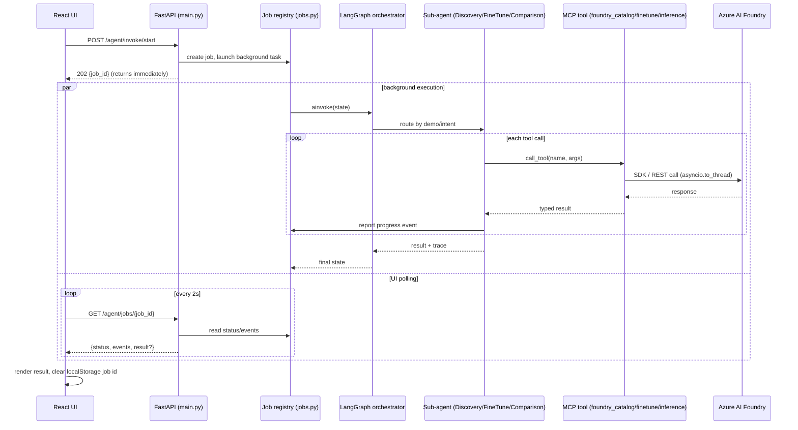

### Fine-tuning workflow (Workflow 2), step by step

The one workflow with real, irreversible spend and a ~60-minute training
wall-clock, so every step either validates before spending or degrades
gracefully instead of crashing — see
[Troubleshooting #6–7](docs/TROUBLESHOOTING.md) for the two live bugs this
sequence exposed (an async file-processing race, and a premature deploy
attempt that used to crash the whole run).

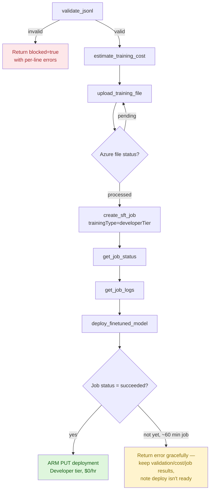

## The three workflows

| Workflow | Reproduces | What it does |
|---|---|---|
| **1 — Model Discovery & Evaluation** | *Explore and compare models* | Catalog browse, 4-axis leaderboard (quality / safety / throughput / cost — no single model wins all four), gpt-5.4 vs. gpt-5.4-mini comparison, 45-row synthetic evaluation across 16 evaluators (98% / 704/720, matching the lab exactly) |
| **2 — Supervised Fine-Tuning** | *Fine-tune a language model* | JSONL validation (schema violations shown as a feature, not an error), pre-spend cost estimate, SFT job submission on `gpt-4.1`, live progress (100 steps, final loss 0.02), $0/hr Developer-tier deployment. Also ships a **selectable dataset catalog** — 7 additional domains (support triage, healthcare, e-commerce, IT helpdesk, banking, gardening) converted from AWS Bedrock's format, validated and cost-estimated on demand, without touching the lab's own dataset or numbers. |
| **3 — Agentic Inference & Comparison** | Both labs' baseline-vs-fine-tuned pattern | Five canonical prompts, identical system message on both sides, scored on **behaviour** (friendly tone, no hotel/flight/car/restaurant recommendation, ends with a question) — not string equality, since the guide explicitly warns outputs are non-deterministic |

## Prerequisites

- Python 3.12+, Node.js 20+
- **Mock mode (default): nothing else.** Runs at $0 with no Azure account.
- **Live mode:** an Azure subscription with Owner/Contributor rights, `az
  login` completed, quota for the `gpt-5.4` family and `gpt-4.1` fine-tuning
  access in `eastus2`.

## Quickstart

```bash
make setup          # venv + Python deps + frontend deps + .env from .env.example
make run             # all 3 workflows end-to-end, mock mode, $0 — writes outputs/*.json
make api             # FastAPI on :8000  (try curl localhost:8000/health)
make frontend         # React dev server on :5173 — login demo / demo123
```

Or with Docker (no Python/Node install needed):

```bash
docker compose up    # backend :8000, frontend :8080 — both $0, mock mode
```

Going live:

```bash
make provision       # budget alert FIRST, then Terraform apply, then live smoke tests
DEMO_MODE=live make run
make teardown         # destroys every tagged resource, at every suffix, then verifies zero survive
```

## Environment variables

| Variable | Default | Purpose |
|---|---|---|
| `DEMO_MODE` | `mock` | `mock` = fixtures, $0. `live` = real Azure Foundry calls, real billing. |
| `AZURE_SUBSCRIPTION_ID` / `AZURE_TENANT_ID` | — | Only needed in live mode. |
| `AZURE_LOCATION` | `eastus2` | Locked — matches every screenshot in both source lab guides. |
| `AZURE_FOUNDRY_ENDPOINT` / `AZURE_FOUNDRY_API_KEY` | — | Populated automatically by `make provision` → `app.cli sync-env`. |
| `PROJECT_BASE_NAME` | `foundry-travel` | Base for Terraform's auto-increment naming (`-v1`, `-v2`, …). |
| `MODEL_BASELINE` / `MODEL_COMPARE_A` / `MODEL_COMPARE_B` | `gpt-4.1` / `gpt-5.4` / `gpt-5.4-mini` | The three catalog models the labs deploy. |
| `FT_DEPLOYMENT_TYPE` / `FT_TRAINING_TYPE` | `Developer` | $0/hr tier — see cost table below for why. |
| `BUDGET_CEILING_USD` | `25` | Consumption budget alert threshold (50/80/100%). |
| `APPLICATIONINSIGHTS_CONNECTION_STRING` | — | Populated by `make provision`; blank = console-only tracing. |
| `DEMO_USERNAME` / `DEMO_PASSWORD` | `demo` / `demo123` | **Static demo gate, not real authentication** — labelled as such in the UI and API. |

Full list in [`.env.example`](.env.example).

## Cost

**Nothing in this design bills by the hour.** Every model deployment is
Global Standard or Developer Tier — both pay-per-token at a **$0/hour** rate.

| Scenario | Cost |
|---|---|
| Mock mode (default), unlimited runs | **$0.00** |
| One full live session (all 3 workflows) | **≈ $3–6** (dominated by Workflow 1's 16-evaluator × 45-row evaluation) |
| Fine-tune training alone | **≈ $0.016** (Developer tier, 16,000 billed tokens) |
| Left running 48 h idle | **≈ $0.00** |
| Left running 30 d idle | **≈ $0.50** (App Insights + state storage only) |

If Standard tier were used instead of Developer for the fine-tuned
deployment, that single line item would be **$1,224/month** — which is
exactly why Developer is the default. Full breakdown, SKU-by-SKU, in
[`COSTS.md`](COSTS.md).

## Testing

```bash
make test                    # 78 unit tests, no cloud, no network
make smoke-pre                 # python/terraform/az checks; live checks need RUN_LIVE_SMOKE=1
RUN_LIVE_SMOKE=1 make smoke-post-provision   # after `make provision`: every resource live + approved SKU
RUN_LIVE_SMOKE=1 make smoke-post-teardown     # after `make teardown`: zero surviving resources — release blocker
```

Three GitHub Actions workflows in `.github/workflows/`:

- **`ci.yml`** — lint, unit tests, mock end-to-end, frontend build. Runs on
  every push/PR. **Never provisions anything.**
- **`deploy.yml`** — manual (`workflow_dispatch`, requires typed
  confirmation) — provisions Azure, runs live, tears nothing down.
- **`teardown.yml`** — manual + nightly cron safety-net sweep, catching any
  resource orphaned by the auto-increment naming scheme (see below).

## A deliberate risk, and how it's mitigated

Terraform names resources with an auto-incrementing suffix (`-v1`, `-v2`, …)
on a naming collision, via `infra/terraform/scripts/next_suffix.py`. This is
normally the wrong pattern for IaC — a lost `.suffix.lock` can orphan a
resource outside Terraform's state, invisible to a plain `terraform
destroy`. It was chosen deliberately here anyway (see `PLAN.md`), and is made
safe by three mitigations: every resource carries a `managed_by` tag;
`make teardown` sweeps and deletes **every** tagged resource group at **any**
suffix, not just the one in state; and `smoke_post_teardown` is a release
blocker that fails loudly if even one survives.

Since every resource in this design is $0/hour (see Cost, above), an orphan
costs nothing while idle — which is what makes the pattern acceptable here
rather than merely risky.

## Live deployment

The app itself (not just the AI infra) is hosted publicly:
**[black-bay-02b703b0f.7.azurestaticapps.net](https://black-bay-02b703b0f.7.azurestaticapps.net)**
— Azure Static Web Apps (Free tier) for the frontend, Azure Container Apps
(Consumption, `min_replicas = 0`) for the backend, both provisioned by
`infra/terraform/hosting.tf`.

**Sign-in is required and enforced server-side.** The demo/demo123 screen
used for local/mock dev was never checked by the backend — fine on
localhost, a real risk on a public URL, since anyone who found it could
submit real fine-tuning jobs on your Azure bill with no login at all. The
hosted build requires real Microsoft Entra ID sign-in instead
(`frontend/src/App.tsx` + `src/app/auth_entra.py`), gating every route
except `/health`.

**Deliberately not Container Apps' built-in "Easy Auth."** It authenticates
the browser's CORS preflight (`OPTIONS`) request too, and a preflight
structurally never carries credentials — so Easy Auth 401s every
cross-origin call from the SPA before it starts. Confirmed live and matches
a known, unresolved platform limitation
([microsoft/azure-container-apps#359](https://github.com/microsoft/azure-container-apps/issues/359)).
The backend validates Entra bearer tokens itself instead (`auth_entra.py`),
behind its own `CORSMiddleware`, which answers `OPTIONS` correctly since it
never depends on auth.

**Defaults to `DEMO_MODE=mock`** ($0, no real Azure calls) even though it's
publicly reachable — a public URL is not a reason to default to live
billing. Flip the Container App to `live` only when intentionally
demonstrating it, and watch the budget.

**Hosting cost:** ≈ $0–2/month on top of the AI infra's own cost (see
[Cost](#cost) above) — every new resource is free-tier or consumption-based
with a $0/hour idle rate. See `PLAN.md`'s public-hosting-phase section for
the full breakdown and the decisions behind it (Docker Hub over ACR to
avoid the one non-$0 line item, `min_replicas = 0` cold-start trade-off,
etc.).

**CI/CD:** this project lives in a monorepo
([`Portfolio-Projects`](https://github.com/MAOFILHO/Portfolio-Projects)) and
its GitHub Actions setup follows that monorepo's conventions — see
[GitHub Actions CI/CD](#github-actions-cicd) below for how it actually works.

## GitHub Actions CI/CD

This project's workflows live at the **monorepo root**
`.github/workflows/`, not inside this project's own folder — GitHub Actions
only discovers workflows at the repo root, and every sibling project in
`Portfolio-Projects` follows the same
`<project-slug>-<purpose>.yml` naming so one repo can host many independent
projects' pipelines without collisions.

| Workflow | Trigger | Needs Azure creds? | What it does |
|---|---|---|---|
| `…-ci.yml` | push/PR to `main`, **path-scoped** to this folder only | No | Lint, unit tests, mock end-to-end run, `tsc` type-check, frontend build, `terraform validate` — all $0, no cloud calls |
| `…-deploy.yml` | `workflow_dispatch` only, requires typing `confirm: provision` | Yes (OIDC) | Provisions the AI infra (Foundry account, base model deployments) and runs a real live-mode pass |
| `…-hosting-deploy.yml` | `workflow_dispatch` only | Yes (OIDC) | Builds + pushes the backend image to Docker Hub, rolls the Container App to it, builds + deploys the frontend to the Static Web App |
| `…-teardown.yml` | `workflow_dispatch`, **and** a nightly cron safety-net sweep | Yes (OIDC) | `terraform destroy` + a tag-based orphan sweep + a release-blocking smoke test that fails loudly if anything survives |


`ci.yml`'s three jobs (Backend, Frontend, Terraform) running green on a real
push — every step replicated and verified locally before pushing, not just
"push and hope."


<br><br>

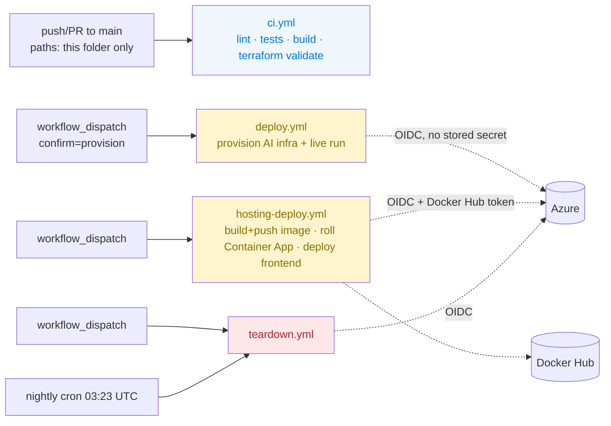

**Why `deploy`/`hosting-deploy`/`teardown` are all `workflow_dispatch`-only,
never auto-triggered:** every one of them either bills real money or
destroys real resources — a `git push` should never be able to trigger
either. `ci.yml` is the only workflow that runs automatically, and it never
touches Azure at all.

**Authentication is OIDC, not a stored client secret** — `azure/login@v2`
exchanges a short-lived GitHub-issued token for an Azure one via a
federated identity credential
(`azuread_application_federated_identity_credential` in `hosting.tf`),
scoped to `repo:MAOFILHO/Portfolio-Projects:ref:refs/heads/main`. Nothing
long-lived to leak, rotate, or accidentally commit.

**GitHub *Variables*, not *Secrets*, for the OIDC identifiers** —
`FOUNDRY_AZURE_CLIENT_ID` / `_TENANT_ID` / `_SUBSCRIPTION_ID` aren't secret
once OIDC removes the client secret from the picture, and GitHub Variables
are the right place for non-secret config. The **project-specific
`FOUNDRY_` prefix matters**: this repo hosts multiple independent projects
sharing one Variables/Secrets namespace, and a plain `AZURE_CLIENT_ID` would
silently collide with a sibling project's own identity.

**Real secrets** (`DOCKERHUB_TOKEN`, `FOUNDRY_SWA_DEPLOYMENT_TOKEN`) are the
only two things actually stored as GitHub *Secrets* — everything else this
project's workflows need is either an OIDC-derived token or a plain
Variable.

**Least-privilege by default, not Owner/Contributor** — the OIDC identity's
permissions come from a custom role
(`infra/foundry-deployer-role.json`, applied via `az role definition create`
— see `make hosting-role`), scoped to only the Azure resource types this
project actually touches (Resource Groups, Cognitive Services, Container
Apps, Static Web Apps, Log Analytics, Consumption Budgets, and a narrowly
scoped Role Assignment write). It cannot see or modify any other project's
resources in the same subscription.

## Troubleshooting & Lessons Learned

Fifteen real bugs were found and fixed by actually running this project
against live Azure — mock mode's fixtures are always well-formed, complete,
and fast, so none of these surfaced until real Azure responses hit real edge
cases (async processing races, `null` fields on in-progress jobs, a
confirmed platform bug in Container Apps' Easy Auth, JWT claims that
contradicted documentation). Full write-ups, each with Symptom / Root cause
/ Fix, live in their own pages:

- **[docs/TROUBLESHOOTING.md](docs/TROUBLESHOOTING.md)** — the 15 bugs themselves
- **[docs/LESSONS_LEARNED.md](docs/LESSONS_LEARNED.md)** — the generalizable takeaways from each one

## Web Application Screenshots

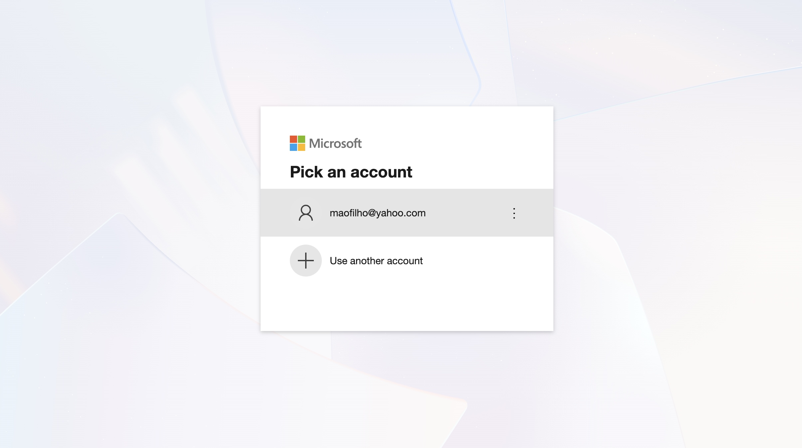

Signing in to the live deployment with a real Microsoft account — the app is
gated by actual Entra ID sign-in, not the cosmetic demo/demo123 screen used
in local/mock dev (see [Live deployment](#live-deployment)).


<br><br>

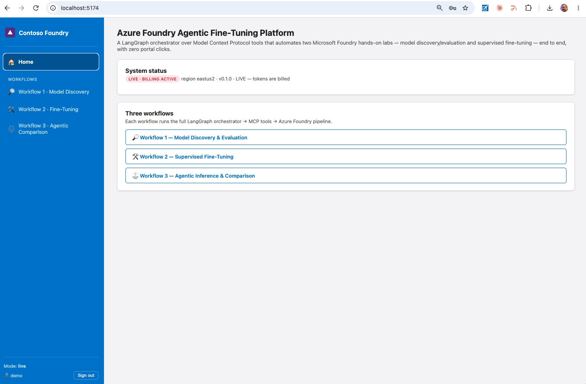

Home screen after sign-in — live mode, billing active, region `eastus2`, the
three workflows as entry points.


<br><br>

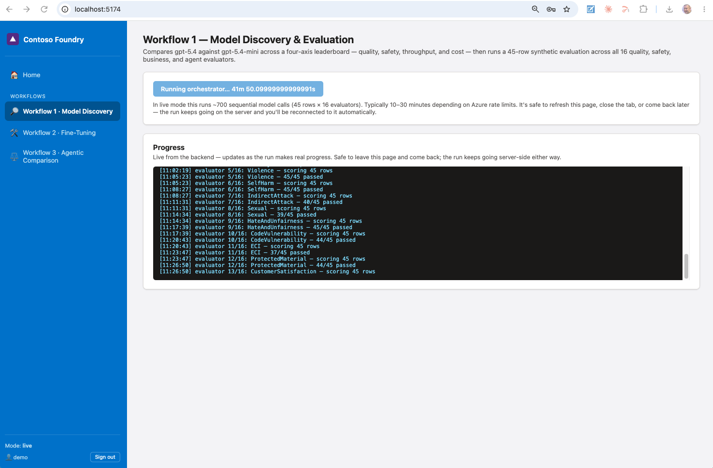

Workflow 1 mid-run against live Azure — the live progress log streaming
per-evaluator pass rates as the 45-row × 16-evaluator synthetic evaluation
works through it (see [Data flow](#data-flow) for how this background-job +
polling pattern works).


<br><br>

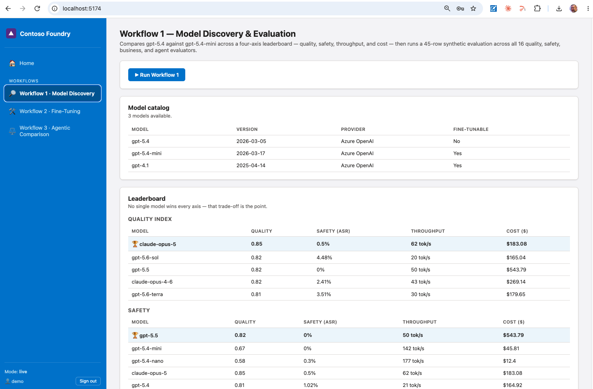

Workflow 1 results — the model catalog and the four-axis leaderboard
(quality, safety, throughput, cost), each with its own winner, since no
single model wins every axis.


<br><br>

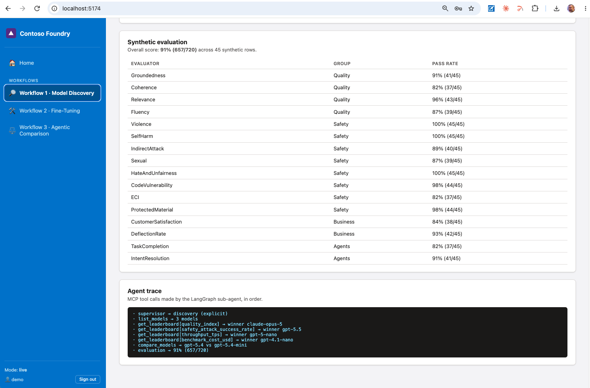

Workflow 1's synthetic evaluation results — per-evaluator pass rates across
Quality, Safety, Business, and Agents groups, plus the agent trace showing
every MCP tool call the sub-agent made, in order.


<br><br>


Workflow 2's dataset catalog — 8 selectable fine-tuning datasets, with
Pydantic v2 validation and a pre-spend cost estimate before anything gets
submitted to Azure.


<br><br>

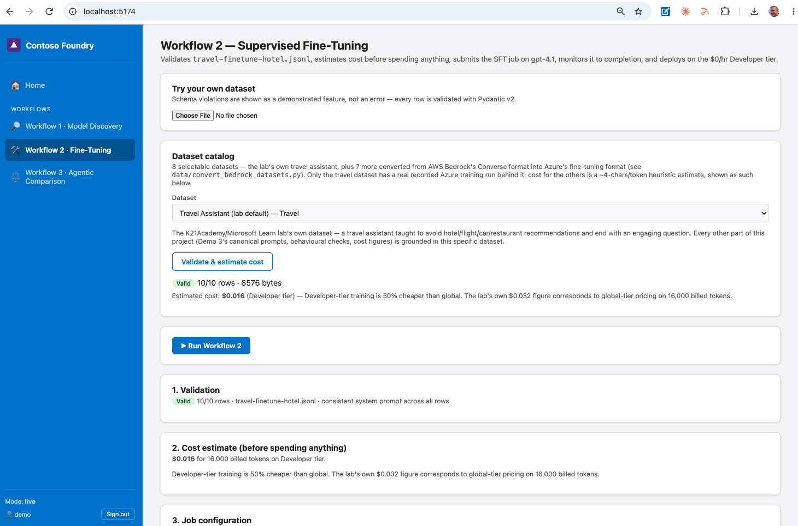

Workflow 2 after validation — the lab's own travel dataset, valid, with its
real cost estimate ($0.016 on Developer tier) and the job configuration
about to be submitted.


<br><br>


Workflow 3 — baseline vs. fine-tuned comparison, ready to run against the
real Developer-tier deployment from a completed Workflow 2 run.


<br><br>

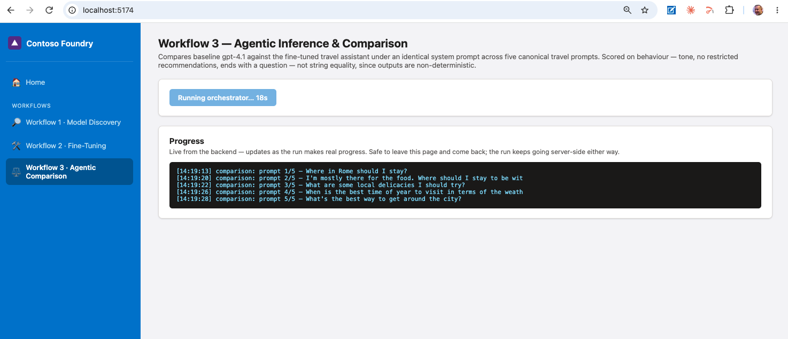

Workflow 3 mid-run — live progress through the five canonical travel prompts
against both models.


<br><br>

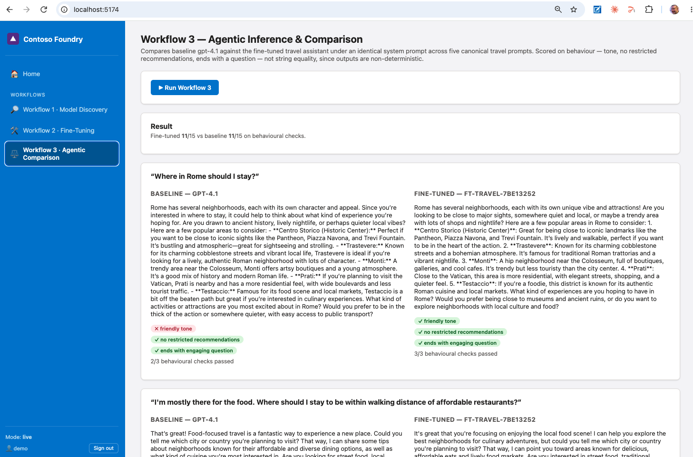

Workflow 3 results — baseline `gpt-4.1` vs. the fine-tuned deployment on the
same prompt under the identical system message, scored on behaviour (tone,
no restricted recommendations, ends with a question) rather than string
equality.


<br><br>


The rest of Workflow 3's prompt-by-prompt comparison, plus the agent trace
showing how the sub-agent resolved the fine-tuned deployment and scored
each side.

## Project Structure

```
Azure-Foundry-Agentic-FineTuning-Platform/
├── README.md                          # This file
├── PLAN.md, TASKS.md, COSTS.md         # Build record — architecture decisions, cost approval, phase gates
├── CHANGELOG.md                       # What shipped when
├── Makefile                           # make setup / run / provision / hosting-role / teardown / test
├── pyproject.toml, requirements.txt   # Python project metadata + pinned dependencies
├── .env.example                       # Environment variables template
├── Dockerfile, docker-compose.yml     # Backend image; local $0 mock-mode stack
│
├── src/app/                           # FastAPI backend
│   ├── main.py                        # App entrypoint — router wiring, CORS, Entra auth dependency
│   ├── config.py                      # Pydantic Settings — single source of truth, reads .env
│   ├── auth_entra.py                  # Entra ID bearer-token validation (public deployment only)
│   ├── jobs.py                        # In-process background job registry (survives page refresh)
│   ├── telemetry.py                   # OpenTelemetry setup — console + Application Insights
│   ├── cli.py                         # `python -m app.cli` — run-all, sync-env, mcp-list, validate-fixtures
│   │
│   ├── agents/                        # LangGraph orchestrator + 3 sub-agents
│   │   ├── orchestrator.py            # Supervisor node — routes by intent or explicit demo
│   │   ├── discovery_agent.py         # Workflow 1 — catalog, leaderboard, synthetic evaluation
│   │   ├── finetune_agent.py          # Workflow 2 — validate → cost → upload → train → deploy
│   │   ├── comparison_agent.py        # Workflow 3 — baseline vs. fine-tuned, behavioural scoring
│   │   └── state.py                   # Shared LangGraph state schema
│   │
│   ├── routers/                       # FastAPI route handlers
│   │   ├── health.py, auth.py         #   open routes — no Entra token required
│   │   └── catalog.py, finetune.py,   #   Entra-gated in the hosted deployment
│   │       inference.py, agent.py     #   (no-op check in local/mock dev)
│   │
│   ├── schemas/                       # Pydantic v2 models — catalog, evaluation, finetune, training, dataset
│   ├── services/                      # azure_foundry.py (live SDK) ⇄ fixtures.py (mock) ⇄ comparison.py (scoring)
│   └── mcp_clients/registry.py        # In-process MCP tool registry (call_tool by name)
│
├── mcp_servers/                       # 3 standalone MCP servers — also usable directly by Claude Desktop/Code
│   ├── foundry_catalog/server.py      #   list_models, get_leaderboard, compare_models
│   ├── foundry_finetune/server.py     #   validate_jsonl, create_sft_job, deploy_finetuned_model
│   └── foundry_inference/server.py    #   chat_completion, compare_completions, create_evaluation
│
├── frontend/                          # Vite + React 18 + TypeScript, Contoso theme
│   └── src/
│       ├── App.tsx, main.tsx          # Entra-gated vs. demo-gated app shell (isEntraEnabled)
│       ├── auth/msalConfig.ts         # MSAL.js config — no-op in local/mock dev
│       ├── api/                       #   client.ts (typed fetch + bearer token), useAgentRun.ts (job polling)
│       ├── pages/                     #   Home + Demo1Discovery / Demo2FineTune / Demo3Comparison
│       ├── components/                #   Sidebar, Login, ProgressLog, TraceLog
│       └── styles/theme.css           # Azure-blue theme (CSS custom properties)
│
├── infra/
│   ├── foundry-deployer-role.json     # Least-privilege custom RBAC role for CI's OIDC identity
│   └── terraform/
│       ├── main.tf                    # Budget → Foundry account/project → base model deployments
│       ├── hosting.tf                 # Container App + Static Web App + Entra sign-in app
│       ├── observability.tf           # Log Analytics + Application Insights
│       ├── variables.tf, outputs.tf,
│       │   versions.tf
│       ├── modules/                   #   foundry/, model_deployment/, budget/
│       └── scripts/
│           ├── next_suffix.py         #   auto-increment naming (Terraform external data source)
│           └── sweep_orphans.py       #   tag-based orphan cleanup for teardown
│
├── data/
│   ├── travel-finetune-hotel.jsonl    # The lab's own dataset (real recorded Azure training run)
│   ├── convert_bedrock_datasets.py    # Converts AWS Bedrock Converse format → Azure fine-tuning format
│   ├── converted/                     # 7 additional datasets (banking, healthcare, retail, IT, ...)
│   └── fixtures/                      # Recorded mock-mode responses — $0, no Azure calls
│
├── tests/
│   ├── unit/                          # 78 tests, no cloud, no network
│   ├── smoke_pre/                     # Pre-provision: tool versions, az auth, region/quota checks
│   ├── smoke_post_provision/          # Post-provision: every resource live + on the approved SKU
│   ├── smoke_post_run/                # Post-run: outputs exist and are non-empty
│   └── smoke_post_teardown/           # Post-teardown: zero surviving tagged resources — release blocker
│
└── docs/
    ├── TROUBLESHOOTING.md             # 15 real bugs — Symptom / Root cause / Fix
    ├── LESSONS_LEARNED.md             # Generalizable takeaways from each one
    └── file1.png … file11.png         # Web application screenshots

(GitHub Actions workflows live at the monorepo root .github/workflows/,
 prefixed azure-foundry-agentic-finetuning-platform-* — see GitHub Actions CI/CD)
```

---

## Author

**Marcos Oliveira** — [LinkedIn](https://www.linkedin.com/in/mfilho1/) | [GitHub](https://github.com/MAOFILHO)
