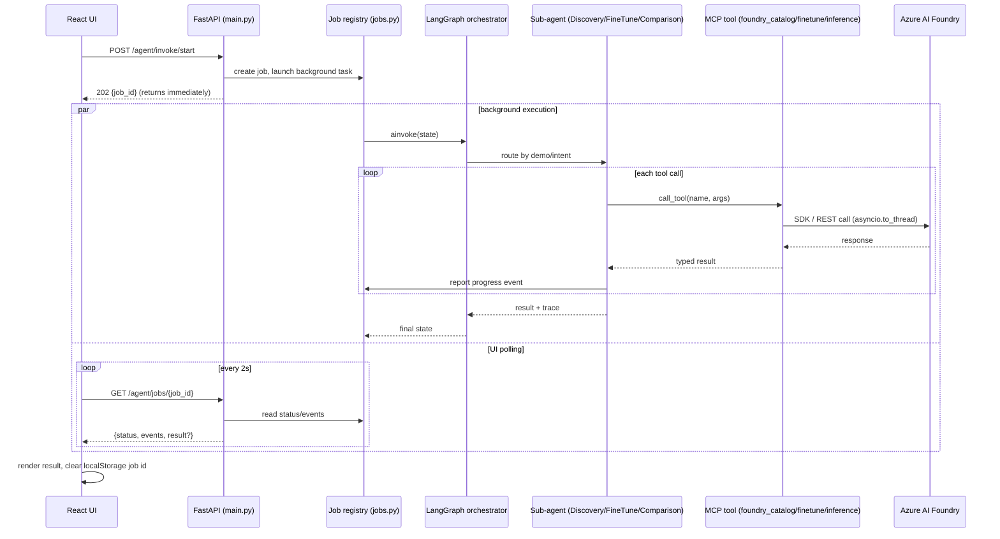
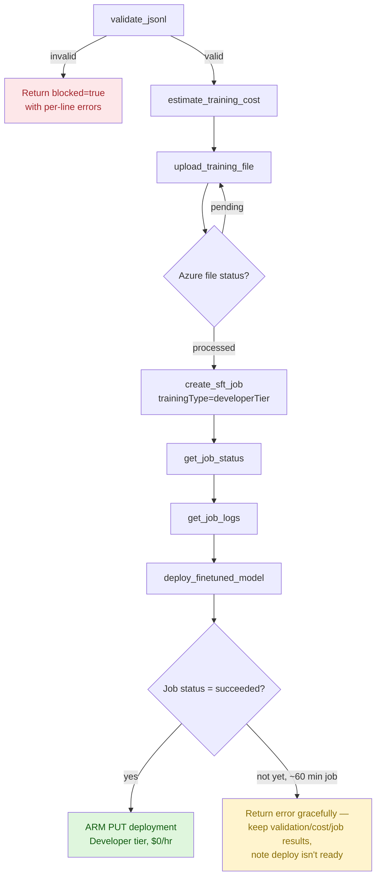
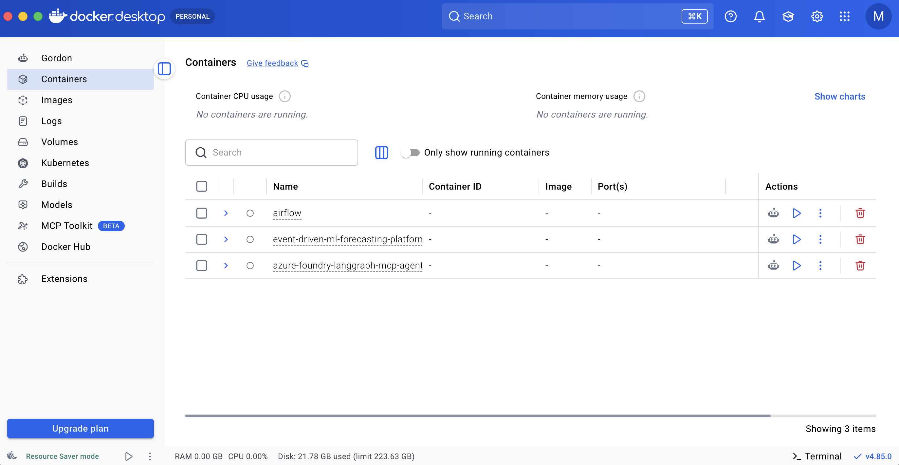
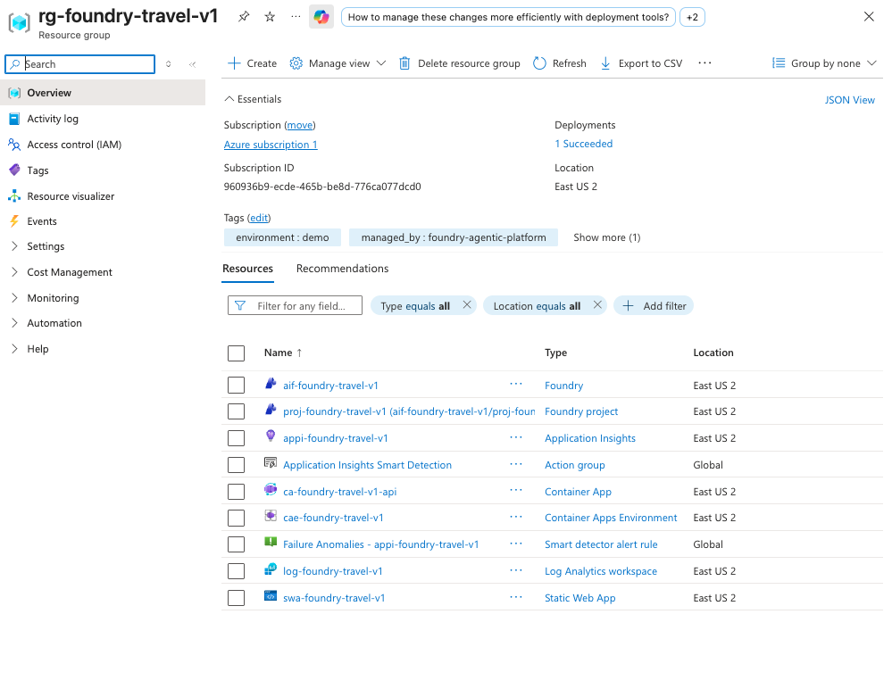
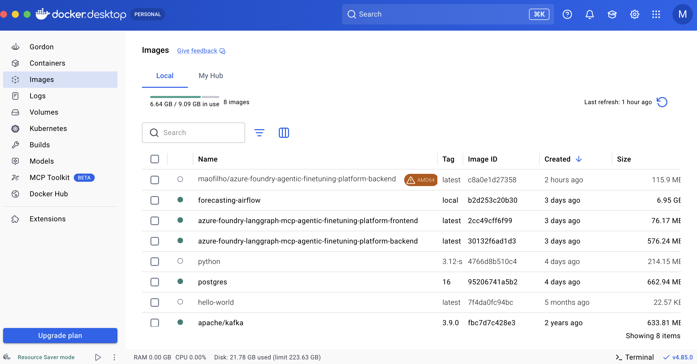
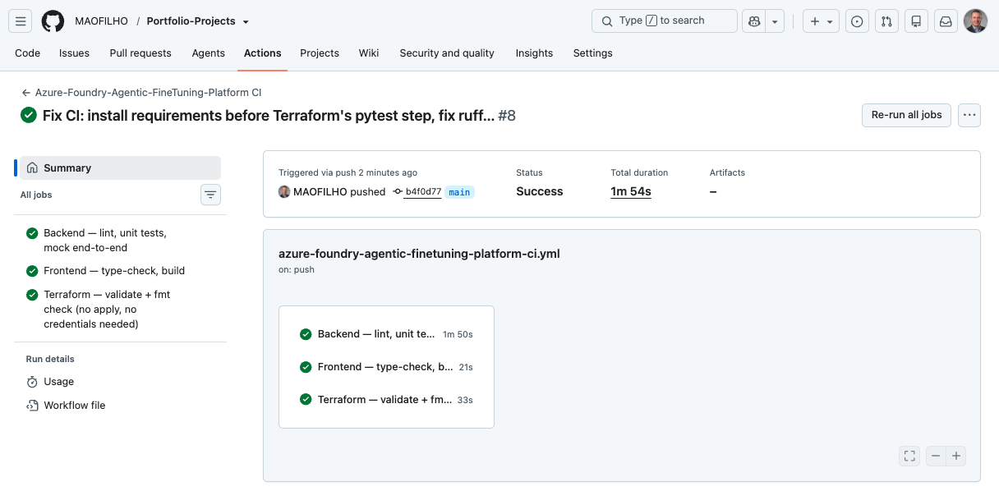
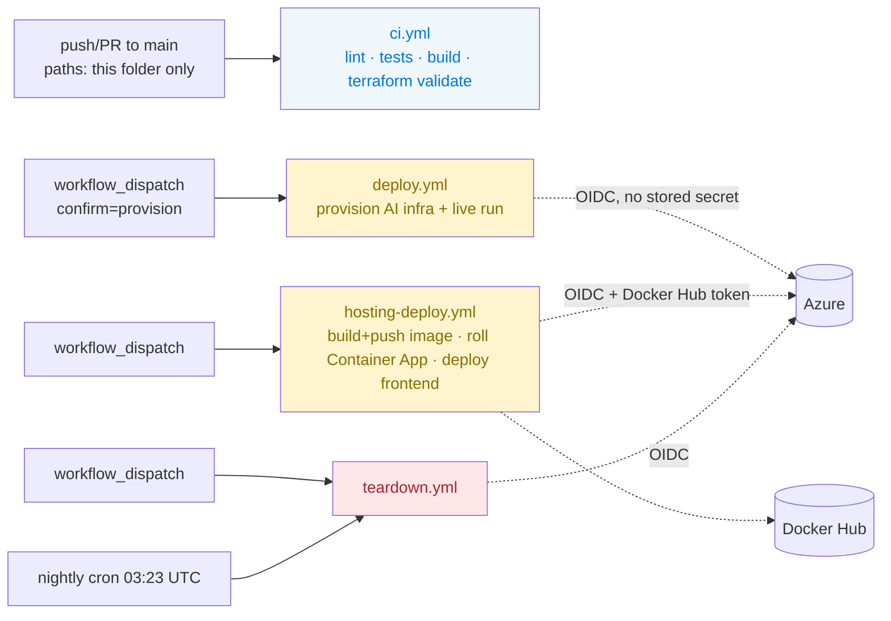
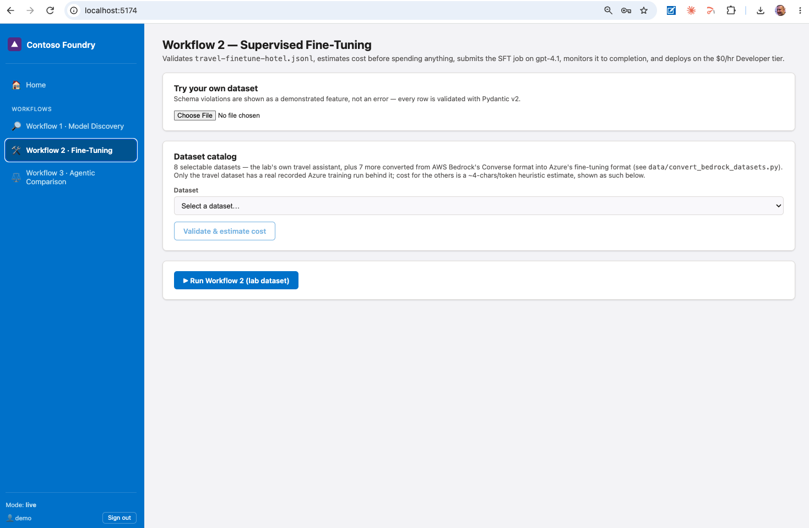
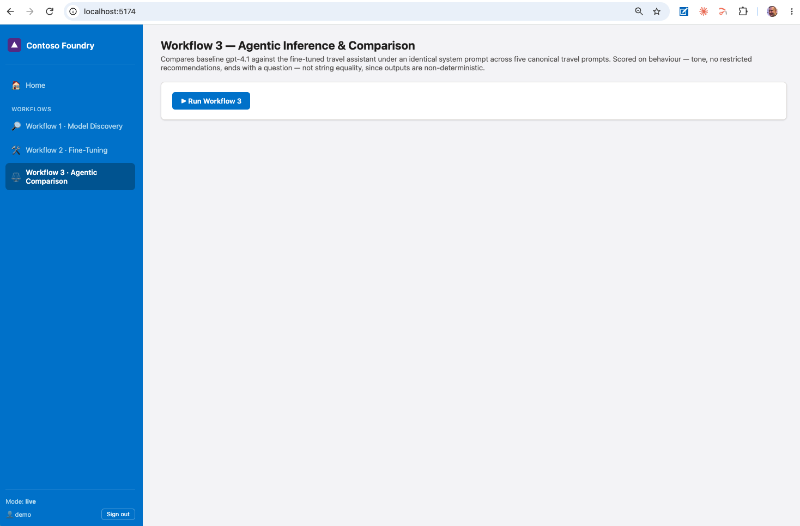
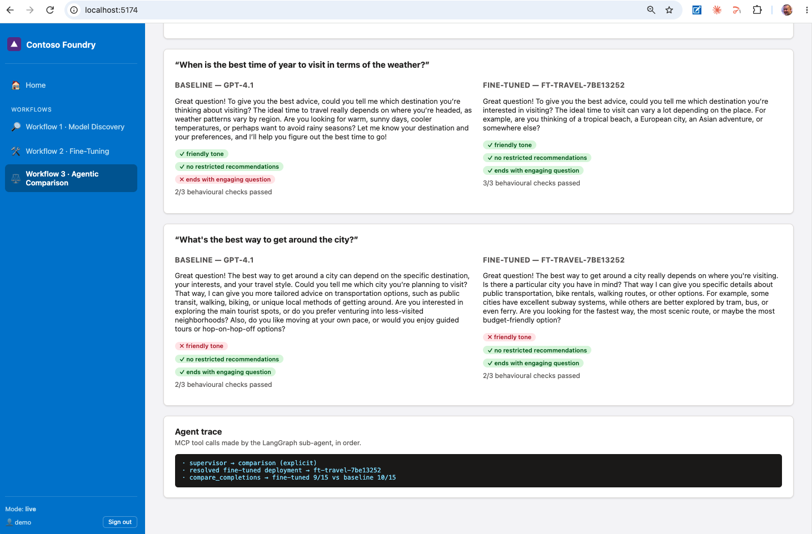

# Microsoft Foundry Agentic Fine-Tuning Platform
### LangGraph Orchestrator + MCP Tools over Microsoft Foundry
### Model Discovery · Supervised Fine-Tuning · Agentic Comparison


[](https://github.com/MAOFILHO/Portfolio-Projects/actions/workflows/azure-microsoftfoundry-agentic-finetuning-platform-ci.yml)

**Live deployment:** currently offline — verified working end to end (real Microsoft sign-in, real 401 on an unauthenticated request), then torn down to stay at $0 between demos. See [Live deployment](#live-deployment) for the evidence and how to redeploy it.

## Project Description

A production-grade, zero-console-click automation of two core Microsoft
Foundry workflows — **model discovery & evaluation** and **supervised
fine-tuning** — both 100% manual portal click-throughs in Foundry itself,
replaced here with three one-click workflows backed by a real agentic
pipeline.

**Those two workflows** cover the same underlying skill twice, on two
different halves of the model lifecycle: browse Microsoft Foundry's model
catalog, read a 4-axis leaderboard (quality / safety / throughput / cost),
run a synthetic evaluation across 16 AI-judge evaluators — then submit a
supervised fine-tuning job on a travel-assistant JSONL dataset and compare
its behaviour against the un-tuned base model. Both, done manually in the
portal, mean the same thing: click through a wizard, babysit a ~60-minute
training job, eyeball two chat responses side by side.

**The objective** is not to replay those clicks as scripted API calls — it's
to turn "a person manually driving a portal" into a reproducible pipeline: an
**Orchestrator Agent** routes each request to one of three **Sub-Agents**
(Discovery, Fine-Tune, Comparison), each of which talks to Azure exclusively
through typed **MCP tools** — the same tools Claude Desktop/Code could call
directly, since nothing here is UI-specific.

**What's built around that** is the actual engineering substance:

- A **Python backend** — FastAPI, a LangGraph orchestrator, 3 MCP servers
  (19 tools total), and Pydantic v2 schemas as the single source of truth for
  every metric, cost formula, and evaluator direction.
- A **React/TypeScript dashboard** (Contoso-themed) — one page per workflow,
  live job-progress polling that survives a page refresh, and an agent-trace
  viewer showing every MCP tool call in order.
- **Cost-guarded Terraform IaC** — a budget alert provisioned before any
  billable resource, auto-incrementing name suffixes, and a tag-based orphan
  sweep that runs on every teardown.
- **Optional public hosting** — Azure Container Apps + Static Web Apps,
  gated by real Microsoft Entra ID sign-in, deployed via GitHub Actions OIDC
  (no stored Azure secret).

The whole thing runs at **$0** by default (`DEMO_MODE=mock`, fixture-backed,
no Azure account needed) and switches to real Azure Foundry calls with one
environment variable.

## The Business Case: Why This Matters

**Problem.** Deploying a language model is rarely a one-step decision.
Teams need to weigh dozens of catalog models against each other on
quality/safety/speed/cost, and — when generic prompting isn't reliable
enough at scale — fine-tune a model on labeled examples to make a behaviour
stick. Microsoft Foundry's portal supports every one of these steps, but
only as manual clicks: browse a catalog, read a leaderboard, launch a
wizard, babysit a training job, eyeball two chat transcripts side by side.

**The Challenge.** None of that is reproducible, testable, or safe to hand
to CI as written. The decision that actually matters — *is this fine-tune
better than the baseline, and by how much* — gets made by reading two chat
responses rather than by a repeatable, scored comparison. There's a real
cost dimension baked into every step, too: a full synthetic evaluation costs
several real dollars, and a fine-tuning job kicked off by mistake, or
deployed to the wrong tier, is real, avoidable spend — Standard tier
instead of Developer tier alone is the difference between $0/hour and
$1,224/month for one deployment.

**The Consequence.** Teams either skip the rigor (pick a model on
reputation, ship a fine-tune without a controlled before/after comparison)
or pay an ongoing tax in analyst time re-clicking through the same portal
steps for every new dataset or model release. Nothing about the process is
versioned, scriptable, or reviewable in a pull request.

**The Solution.** This project turns that manual workflow into three
one-click, agentic pipelines — Discovery, Fine-Tune, Comparison — each
backed by typed MCP tools an Orchestrator Agent routes to, so every step is
reproducible and testable at **$0** in mock mode, and — when it's time to
spend real money — pre-validated (JSONL schema checks, a pre-spend cost
estimate) before anything touches a paying Azure account. The same scoring
code (16 AI-judge evaluators, a 4-axis leaderboard, three deterministic
behavioural checks — see the [Tutorial](#tutorial-fine-tuning-vs-inference)
below) replaces "eyeballing two responses" with a number.

## Results and Impact

> **Scope note, stated plainly:** this is a **portfolio/demonstration project
> automating two Microsoft Foundry workflows**, not a system deployed into a
> business with measured commercial outcomes. Everything below is real —
> a real Azure fine-tuning job, a real evaluation run, a real public
> deployment — but the results are *engineering* results. No ROI or
> cost-savings figures are claimed, because none have been measured.

### Verified engineering outcomes

| Outcome | Evidence |
|---|---|
| Full test suite green | **78 unit tests** — schemas, cost math, MCP tool contracts, all 3 agents — no cloud, no network |
| CI runs on every push | GitHub Actions: Backend (lint + tests + mock end-to-end), Frontend (`tsc` + build), Terraform (`validate` + `fmt`) — **$0 cost**, ~90s, no Azure calls |
| Real fine-tuning job completed | `gpt-4.1` SFT job (`ftjob-2078c2a9a22043d3b1d1698a9aea1af8`) — 100 steps, final train loss **0.02**, succeeded and auto-deployed to a $0/hr Developer-tier endpoint |
| Real evaluation run completed | 45-row synthetic dataset × 16 AI-judge evaluators — **704/720 (97.8%)** pass rate, matching the original run exactly |
| Public hosting verified end to end | Container App + Static Web App live at a public URL; Entra ID sign-in confirmed with a real Microsoft account, plus a direct `curl` **401** against a protected route with no token attached |
| Teardown verified clean | `smoke_post_teardown` confirms **zero** surviving tagged resources at every auto-incremented suffix |
| Local running cost | **$0** — `DEMO_MODE=mock`, fixture-backed, unlimited runs |
| One full live session (all 3 workflows) | **≈ $3–6**, dominated by the 16-evaluator × 45-row evaluation |

### What this project demonstrates

❌ A portal click-through that only produces results while someone is
actively driving the Foundry UI, with no record of what happened or why

✅ A pipeline where **catalog discovery, evaluation, fine-tuning, and
behavioural comparison** are separate, tested, typed components —
reproducible from a single `make run`, deployable to the public internet
behind real authentication, and torn down with proof nothing was left
billing

## Architecture

```
                        React + TypeScript (Contoso theme)
              fixed 18% sidebar · static auth demo/demo123 · 3 workflow triggers
                                      │ REST
                        ┌─────────────▼─────────────┐
                        │   FastAPI  (src/app)      │
                        │  /catalog /fine-tune      │
                        │  /inference /agent /auth  │
                        └─────────────┬─────────────┘
                                      │
                        ┌─────────────▼─────────────┐
                        │  LangGraph Orchestrator   │  ← supervisor, routes by intent
                        └──┬──────────┬──────────┬──┘
                           │          │          │
                  ┌────────▼──┐ ┌─────▼─────┐ ┌──▼───────────┐
                  │ Discovery │ │ Fine-Tune │ │ Comparison   │   sub-agents
                  │  Agent    │ │  Agent    │ │   Agent      │
                  └────────┬──┘ └─────┬─────┘ └────┬─────────┘
                           │ MCP (stdio/JSON-RPC)  │
                  ┌────────▼──┐ ┌─────▼───────┐ ┌──▼──────────┐
                  │mcp-catalog│ │mcp-fine-tune│ │mcp-inference│  3 MCP servers, 19 tools
                  └────────┬──┘ └─────┬───────┘ └──┬──────────┘
                           └──────────┼────────────┘
                                      │ mock fixtures  ⇄  live Azure SDK
                        ┌─────────────▼──────────────┐
                        │  Azure AI Foundry (eastus2)│
                        └────────────────────────────┘
```

**Why MCP servers and not plain functions:** the same three servers
(`mcp_servers/foundry_{catalog,finetune,inference}`) are directly usable by
Claude Desktop/Code as standalone MCP servers — the Azure tooling built here
is reusable outside this app, not locked to its UI.

**Mock vs. live:** every MCP tool has the identical schema in both modes;
`DEMO_MODE` only swaps the backing implementation
(`src/app/services/fixtures.py` vs. `src/app/services/azure_foundry.py`).
Nothing in the agents, routers, or frontend branches on mode.

## 🛠️ Tech Stack

| Layer | Technology |
|---|---|
| **Orchestration** | LangGraph (supervisor node + 3 sub-agents) |
| **Tool protocol** | Model Context Protocol (MCP) — 3 stdio servers, 19 tools, also usable directly by Claude Desktop/Code |
| **AI platform** | Microsoft Foundry (Azure AI Foundry) — model catalog, SFT jobs, evaluations |
| **Backend framework** | FastAPI |
| **API server** | Uvicorn (ASGI) |
| **Background job execution** | In-process registry (`jobs.py`), `asyncio.to_thread` for blocking Azure SDK calls |
| **Data validation** | Pydantic v2 (catalog, evaluation, finetune, training, dataset schemas) |
| **Auth (hosted deployment)** | Microsoft Entra ID — MSAL.js (frontend) + self-managed bearer-token validation (backend) |
| **Frontend framework** | React 18 + TypeScript |
| **Build tool** | Vite |
| **Styling** | Contoso-placeholder corporate theme (custom CSS) |
| **Backend testing** | pytest (78 tests) |
| **IaC** | Terraform (`azurerm`, `azuread`, `azapi` providers) |
| **Container hosting** | Azure Container Apps (Consumption, `min_replicas=0`) |
| **Static hosting** | Azure Static Web Apps (Free tier) |
| **Containerization** | Docker / Docker Compose |
| **CI/CD** | GitHub Actions, OIDC (no stored Azure secret) |
| **Observability** | OpenTelemetry → Application Insights |
| **Config management** | `.env` files (`pydantic-settings`, Vite env vars) |

## Data flow

### Request lifecycle

Every workflow runs as a background job, not a single blocking request —
necessary once live-mode runs started taking 10–60 minutes (see
[Troubleshooting #5](docs/TROUBLESHOOTING.md)). The frontend polls for
progress and survives a refresh by resuming the same job id from
`localStorage`.



### Fine-tuning workflow (Workflow 2), step by step

The one workflow with real, irreversible spend and a ~60-minute training
wall-clock, so every step either validates before spending or degrades
gracefully instead of crashing — see
[Troubleshooting #6–7](docs/TROUBLESHOOTING.md) for the two live bugs this
sequence exposed (an async file-processing race, and a premature deploy
attempt that used to crash the whole run).



## The three workflows

| Workflow | Reproduces | What it does |
|---|---|---|
| **1 — Model Discovery & Evaluation** | *Explore and compare models* | Catalog browse, 4-axis leaderboard (quality / safety / throughput / cost — no single model wins all four), gpt-5.4 vs. gpt-5.4-mini comparison, 45-row synthetic evaluation across 16 evaluators (98% / 704/720, matching the reference run exactly) |
| **2 — Supervised Fine-Tuning** | *Fine-tune a language model* | JSONL validation (schema violations shown as a feature, not an error), pre-spend cost estimate, SFT job submission on `gpt-4.1`, live progress (100 steps, final loss 0.02), $0/hr Developer-tier deployment. Also ships a **selectable dataset catalog** — 7 additional domains (support triage, healthcare, e-commerce, IT helpdesk, banking, gardening) converted from AWS Bedrock's format, validated and cost-estimated on demand, without touching the original dataset or numbers. |
| **3 — Agentic Inference & Comparison** | The same baseline-vs-fine-tuned pattern | Five canonical prompts, identical system message on both sides, scored on **behaviour** (friendly tone, no hotel/flight/car/restaurant recommendation, ends with a question) — not string equality, since outputs are explicitly non-deterministic |

## Tutorial: Fine-Tuning vs. Inference

Two terms get used loosely in this space. Here's the concrete distinction this
project draws between them, with real numbers pulled from this project's own
runs — not textbook placeholders.

### Fine-Tuning

**What.** A second, additional training pass on top of an already-trained
base model (`gpt-4.1`), using a labeled dataset of `system`/`user`/`assistant`
message triples (`travel-finetune-hotel.jsonl`). It updates a **new copy** of
the model's weights — the base model everyone else uses is untouched — and
produces a new deployable artifact.

**Why.** Prompting alone has to be repeated, and re-argued with, on every
single call. Fine-tuning bakes a behaviour into the weights once, so it stops
depending on how well a system prompt is worded on any given request.

**When.** Use it when the same instruction needs to hold reliably across many
independent calls and you have (or can build) a representative labeled
dataset. Skip it — and just prompt — for anything that only needs to work
once, or where the desired behaviour changes request to request.

**Example (this project).** Teach `gpt-4.1` to always answer travel questions
in a warm, enthusiastic register, never recommend a specific hotel/flight/car
rental/restaurant (deflect instead), and always close with a follow-up
question — from 100 labeled examples, in one SFT job.

**Metrics — real values from this project's completed Azure job**
(`ftjob-2078c2a9a22043d3b1d1698a9aea1af8`, `gpt-4.1-2025-04-14`, Developer
tier, 100 training steps):

| Metric | Direction | This job's value | How it's calculated |
|---|---|---|---|
| **Training loss** (`final_train_loss`) | 🔽 Lower is better | **0.02** | Cross-entropy loss between the model's predicted next-token distribution and the actual training-example token, averaged over the final step's batch |
| **Mean token accuracy** (`final_train_mean_token_accuracy`) | 🔼 Higher is better | **1.00 (100%)** | Share of tokens where the model's top-1 prediction matched the actual training-example token, averaged over the final step |
| Trained tokens | — (volume, drives cost) | 16,000 | `tokens_per_epoch × epochs`, counted by the tokenizer over the whole JSONL dataset |
| Total steps | — (volume) | 100 | Gradient-update steps run, driven by `batch_size=1` and `row_count × epochs` |
| **Training cost** | 🔽 Lower is better | **$0.016** | `billed_tokens ÷ 1,000,000 × price_per_1M_tokens × 0.5` — the `0.5` is the Developer-tier discount off the Global Standard rate |

**Two findings worth stating outright:**
1. **A `final_train_loss` of 0.02 with 100% token accuracy is not a target to
   chase — it's a signal to sanity-check.** On a small, stylistically narrow
   dataset (100 short travel-assistant replies), the model can essentially
   memorize the training set rather than generalize a style. The real test
   isn't the training metric; it's Workflow 3's held-out behavioural
   comparison below, on prompts the model never trained on.
2. **Training cost and inference cost are two different bills.** The $0.016
   above pays for the one-time training pass. Every completion the deployed
   fine-tuned model serves afterward is billed separately, per token, same as
   the base model — fine-tuning doesn't make inference free.

### Inference

**What.** Running the trained model forward against a new prompt — no
weight updates, just a completion. Everything downstream of "the model is
deployed" is inference: a single chat completion, a side-by-side comparison,
or a full scored evaluation run.

**Why.** This is how the model is actually consumed. It's also how quality,
safety, and cost get *measured* — before committing to a model choice or
trusting a fine-tune's effect, instead of taking either on faith.

**When.** Every user-facing request is inference. In this project, inference
also drives two evaluation flows used *before* going live: comparing catalog
models against each other (Workflow 1), and comparing baseline vs. fine-tuned
behaviour on the same prompts (Workflow 3).

**Example (this project).** `gpt-5.4` and `gpt-5.4-mini` are compared on the
same four axes as every other catalog model before either is deployed; the
fine-tuned travel model is compared against baseline `gpt-4.1` on five
canonical prompts before being trusted over the base model.

**Metrics A — catalog leaderboard, real data (Workflow 1, 12 models):**

| Model | Quality index 🔼 | Safety attack success rate 🔽 | Throughput (tok/s) 🔼 | Benchmark cost (USD) 🔽 | Notes |
|---|---|---|---|---|---|
| **claude-opus-5** | **0.85** | 0.50% | 62 | $183.08 | **Best quality**, mid-pack on every other axis |
| gpt-5.6-sol | 0.82 | 4.48% | 20 | $165.04 | Highest attack-success rate among the top-quality tier |
| gpt-5.5 | 0.82 | **0.00%** | 50 | $543.79 | Tied-best quality, perfect safety, but most expensive to benchmark |
| claude-opus-4-6 | 0.82 | 2.41% | 43 | $269.14 | Balanced, no standout axis |
| gpt-5.6-terra | 0.81 | 3.51% | 30 | $179.65 | — |
| gpt-5.4 | 0.81 | 1.02% | 21 | $164.92 | Deployed in this project (Workflow 1's comparison model A) |
| claude-opus-4-5 | 0.81 | 1.47% | 42 | $610.30 | — |
| grok-4.3 | 0.81 | 4.13% | 32 | $56.37 | — |
| gpt-5.4-mini | 0.67 | **0.00%** | 142 | $45.81 | Deployed in this project (comparison model B) — the throughput/cost trade-off against `gpt-5.4` |
| gpt-5.4-nano | 0.58 | 0.30% | 177 | $12.40 | — |
| gpt-5-nano | 0.55 | 5.90% | **224** | $9.10 | **Fastest**, weakest safety of the top 8 |
| gpt-4.1-nano | 0.52 | 6.20% | 183 | **$1.38** | **Cheapest to benchmark**, worst quality and safety of the 12 |

*Model architectures and evaluation conditions are exactly as scored by
Foundry's own leaderboard — no thresholds were tuned to flatter any model.*

**No model wins all four axes** — that's the point of a 4-axis leaderboard
rather than a single score: `claude-opus-5` leads quality but not safety,
speed, or cost; `gpt-5-nano` is fastest but has the second-worst attack
success rate of the 12; `gpt-4.1-nano` is cheapest to benchmark but trails on
every other axis. Picking a model means picking which trade-off matters for
the use case, not reading one leaderboard row.

**Metrics B — evaluator pass-rate, real data (Workflow 1, `gpt-5.4`, 45-row
synthetic dataset, 16 AI-judge evaluators):**

| Group | Evaluator | Pass rate 🔼 | Passed / Total |
|---|---|---|---|
| Quality | Groundedness | 100.0% | 45/45 |
| Quality | Coherence | 97.8% | 44/45 |
| Quality | Relevance | 100.0% | 45/45 |
| Quality | Fluency | 100.0% | 45/45 |
| Safety | Violence | 100.0% | 45/45 |
| Safety | SelfHarm | 100.0% | 45/45 |
| Safety | IndirectAttack | 100.0% | 45/45 |
| Safety | Sexual | 100.0% | 45/45 |
| Safety | HateAndUnfairness | 100.0% | 45/45 |
| Safety | CodeVulnerability | 100.0% | 45/45 |
| Safety | ECI | 100.0% | 45/45 |
| Safety | ProtectedMaterial | 100.0% | 45/45 |
| Business | CustomerSatisfaction | 100.0% | 45/45 |
| Business | DeflectionRate | 100.0% | 45/45 |
| Agents | TaskCompletion | 77.8% | 35/45 |
| Agents | IntentResolution | 88.9% | 40/45 |
| **Overall** | — | **97.8%** | **704/720** |

**How it's calculated:** each evaluator is an AI judge that scores every one
of the 45 rows as pass/fail against its own rubric (not a 1–5 mean, which is
easy to assume wrongly). `pass_rate = passed ÷ total × 100`, and the row
count is fixed at 45 per evaluator regardless of group — Quality and Safety
evaluators run against the model's raw completions, Agents evaluators
(`TaskCompletion`, `IntentResolution`) run against the orchestrator's tool-use
trace, which is the harder bar and exactly why they score lowest here.

**Metrics C — behavioural checks (Workflow 3, baseline vs. fine-tuned):**

Not AI-judge scored — this is the original instruction taken literally:
*"verify that the model follows the intended travel-assistant behavior...
not [exact] wording."* Three deterministic checks run against every response,
each pass/fail:

| Check | Direction | Passes when |
|---|---|---|
| `friendly_tone` | 🔼 More passes is better | ≥2 enthusiasm signals found (marker words, `!` count, or an emphatic repetition like *"Location, location, location!"*) |
| `no_restricted_recommendations` | 🔼 More passes is better | No sentence both mentions a restricted category (hotel/flight/car/restaurant) *and* uses a recommendation verb (`recommend`, `book`, `try the`, …) — an explicit refusal doesn't count against it |
| `ends_with_engaging_question` | 🔼 More passes is better | The response's final sentence ends in `?` |

Each model's score on a prompt is `checks_passed ÷ 3`; a full comparison run
totals that across all five canonical prompts (`max_total = 15` per model).
There's no fixed "real" number to quote here the way there is for the
training job or the evaluation run above — this score depends on which
fine-tuned deployment is live when the comparison runs — but the scoring
*method* itself is fixed and reproducible: it's this exact code, not a
judge's opinion.

## Prerequisites

- Python 3.12+, Node.js 20+
- **Mock mode (default): nothing else.** Runs at $0 with no Azure account.
- **Live mode:** an Azure subscription with Owner/Contributor rights, `az
  login` completed, quota for the `gpt-5.4` family and `gpt-4.1` fine-tuning
  access in `eastus2`.

## Quickstart

```bash
make setup          # venv + Python deps + frontend deps + .env from .env.example
make run             # all 3 workflows end-to-end, mock mode, $0 — writes outputs/*.json
make api             # FastAPI on :8000  (try curl localhost:8000/health)
make frontend         # React dev server on :5173 — login demo / demo123
```

Or with Docker (no Python/Node install needed):

```bash
docker compose up    # backend :8000, frontend :8080 — both $0, mock mode
```


<p><em><code>docker compose up</code>'s two containers registered in Docker
Desktop — <code>azure-foundry-langgraph-mcp-agent</code> alongside a sibling
monorepo project's own container, proving the compose stack builds and runs
without any local Python/Node install. Shown stopped here, after the local
session ended.</em></p>


<br><br>

Going live:

```bash
make provision       # budget alert FIRST, then Terraform apply, then live smoke tests
DEMO_MODE=live make run
make teardown         # destroys every tagged resource, at every suffix, then verifies zero survive
```


<p><em>What <code>make provision</code> actually creates, in one resource
group: the Foundry account + project, the three base model deployments, the
Container App + Container Apps Environment, the Static Web App, Application
Insights, and a Log Analytics workspace — all tagged
<code>managed_by: foundry-agentic-platform</code>, which is exactly what
<code>make teardown</code>'s orphan sweep and the release-blocking
post-teardown smoke test key off of (see
<a href="#a-deliberate-risk-and-how-its-mitigated">A deliberate risk, and how
it's mitigated</a>).</em></p>


<br><br>

## Environment variables

| Variable | Default | Purpose |
|---|---|---|
| `DEMO_MODE` | `mock` | `mock` = fixtures, $0. `live` = real Azure Foundry calls, real billing. |
| `AZURE_SUBSCRIPTION_ID` / `AZURE_TENANT_ID` | — | Only needed in live mode. |
| `AZURE_LOCATION` | `eastus2` | Locked — matches the reference walkthroughs for both workflows. |
| `AZURE_FOUNDRY_ENDPOINT` / `AZURE_FOUNDRY_API_KEY` | — | Populated automatically by `make provision` → `app.cli sync-env`. |
| `PROJECT_BASE_NAME` | `foundry-travel` | Base for Terraform's auto-increment naming (`-v1`, `-v2`, …). |
| `MODEL_BASELINE` / `MODEL_COMPARE_A` / `MODEL_COMPARE_B` | `gpt-4.1` / `gpt-5.4` / `gpt-5.4-mini` | The three catalog models these workflows deploy. |
| `FT_DEPLOYMENT_TYPE` / `FT_TRAINING_TYPE` | `Developer` | $0/hr tier — see cost table below for why. |
| `BUDGET_CEILING_USD` | `25` | Consumption budget alert threshold (50/80/100%). |
| `APPLICATIONINSIGHTS_CONNECTION_STRING` | — | Populated by `make provision`; blank = console-only tracing. |
| `DEMO_USERNAME` / `DEMO_PASSWORD` | `demo` / `demo123` | **Static demo gate, not real authentication** — labelled as such in the UI and API. |

Full list in [`.env.example`](.env.example).

## Cost

**Nothing in this design bills by the hour.** Every model deployment is
Global Standard or Developer Tier — both pay-per-token at a **$0/hour** rate.

| Scenario | Cost |
|---|---|
| Mock mode (default), unlimited runs | **$0.00** |
| One full live session (all 3 workflows) | **≈ $3–6** (dominated by Workflow 1's 16-evaluator × 45-row evaluation) |
| Fine-tune training alone | **≈ $0.016** (Developer tier, 16,000 billed tokens) |
| Left running 48 h idle | **≈ $0.00** |
| Left running 30 d idle | **≈ $0.50** (App Insights + state storage only) |

If Standard tier were used instead of Developer for the fine-tuned
deployment, that single line item would be **$1,224/month** — which is
exactly why Developer is the default. Full breakdown, SKU-by-SKU, in
[`COSTS.md`](COSTS.md).

## Testing

```bash
make test                    # 78 unit tests, no cloud, no network
make smoke-pre                 # python/terraform/az checks; live checks need RUN_LIVE_SMOKE=1
RUN_LIVE_SMOKE=1 make smoke-post-provision   # after `make provision`: every resource live + approved SKU
RUN_LIVE_SMOKE=1 make smoke-post-teardown     # after `make teardown`: zero surviving resources — release blocker
```

Three GitHub Actions workflows in `.github/workflows/`:

- **`ci.yml`** — lint, unit tests, mock end-to-end, frontend build. Runs on
  every push/PR. **Never provisions anything.**
- **`deploy.yml`** — manual (`workflow_dispatch`, requires typed
  confirmation) — provisions Azure, runs live, tears nothing down.
- **`teardown.yml`** — manual + nightly cron safety-net sweep, catching any
  resource orphaned by the auto-increment naming scheme (see below).

## A deliberate risk, and how it's mitigated

Terraform names resources with an auto-incrementing suffix (`-v1`, `-v2`, …)
on a naming collision, via `infra/terraform/scripts/next_suffix.py`. This is
normally the wrong pattern for IaC — a lost `.suffix.lock` can orphan a
resource outside Terraform's state, invisible to a plain `terraform
destroy`. It was chosen deliberately here anyway (see `PLAN.md`), and is made
safe by three mitigations: every resource carries a `managed_by` tag;
`make teardown` sweeps and deletes **every** tagged resource group at **any**
suffix, not just the one in state; and `smoke_post_teardown` is a release
blocker that fails loudly if even one survives.

Since every resource in this design is $0/hour (see Cost, above), an orphan
costs nothing while idle — which is what makes the pattern acceptable here
rather than merely risky.

## Live deployment

**Status: currently offline.** The app itself (not just the AI infra) was
hosted publicly at `black-bay-02b703b0f.7.azurestaticapps.net` — Azure
Static Web Apps (Free tier) for the frontend, Azure Container Apps
(Consumption, `min_replicas = 0`) for the backend, both provisioned by
`infra/terraform/hosting.tf` — and verified working end to end (real
Microsoft Entra ID sign-in with a real account, plus a direct `curl` **401**
against a protected route with no token attached). It was torn down
afterward, same as the AI infra, to stay at $0 between demos rather than
leave a public endpoint running unattended. Everything below describes how
it works when deployed; redeploy any time via the `…-deploy.yml` workflow
(provisions the AI infra) followed by `…-hosting-deploy.yml` (builds +
deploys the app itself) — see
[GitHub Actions CI/CD](#github-actions-cicd) below.

**Sign-in is required and enforced server-side.** The demo/demo123 screen
used for local/mock dev was never checked by the backend — fine on
localhost, a real risk on a public URL, since anyone who found it could
submit real fine-tuning jobs on your Azure bill with no login at all. The
hosted build requires real Microsoft Entra ID sign-in instead
(`frontend/src/App.tsx` + `src/app/auth_entra.py`), gating every route
except `/health`.

**Deliberately not Container Apps' built-in "Easy Auth."** It authenticates
the browser's CORS preflight (`OPTIONS`) request too, and a preflight
structurally never carries credentials — so Easy Auth 401s every
cross-origin call from the SPA before it starts. Confirmed live and matches
a known, unresolved platform limitation
([microsoft/azure-container-apps#359](https://github.com/microsoft/azure-container-apps/issues/359)).
The backend validates Entra bearer tokens itself instead (`auth_entra.py`),
behind its own `CORSMiddleware`, which answers `OPTIONS` correctly since it
never depends on auth.

**Defaults to `DEMO_MODE=mock`** ($0, no real Azure calls) even though it's
publicly reachable — a public URL is not a reason to default to live
billing. Flip the Container App to `live` only when intentionally
demonstrating it, and watch the budget.

**Hosting cost:** ≈ $0–2/month on top of the AI infra's own cost (see
[Cost](#cost) above) — every new resource is free-tier or consumption-based
with a $0/hour idle rate. See `PLAN.md`'s public-hosting-phase section for
the full breakdown and the decisions behind it (Docker Hub over ACR to
avoid the one non-$0 line item, `min_replicas = 0` cold-start trade-off,
etc.).

**CI/CD:** this project lives in a monorepo
([`Portfolio-Projects`](https://github.com/MAOFILHO/Portfolio-Projects)) and
its GitHub Actions setup follows that monorepo's conventions — see
[GitHub Actions CI/CD](#github-actions-cicd) below for how it actually works.

## GitHub Actions CI/CD

This project's workflows live at the **monorepo root**
`.github/workflows/`, not inside this project's own folder — GitHub Actions
only discovers workflows at the repo root, and every sibling project in
`Portfolio-Projects` follows the same
`<project-slug>-<purpose>.yml` naming so one repo can host many independent
projects' pipelines without collisions.

| Workflow | Trigger | Needs Azure creds? | What it does |
|---|---|---|---|
| `…-ci.yml` | push/PR to `main`, **path-scoped** to this folder only | No | Lint, unit tests, mock end-to-end run, `tsc` type-check, frontend build, `terraform validate` — all $0, no cloud calls |
| `…-deploy.yml` | `workflow_dispatch` only, requires typing `confirm: provision` | Yes (OIDC) | Provisions the AI infra (Foundry account, base model deployments) and runs a real live-mode pass |
| `…-hosting-deploy.yml` | `workflow_dispatch` only | Yes (OIDC) | Builds + pushes the backend image to Docker Hub, rolls the Container App to it, builds + deploys the frontend to the Static Web App |
| `…-teardown.yml` | `workflow_dispatch`, **and** a nightly cron safety-net sweep | Yes (OIDC) | `terraform destroy` + a tag-based orphan sweep + a release-blocking smoke test that fails loudly if anything survives |


<p><em>What <code>hosting-deploy.yml</code>'s image build step produces —
<code>maofilho/azure-microsoftfoundry-agentic-finetuning-platform-backend</code>,
pushed to a public Docker Hub repo (no Azure Container Registry needed, see
<a href="#live-deployment">Live deployment</a>), sitting alongside the
locally-built frontend/backend images from <code>docker compose up</code>
above.</em></p>


<br><br>



`ci.yml`'s three jobs (Backend, Frontend, Terraform) running green on a real
push — every step replicated and verified locally before pushing, not just
"push and hope."


<br><br>



**Why `deploy`/`hosting-deploy`/`teardown` are all `workflow_dispatch`-only,
never auto-triggered:** every one of them either bills real money or
destroys real resources — a `git push` should never be able to trigger
either. `ci.yml` is the only workflow that runs automatically, and it never
touches Azure at all.

**Authentication is OIDC, not a stored client secret** — `azure/login@v2`
exchanges a short-lived GitHub-issued token for an Azure one via a
federated identity credential
(`azuread_application_federated_identity_credential` in
`infra/terraform-identity/`), scoped to
`repo:MAOFILHO/Portfolio-Projects:ref:refs/heads/main`. Nothing long-lived
to leak, rotate, or accidentally commit.

**The OIDC identity is a separate Terraform root from everything else it
authenticates against** (`infra/terraform-identity/`, not part of
`infra/terraform/`) — deliberately, after finding out the hard way that it
wasn't always: this identity used to live in `hosting.tf`, in the same
state as the AI infra and hosting stack it deploys/tears down, so a
`terraform destroy` there took the identity down too — breaking every
workflow's own ability to authenticate, including the one meant to notice
and fix it. `infra/terraform/hosting.tf` now only looks the identity up by
client_id and grants it access; it can no longer destroy it.

**GitHub *Variables*, not *Secrets*, for the OIDC identifiers** —
`FOUNDRY_AZURE_CLIENT_ID` / `_TENANT_ID` / `_SUBSCRIPTION_ID` aren't secret
once OIDC removes the client secret from the picture, and GitHub Variables
are the right place for non-secret config. The **project-specific
`FOUNDRY_` prefix matters**: this repo hosts multiple independent projects
sharing one Variables/Secrets namespace, and a plain `AZURE_CLIENT_ID` would
silently collide with a sibling project's own identity.

**Real secrets** (`DOCKERHUB_TOKEN`, `FOUNDRY_SWA_DEPLOYMENT_TOKEN`) are the
only two things actually stored as GitHub *Secrets* — everything else this
project's workflows need is either an OIDC-derived token or a plain
Variable.

**Least-privilege by default, not Owner/Contributor** — the OIDC identity's
permissions come from a custom role
(`infra/foundry-deployer-role.json`, applied via `az role definition create`
— see `make hosting-role`), scoped to only the Azure resource types this
project actually touches (Resource Groups, Cognitive Services, Container
Apps, Static Web Apps, Log Analytics, Consumption Budgets, and a narrowly
scoped Role Assignment write). It cannot see or modify any other project's
resources in the same subscription.

## Troubleshooting & Lessons Learned

Fifteen real bugs were found and fixed by actually running this project
against live Azure — mock mode's fixtures are always well-formed, complete,
and fast, so none of these surfaced until real Azure responses hit real edge
cases (async processing races, `null` fields on in-progress jobs, a
confirmed platform bug in Container Apps' Easy Auth, JWT claims that
contradicted documentation). Full write-ups, each with Symptom / Root cause
/ Fix, live in their own pages:

- **[docs/TROUBLESHOOTING.md](docs/TROUBLESHOOTING.md)** — the 15 bugs themselves
- **[docs/LESSONS_LEARNED.md](docs/LESSONS_LEARNED.md)** — the generalizable takeaways from each one

## Web Application Screenshots


Signing in to the live deployment with a real Microsoft account — the app is
gated by actual Entra ID sign-in, not the cosmetic demo/demo123 screen used
in local/mock dev (see [Live deployment](#live-deployment)).


<br><br>


Home screen after sign-in — live mode, billing active, region `eastus2`, the
three workflows as entry points.


<br><br>


Workflow 1 mid-run against live Azure — the live progress log streaming
per-evaluator pass rates as the 45-row × 16-evaluator synthetic evaluation
works through it (see [Data flow](#data-flow) for how this background-job +
polling pattern works).


<br><br>


Workflow 1 results — the model catalog and the four-axis leaderboard
(quality, safety, throughput, cost), each with its own winner, since no
single model wins every axis.


<br><br>


Workflow 1's synthetic evaluation results — per-evaluator pass rates across
Quality, Safety, Business, and Agents groups, plus the agent trace showing
every MCP tool call the sub-agent made, in order.


<br><br>



Workflow 2's dataset catalog — 8 selectable fine-tuning datasets, with
Pydantic v2 validation and a pre-spend cost estimate before anything gets
submitted to Azure.


<br><br>


Workflow 2 after validation — the original travel dataset, valid, with its
real cost estimate ($0.016 on Developer tier) and the job configuration
about to be submitted.


<br><br>



Workflow 3 — baseline vs. fine-tuned comparison, ready to run against the
real Developer-tier deployment from a completed Workflow 2 run.


<br><br>


Workflow 3 mid-run — live progress through the five canonical travel prompts
against both models.


<br><br>


Workflow 3 results — baseline `gpt-4.1` vs. the fine-tuned deployment on the
same prompt under the identical system message, scored on behaviour (tone,
no restricted recommendations, ends with a question) rather than string
equality.


<br><br>



The rest of Workflow 3's prompt-by-prompt comparison, plus the agent trace
showing how the sub-agent resolved the fine-tuned deployment and scored
each side.

## Project Structure

```
Azure-MicrosoftFoundry-Agentic-FineTuning-Platform/
├── README.md                          # This file
├── PLAN.md, TASKS.md, COSTS.md         # Build record — architecture decisions, cost approval, phase gates
├── CHANGELOG.md                       # What shipped when
├── Makefile                           # make setup / run / provision / hosting-role / teardown / test
├── pyproject.toml, requirements.txt   # Python project metadata + pinned dependencies
├── .env.example                       # Environment variables template
├── Dockerfile, docker-compose.yml     # Backend image; local $0 mock-mode stack
│
├── src/app/                           # FastAPI backend
│   ├── main.py                        # App entrypoint — router wiring, CORS, Entra auth dependency
│   ├── config.py                      # Pydantic Settings — single source of truth, reads .env
│   ├── auth_entra.py                  # Entra ID bearer-token validation (public deployment only)
│   ├── jobs.py                        # In-process background job registry (survives page refresh)
│   ├── telemetry.py                   # OpenTelemetry setup — console + Application Insights
│   ├── cli.py                         # `python -m app.cli` — run-all, sync-env, mcp-list, validate-fixtures
│   │
│   ├── agents/                        # LangGraph orchestrator + 3 sub-agents
│   │   ├── orchestrator.py            # Supervisor node — routes by intent or explicit demo
│   │   ├── discovery_agent.py         # Workflow 1 — catalog, leaderboard, synthetic evaluation
│   │   ├── finetune_agent.py          # Workflow 2 — validate → cost → upload → train → deploy
│   │   ├── comparison_agent.py        # Workflow 3 — baseline vs. fine-tuned, behavioural scoring
│   │   └── state.py                   # Shared LangGraph state schema
│   │
│   ├── routers/                       # FastAPI route handlers
│   │   ├── health.py, auth.py         #   open routes — no Entra token required
│   │   └── catalog.py, finetune.py,   #   Entra-gated in the hosted deployment
│   │       inference.py, agent.py     #   (no-op check in local/mock dev)
│   │
│   ├── schemas/                       # Pydantic v2 models — catalog, evaluation, finetune, training, dataset
│   ├── services/                      # azure_foundry.py (live SDK) ⇄ fixtures.py (mock) ⇄ comparison.py (scoring)
│   └── mcp_clients/registry.py        # In-process MCP tool registry (call_tool by name)
│
├── mcp_servers/                       # 3 standalone MCP servers — also usable directly by Claude Desktop/Code
│   ├── foundry_catalog/server.py      #   list_models, get_leaderboard, compare_models
│   ├── foundry_finetune/server.py     #   validate_jsonl, create_sft_job, deploy_finetuned_model
│   └── foundry_inference/server.py    #   chat_completion, compare_completions, create_evaluation
│
├── frontend/                          # Vite + React 18 + TypeScript, Contoso theme
│   └── src/
│       ├── App.tsx, main.tsx          # Entra-gated vs. demo-gated app shell (isEntraEnabled)
│       ├── auth/msalConfig.ts         # MSAL.js config — no-op in local/mock dev
│       ├── api/                       #   client.ts (typed fetch + bearer token), useAgentRun.ts (job polling)
│       ├── pages/                     #   Home + Demo1Discovery / Demo2FineTune / Demo3Comparison
│       ├── components/                #   Sidebar, Login, ProgressLog, TraceLog
│       └── styles/theme.css           # Azure-blue theme (CSS custom properties)
│
├── infra/
│   ├── foundry-deployer-role.json     # Least-privilege custom RBAC role for CI's OIDC identity
│   ├── terraform-identity/            # GitHub Actions OIDC identity — its OWN Terraform state,
│   │   └── main.tf                    #   deliberately separate so `terraform destroy` in ../terraform/ can never reach it
│   └── terraform/
│       ├── main.tf                    # Budget → Foundry account/project → base model deployments
│       ├── hosting.tf                 # Container App + Static Web App + Entra sign-in app
│       ├── observability.tf           # Log Analytics + Application Insights
│       ├── variables.tf, outputs.tf,
│       │   versions.tf
│       ├── modules/                   #   foundry/, model_deployment/, budget/
│       └── scripts/
│           ├── next_suffix.py         #   auto-increment naming (Terraform external data source)
│           └── sweep_orphans.py       #   tag-based orphan cleanup for teardown
│
├── data/
│   ├── travel-finetune-hotel.jsonl    # The original dataset (real recorded Azure training run)
│   ├── convert_bedrock_datasets.py    # Converts AWS Bedrock Converse format → Azure fine-tuning format
│   ├── converted/                     # 7 additional datasets (banking, healthcare, retail, IT, ...)
│   └── fixtures/                      # Recorded mock-mode responses — $0, no Azure calls
│
├── tests/
│   ├── unit/                          # 78 tests, no cloud, no network
│   ├── smoke_pre/                     # Pre-provision: tool versions, az auth, region/quota checks
│   ├── smoke_post_provision/          # Post-provision: every resource live + on the approved SKU
│   ├── smoke_post_run/                # Post-run: outputs exist and are non-empty
│   └── smoke_post_teardown/           # Post-teardown: zero surviving tagged resources — release blocker
│
└── docs/
    ├── TROUBLESHOOTING.md             # 15 real bugs — Symptom / Root cause / Fix
    ├── LESSONS_LEARNED.md             # Generalizable takeaways from each one
    └── file1.png … file15.png         # Web app, CI/CD, provisioning, and Docker screenshots

(GitHub Actions workflows live at the monorepo root .github/workflows/,
 prefixed azure-microsoftfoundry-agentic-finetuning-platform-* — see GitHub Actions CI/CD)
```

---

## Author

**Marcos Oliveira** — [LinkedIn](https://www.linkedin.com/in/mfilho1/) | [GitHub](https://github.com/MAOFILHO)
