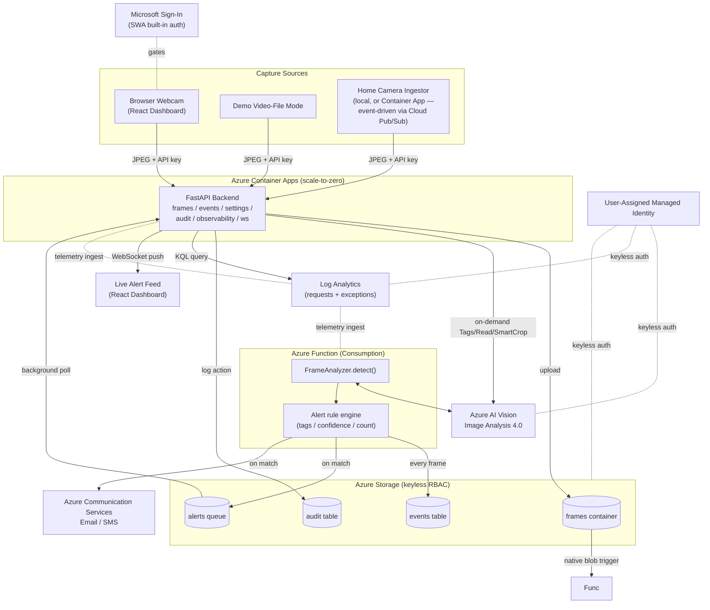
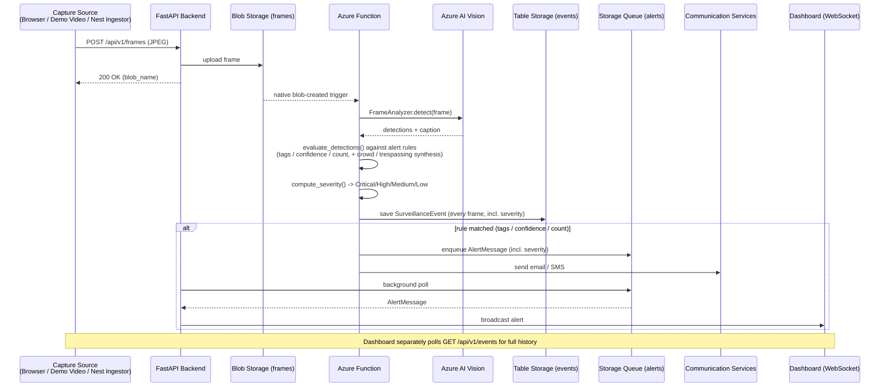
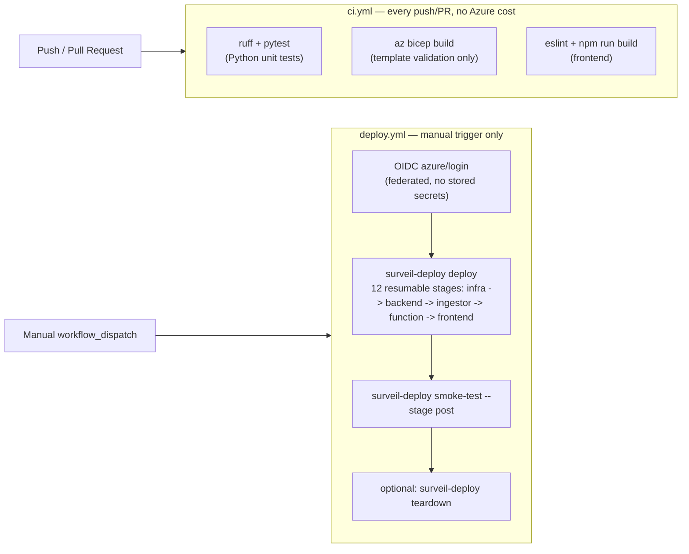

# Azure Real-Time Surveillance

### Real-Time Camera Surveillance & Alerting on Azure AI

A cost-aware, end-to-end **real-time video surveillance system** built on **Azure AI Vision**, deployed via a fully automated **Python CLI** with **zero Azure Portal clicks**. A **React + TypeScript** dashboard — gated behind Microsoft sign-in via Static Web Apps' built-in authentication — captures webcam frames (or ingests a real Google Nest camera), an **Azure Function** analyzes each frame with **Azure AI Vision Image Analysis 4.0**, and alerts are pushed live over **WebSocket** plus optional **email/SMS** via **Azure Communication Services**. An in-app Observability page queries Application Insights directly for live request/error telemetry, and an Audit Trail records user-facing actions — no separate ops tooling required.


## Project Description

A browser (or an IP/security camera) captures frames and uploads them to Blob Storage via a **FastAPI** backend on **Azure Container Apps** (scale-to-zero). An **Azure Function** analyzes each frame asynchronously with **Azure AI Vision**, and any match against configurable alert rules (watched tags, confidence, count) fires in two ways — instantly to the dashboard over **WebSocket**, and optionally via **email/SMS** through Azure Communication Services. Every analyzed frame (alert or not) is recorded in Table Storage for the event history view. The entire system — infrastructure, backend, Function, and frontend — deploys through one resumable Python CLI with **zero Azure Portal clicks**. See [docs/architecture.md](docs/architecture.md) for full architectural rationale.

The detection backend is deliberately pluggable (`FrameAnalyzer` protocol in `shared/surveil_core/analyzer.py`) so a future Custom Vision or YOLOv4 object detector can be dropped in without touching capture, alerting, or the deployment pipeline — see [docs/extending-phase2.md](docs/extending-phase2.md).

## Feature Scope

**Capture sources**
- **Browser webcam** — a React dashboard captures frames via `getUserMedia`, throttled to a configurable interval (default 3s), encoded as JPEG.
- **Demo/video-file mode** — plays a bundled sample video instead of a live webcam, for demoing without hardware.
- **Video Upload & Analysis** — batch-analyze a video file you already have, separate from live capture. The browser extracts frames client-side by seeking the file to a series of timestamps (not real-time playback, so a 10-minute file doesn't take 10 minutes to process) and posts each one through the exact same `POST /api/v1/frames` path as live capture — no backend changes needed. A configurable extraction interval caps the number of frames (and therefore billed Vision API calls) a single upload can produce.
- **Home security camera ingestion (`ingestors/nest/`)** — watches one or more real Google Nest cameras for motion/person events (via Google Cloud Pub/Sub, event-driven rather than polling) and forwards each detected event's frame into the same ingest endpoint as the browser capture, so it's analyzed and alerted on identically. Frame extraction adapts automatically to what each camera model supports: a fast path for cameras that expose a clip-preview URL directly in the event payload, and a fallback that negotiates a real WebRTC media session (SDP/ICE/RTP) to pull a live frame from cameras that only expose a live-stream interface. Duplicate Pub/Sub redeliveries of the same event (common in practice — one real doorbell press is often redelivered 2-4 times) are de-duplicated in-process so they don't each spawn a competing WebRTC capture session.
  - Runs two ways: locally (a laptop/Pi/NAS, zero Azure cost — the original design), or as an opt-in, always-on Container App (`NEST_INGESTOR_ENABLED=true`) deployed in the same Container Apps environment as the backend. Unlike the backend/Function (both scale-to-zero), this Container App is fixed at `minReplicas: 1, maxReplicas: 1` — it holds a persistent Pub/Sub streaming-pull connection that must never drop (scale to zero) or double-consume (scale out), which is a real, unavoidable ~$10-15/month always-on cost (see [docs/cost.md](docs/cost.md)).
  - **Confirmed via real multi-camera hardware testing:** only the doorbell reliably produces frames end-to-end (both from a button press and from plain walk-by motion/person detection). Other camera models 400 on the direct clip-preview command (`"Command ... GenerateImage is not supported due to camera not supporting RTSP protocol"`) and correctly fall back to the WebRTC path — which negotiates a fully healthy connection (ICE completed, DTLS connected, audio demonstrably flowing) but never receives a single video RTP packet, even with an RTCP PLI (keyframe request) sent immediately using the SSRC parsed straight out of the SDP answer rather than waited-for via `getStats()`. This points to a Google-side limitation specific to WebRTC video for these camera models via the public SDM API, not a bug in this project's signaling — confirmed live against real hardware, not inferred. Diagnostic logging for connection/ICE/signaling state is left in place in `ingestors/nest/webrtc_capture.py` for whoever picks this back up. See `ingestors/nest/README.md` for the full root-cause writeup.

**Analysis & alerting**
- Frame analysis via **Azure AI Vision Image Analysis 4.0** (object detection, people detection, captioning) behind a swappable analyzer interface. The Vision resource is deployed in **`eastus`** specifically (independent of the rest of the deployment's region, default `eastus2`) because Captions on Image Analysis 4.0 are available there on the free `F0` tier; all other resources stay in `AZURE_LOCATION`.
- Configurable alert rules: watched tags (e.g. "person", "vehicle", "knife"), minimum confidence, minimum object count.
- **Alert severity levels** (Critical/High/Medium/Low) — every alert is ranked via a configurable tag→severity map (`weapon`/`gun`/`knife` → critical, `trespassing` → high, `crowd` → medium, `person` → low by default), shown as a color-coded badge in the Live Alert Feed and Event History.
- **Crowd rule** — synthesizes a `crowd` tag (severity: medium) whenever the number of detected people in a frame meets `ALERT_CROWD_THRESHOLD`. Disabled by default (`0`).
- **Trespassing / restricted-zone rule** — synthesizes a `trespassing` tag (severity: high) whenever a detected person's bounding-box center falls inside a configured rectangular zone (`ALERT_RESTRICTED_ZONE`, normalized `x_min,y_min,x_max,y_max` image-fraction coordinates, so it's resolution-independent). Disabled by default (empty).
- Both rules build entirely on what the existing detectors (Azure Vision Objects/People, or the self-hosted SSD-MobileNet backend) already produce — no additional model training or custom detection was required.
- Dual alert delivery: instant **WebSocket** push to any connected dashboard, plus optional **email/SMS**.
- Full event history (every analyzed frame, matched or not) queryable from the dashboard, with a thumbnail per event and a click-to-expand view showing the actual detection bounding boxes drawn on the full frame.
- **On-demand Vision analysis** per frame, triggered from the dashboard: Tags, Read (OCR), and Smart Crop — separate, billed, user-initiated calls distinct from the automatic per-frame detection the Function runs for alerting.

**Dashboard & access**
- **Sign-in required**: the dashboard is gated behind Azure Static Web Apps' built-in authentication (Microsoft identity provider) — no passwords stored or handled by this system's own code.
- **Top navigation**: Capture (webcam/demo video + live alerts + event history), Profile, Settings, Observability, Audit Trail.
- **Capture page layout**: a 2x2 grid — Live Capture and Video Upload & Analysis side by side up top (each using an identical fixed-height "camera box" pattern via CSS Grid `align-self: stretch`, so their video placeholders and Start Capture/Start Analysis buttons always line up regardless of what's loaded), Event History and a compact Live Alerts ticker side by side below.
- **Settings** — read-only view of the live alert configuration (watch tags, confidence, capture interval, crowd/trespassing rules, and the effective severity map — built-in defaults merged with any `ALERT_SEVERITY_MAP` override, shown with the same colour-coded badges as the rest of the dashboard) this deployment is actually running with.
- **Observability** — backend health, an hourly request/failure chart, and a recent-exceptions table, all queried live from Application Insights (via its Log Analytics workspace) and rendered in-app — plus a deep link to the full Application Insights blade in the Azure Portal.
- **Audit Trail** — sign-ins and on-demand analysis actions, logged to Table Storage and listed in-app.

**Operational tooling**
- A single **Python CLI** (`surveil-deploy`) drives the entire deployment as an ordered, resumable, 12-stage pipeline with descriptive step-by-step terminal output — provision infra, build and deploy the backend/ingestor/Function/frontend, run health checks, and validate an end-to-end detection, all from one command.
- One-command **teardown**, including handling for soft-deleted Cognitive Services accounts.
- A unit test suite (config, state, alert-rule engine, mocked analyzer, frame-naming regression tests) that requires no live Azure resources, plus a live end-to-end smoke test that does.
- CI (lint + unit tests + Bicep validation + frontend build) on every push; a separate manual-only deployment workflow so nothing provisions real Azure resources without an explicit trigger. **Not yet exercised in this environment** — this repository has no GitHub remote configured yet, so these workflows have never actually run; only the local `surveil-deploy` CLI pipeline has.

## Tech Stack

| Layer | Technology |
|---|---|
| Cloud platform | Microsoft Azure |
| Compute | Azure Container Apps (FastAPI backend), Azure Functions (Consumption, Python) |
| AI/ML | Azure AI Vision — Image Analysis 4.0 |
| Storage | Azure Storage (Blob, Queue, Table) |
| Messaging/alerting | Azure Storage Queue, WebSocket, Azure Communication Services (email/SMS) |
| Frontend hosting | Azure Static Web Apps |
| Container registry | Azure Container Registry |
| Observability | Application Insights, Log Analytics — queried live and rendered in-app (`azure-monitor-query`), not just viewed in the Portal |
| Identity / Auth | Azure Managed Identity (user-assigned), RBAC — no credential keys in the core system; dashboard sign-in via Static Web Apps built-in auth (Microsoft identity provider) |
| Infrastructure as Code | Bicep (subscription-scoped, modular) |
| Backend | Python 3.12, FastAPI, Pydantic / Pydantic Settings, WebSockets, `azure-ai-vision-imageanalysis`, `azure-storage-*`, `azure-communication-*` SDKs |
| Deployment CLI | Python, Typer, Rich, streamed Azure CLI/Functions Core Tools/npm orchestration |
| Frontend | React 18, TypeScript, Vite |
| Home camera ingestion | Python, Google Cloud Pub/Sub, Smart Device Management API, OpenCV, `aiortc` (WebRTC) |
| Testing | pytest, `pytest-asyncio`, mocked Azure SDK clients |
| Linting | ruff (Python), ESLint + typescript-eslint (frontend) |
| CI/CD | GitHub Actions |

## The Business Case: Why This Matters

**Problem:** Small sites (a garage, a storefront, a home office) want camera-based intrusion/threat alerting without paying for an enterprise video-analytics platform or hiring someone to watch a feed all day.

**The Challenge:** Off-the-shelf security cameras either lock you into a vendor's cloud, or require standing up expensive always-on infrastructure (GPU inference clusters, managed video-indexing services) that costs far more than the problem justifies.

**The Solution:** A serverless-first architecture where the only components that run continuously are a Storage account and a Cognitive Services resource — the compute (Container App, Function) scales to zero when nothing is happening, and detection uses a pay-per-call Vision API instead of a dedicated model-serving cluster. The whole system deploys and tears down on demand via one CLI.

## Azure Architecture

```
                     Browser (React + TS, Azure Static Web Apps — Free)
                     Gated by Microsoft sign-in (SWA built-in auth) before anything loads
                     Capture: LiveCamera (getUserMedia) / Demo Video     Nav: Capture, Profile,
                                   |                                     Settings, Observability, Audit
                                   |  throttled frames (default every 3s)
                                   |  WebSocket (alerts) <----------------+
                                   v                                      |
        +-------------------------------------------------------------------------------------------------+
        | FastAPI  (Azure Container Apps, minReplicas=0)                                                  |
        |  POST /api/v1/frames                -> upload to Blob (API-key gated)                           |
        |  GET  /api/v1/frames/{cam}/{file}    -> proxy frame image (thumbnails)                          |
        |  POST /api/v1/frames/.../analyze     -> on-demand Vision (Tags/Read/SmartCrop, API-key gated)   |
        |  WS   /ws/alerts                     -> fan-out to dashboards                                   |
        |  GET  /api/v1/events                 -> recent events (Table)                                   |
        |  GET  /api/v1/settings               -> current alert config (read-only)                        |
        |  GET/POST /api/v1/audit              -> audit trail (Table, API-key gated writes)               |
        |  GET  /api/v1/observability/*        -> requests summary + exceptions (Log Analytics query)     |
        |  GET  /api/v1/health                                                                            |
        |  background task: reads 'alerts' queue -> WS                                                    |
        +---------------------+---------------------------------------------------------------------------+
                              | frame blob upload (container: frames)
                              v
        Azure Storage (StorageV2, Standard_LRS, Hot, keyless RBAC)
          containers: frames, events (annotated)
          queue: alerts       | tables: events, audit
                              | native blob trigger
                              v
        +-------------------------------------------------------------------------+
        | Azure Function (Python, Consumption plan)                               |  
        |  trigger: blob created in 'frames/{name}'                               |
        |  FrameAnalyzer.detect(frame) --------------------> Azure AI Vision      |
        |  evaluate_detections() -> alert rule engine        Image Analysis 4.0   |
        |  on alert: write event (Table) + annotated blob    (F0 free or S1)      |
        |            enqueue 'alerts' queue (-> WebSocket)                        |
        |            send Azure Communication Services email/SMS                  | 
        +-------------------------------------------------------------------------+

        Home Camera Ingestor (ingestors/nest/) — optional 2nd capture source
          Google Cloud Pub/Sub -> dedup -> WebRTC/clip-preview capture -> POST /api/v1/frames
          runs locally (free) OR as an always-on Container App (minReplicas=maxReplicas=1, ~$10-15/mo)

        Observability: Application Insights + Log Analytics (PerGB2018, 30d retention)
          queried directly by the backend's Observability page — not just the Azure Portal
        Identity: one user-assigned Managed Identity — keyless Blob/Queue/Table + Vision +
                  Log Analytics Reader access; no credentials anywhere in this system's own code
```

## Azure Architecture



**Azure** (default region `eastus2`, except Vision — see below):
- Container Apps: FastAPI backend (frame ingest, on-demand analysis, event/settings/audit/observability APIs, WebSocket alert fan-out)
- Container Apps (optional, `minReplicas=maxReplicas=1`): Nest ingestor, when `NEST_INGESTOR_ENABLED=true`
- Azure Functions (Consumption, Python): async frame analysis worker
- Azure AI Vision (Cognitive Services, `ComputerVision` kind), deployed in **`eastus`** (`VISION_LOCATION`, independent of `AZURE_LOCATION`) so Image Analysis 4.0 Captions are available on the free `F0` tier: objects, people, caption, tags, read, smart crops
- Storage Account (StorageV2, `Standard_LRS`): blob containers `frames`/`events`, queue `alerts`, tables `events`/`audit`
- Azure Communication Services: email (Azure-managed domain) + optional SMS alerting
- Static Web Apps (Free): React + TypeScript dashboard, gated by built-in Microsoft sign-in
- Container Registry (Basic): builds the backend/ingestor images via `az acr build` (no local Docker needed)
- Application Insights + Log Analytics: tracing/logging, queried live by the backend's Observability page (`Log Analytics Reader` RBAC) in addition to being viewable in the Portal
- User-assigned Managed Identity: the only credential in the system — no storage account keys anywhere

## Data Flow

What happens to a single frame, end to end:



Two things worth calling out: the Function and the API never talk to each other directly — the `alerts` Storage Queue is the only coupling, so either side can be redeployed or briefly unavailable without losing an alert. And every frame gets a Table Storage record whether or not it triggers an alert, which is what powers the dashboard's event history view (as distinct from the live alert feed, which only shows matches).

**On-demand analysis** (Tags / Read / Smart Crop buttons, triggered by clicking into an event) is a separate, synchronous path: the browser calls `POST /api/v1/frames/{camera_id}/{file}/analyze`, the backend re-downloads that already-stored frame from Blob Storage and calls Azure AI Vision directly (not via the Function), and returns the result inline — a live, billed Vision API call per click, by design not cached or run automatically.

**Sign-in** happens before any of the above: Static Web Apps enforces `allowedRoles: ["authenticated"]` on every route (`staticwebapp.config.json`), redirecting an unauthenticated request straight to `/.auth/login/aad`. The React app treats "no signed-in user" as a first-class state (not just a hidden nav bar) and shows an explicit "You're signed out" screen with a re-authenticate link.

## CI/CD Pipeline

**Status in this environment: not yet exercised.** This repository has no GitHub remote configured and no commits yet, so `ci.yml`/`deploy.yml` have never actually run — GitHub Actions only exists once code is pushed to a GitHub-hosted repo. Every deployment so far has gone through the local `surveil-deploy` CLI directly (see [CLI Commands](#cli-commands)). The diagram below describes what these workflows *will* do once this repo is pushed to GitHub, not something already observed running.



`ci.yml` runs automatically and never touches Azure — it's the fast, free correctness gate (lint, unit tests, Bicep compiles, frontend builds). `deploy.yml` is deliberately **manual-only** (`workflow_dispatch`): provisioning real Azure resources costs money, so nothing triggers it on a push. It authenticates via OIDC federated credentials (no secrets stored in GitHub), runs the same 12-stage `surveil-deploy deploy` pipeline described below, then a post-deploy smoke test, with an optional immediate teardown for cost-safe scheduled validation runs.

**A real operational hazard worth knowing before relying on this**: `s03_deploy_infra` (Bicep) and `s07_deploy_function` are more tightly coupled than the stage numbering suggests. The Function App's `WEBSITE_RUN_FROM_PACKAGE` app setting is deliberately set outside Bicep (by `s07`, via `az functionapp config appsettings set`) rather than in `functionapp.bicep`'s `siteConfig.appSettings` — but that `appSettings` block is a **full replace** on every Bicep deploy, not a merge. Re-running `s03` without immediately re-running `s07` afterward silently deletes the Function's code package reference: the deploy reports success, the Function host reports `Running`, and nothing gets analyzed ever again until `s07` runs. The full `surveil-deploy deploy` sequence always runs `s07` right after `s03`, so this only bites if you cherry-pick individual stages — which the pipeline supports (each step is independently callable), but should be done with this coupling in mind. Documented directly in `s03_deploy_infra.py`.

## Design Decisions

- **Hybrid compute, decoupled by a queue** — the Function never calls the FastAPI process directly; it enqueues an `AlertMessage` on the `alerts` Storage Queue, and a background task in FastAPI polls that queue and fans out to WebSocket clients. Each side is independently testable, and the API stays responsive even if analysis is slow.
- **Native blob trigger over Event Grid** — the Function uses a plain `blob_trigger` binding on `frames/{name}` instead of an Event Grid subscription. Event Grid requires a webhook handshake against the function's own extension endpoint, which only exists *after* the function code is deployed — a circular dependency for a Bicep-first pipeline. The tradeoff is documented in [docs/architecture.md](docs/architecture.md).
- **Everything keyless** — Blob/Queue/Table and Vision access all go through one user-assigned managed identity with scoped RBAC roles; the only secret in the whole system is the Azure Communication Services connection string (used only for sending alert email/SMS).
- **Pluggable analyzer** — `FrameAnalyzer` is a `Protocol`; today only `AzureVisionAnalyzer` implements it. A Custom Vision or YOLOv4 backend can be added later without touching capture, alert rules, or infra.
- **Wrap `az`/`func`/`npm`, don't reimplement them** — the Python CLI streams and orchestrates real Azure CLI, Functions Core Tools, and npm commands rather than reimplementing REST calls; every step prints exactly which command it's running.
- **Resumable deployment state** — `deployment_state.json` checkpoints each completed step; re-running `surveil-deploy deploy` after a failure resumes from the failed step instead of re-provisioning everything.
- **Deploy Container Apps from a unique per-build tag, never `: latest`** — `s05_build_backend.py`/`s06_deploy_ingestor.py` build both `surveil-backend:<timestamp>` and `: latest`, but `az containerapp update --image` is always pointed at the timestamped tag. Confirmed the hard way: pointing at an unchanged `: latest` string can make Container Apps report a successful update *without creating a new revision or restarting the running replica* — the deploy succeeds, the old code just keeps running.
- **Static Web Apps built-in auth over a custom login form** — the dashboard is gated by Azure AD sign-in through Static Web Apps' native identity provider integration (`staticwebapp.config.json`), not a hand-rolled username/password system. No credential storage, no password hashing, no session-token code to get wrong — at the cost of only gating the frontend's own routes, not the backend Container App API (a separate origin), which still relies on the shared `X-Api-Key` anti-abuse gate on write endpoints. Real end-to-end auth would mean the backend validating a token too.

## Prerequisites

| Tool | Version | Install (macOS) |
|------|---------|-----------------|
| **Python** | **3.12.x** | `brew install python@3.12` |
| Azure CLI | 2.60+ | `brew install azure-cli` |
| Node.js | 20+ LTS | `brew install node` |
| Azure Functions Core Tools | 4.x | `npm install -g azure-functions-core-tools@4 --unsafe-perm true` |
| Git | 2.40+ | `brew install git` |


**Azure subscription** with **Contributor** role is sufficient — unlike accelerators that provision cross-resource RBAC role assignments requiring Owner, this template's only role assignments are scoped to resources it creates itself (Storage, Cognitive Services, Container Registry), which Contributor can grant.

> The `brew tap azure/functions && brew install azure-functions-core-tools@4` route (Microsoft's other documented install path) can fail with `Refusing to load formula ... from untrusted tap` depending on your Homebrew version/config. The `npm install -g` route above is Microsoft's officially documented alternative and sidesteps that entirely — use it if you hit the brew tap error.

## Project Structure

```
azure-realtime-surveillance/
├── pyproject.toml                # surveil-deploy CLI package
├── Makefile                      # make deploy / teardown / test / smoke-pre / smoke-post
├── .env.example                  # all configuration knobs
├── README.md
│
├── src/surveil_deploy/           # DEPLOYMENT AUTOMATION (Python CLI)
│   ├── cli.py                    # Typer: deploy, teardown, status, smoke-test
│   ├── config.py                 # Pydantic settings <- .env
│   ├── console.py                # Rich terminal output (log_step / health rows / summary)
│   ├── state.py                  # resumable JSON checkpoint
│   ├── runner.py                 # streaming subprocess wrapper (az / func / npm)
│   ├── steps/                    # s00_preflight ... s12_teardown
│   └── smoke/                    # pre_deploy.py, post_deploy.py
│
├── shared/surveil_core/          # Detection, alert-rule, storage, notify logic
│                                  # (shared verbatim by backend/ and function/)
├── backend/                      # FastAPI app (Azure Container Apps)
│   └── app/routes/               # frames, events, settings, audit, observability, health, ws
├── function/                     # Azure Function analysis worker
├── frontend/                     # React + TypeScript dashboard (-> Static Web Apps)
│   └── src/pages/                # Profile, Settings, Observability, Audit Trail
├── ingestors/nest/                # Optional: Google Nest camera event ingestor (local or Container App)
├── infra/                        # Bicep (main.bicep + modules/)
├── docs/                         # architecture, deployment, cost, troubleshooting, extending-phase2
├── sample_videos/                # demo footage for video-file capture mode
└── tests/                        # unit tests + tests/integration (live E2E)
```

## Cost Estimates

| Resource | Monthly cost (idle-heavy demo usage) |
|----------|-------------|
| Azure AI Vision (S1, pay-per-call) | ~$0.10-3 (per-transaction) |
| Container Apps (Consumption, scale-to-zero) | ~$0-2 |
| Azure Functions (Consumption) | ~$0-1 |
| Storage Account (LRS, Hot) | ~$0.05-0.5 |
| Static Web Apps (Free) | Free |
| Container Registry (Basic) | ~$5 (flat, ~$0.17/day — the only always-on cost) |
| Application Insights + Log Analytics (PerGB2018, 30d) | ~$0.1-2 |
| Azure Communication Services | ~$0-1 (per email/SMS sent) |
| Nest ingestor Container App (optional, `NEST_INGESTOR_ENABLED=true`) | ~$10-15/month flat — fixed at `minReplicas=maxReplicas=1`, the one other always-on cost besides ACR |
| **Total** | **~$1-10 for a short-lived deployment without the Nest ingestor; +~$10-15/month if it's enabled** |

> Set `VISION_SKU=F0` in `.env` for the free Vision tier (1 per subscription, 20 calls/min) to cut Vision cost to $0 for light demo use. Tear down when done:
> ```bash
> surveil-deploy teardown
> ```

## Quick Start

### 1. Clone and Configure

```bash
cd azure-realtime-surveillance
make install                 # creates .venv, installs surveil-deploy + shared/surveil_core
cp .env.example .env
# edit .env — at minimum set AZURE_SUBSCRIPTION_ID
```

### 2. Log in to Azure

```bash
az login
```
(`surveil-deploy deploy` will also prompt for this automatically if you skip it.)

### 3. Deploy

```bash
surveil-deploy smoke-test --stage pre     # ~5s: verify local prerequisites
surveil-deploy deploy                     # ~10-20 min: full deployment (12 stages)
```


<br><br>


<br><br>


After deployment, the dashboard and API URLs are printed in the deployment summary.

## Configuration

Copy `.env.example` to `.env`. Key settings:

```bash
AZURE_SUBSCRIPTION_ID=<az account show --query id -o tsv>
AZURE_LOCATION=eastus2
VISION_LOCATION=eastus         # kept separate from AZURE_LOCATION — Captions require eastus on F0
AZURE_RESOURCE_GROUP=surveil-rg
VISION_SKU=S1                 # or F0 for the free tier
ALERT_WATCH_TAGS=person,knife,gun
ALERT_MIN_CONFIDENCE=0.6
ALERT_MIN_COUNT=1
ALERT_SEVERITY_MAP=           # optional "tag:severity,tag:severity" override, e.g. dog:high — defaults built into alert_rules.py otherwise
ALERT_CROWD_THRESHOLD=0        # person-count that synthesizes a "crowd" alert tag; 0 disables the rule
ALERT_RESTRICTED_ZONE=         # "x_min,y_min,x_max,y_max" normalized 0.0-1.0 coords; empty disables the trespassing rule
ALERT_EMAIL_TO=you@example.com   # leave empty to skip email alerting
```

See `.env.example` for the full list, including SMS and image-build-mode options.

**Alert severity, crowd, and trespassing rules** — all three ship **disabled/safe by default** and are entirely opt-in:
- Severity uses a built-in default map (weapons → critical, trespassing → high, crowd → medium, person → low); override with `ALERT_SEVERITY_MAP` (JSON) if you want different rankings.
- Crowd alerting is off until you set `ALERT_CROWD_THRESHOLD` to a person count above zero.
- The trespassing/zone rule is off until you set `ALERT_RESTRICTED_ZONE` to real normalized coordinates for your camera's framing (e.g. `0.1,0.1,0.9,0.9` covers most of the frame, leaving a small border).

## Stage Details

| Stage | Purpose |
|---|---|
| `s00_preflight` | Checks Python 3.12, Azure CLI, Node 20+, Functions Core Tools, git |
| `s01_azure_login` | `az login` if needed, subscription selection, region validation |
| `s02_collect_secrets` | Reports which alert channels (email/SMS) are configured |
| `s03_deploy_infra` | `az deployment sub create` — provisions all Bicep resources |
| `s04_resolve_names` | Resolves/reuses deployed resource names and endpoints |
| `s05_build_backend` | `az acr build` (cloud build) the backend image, update + shift traffic |
| `s06_deploy_ingestor` | Opt-in (`NEST_INGESTOR_ENABLED=true`): builds and deploys the Nest ingestor Container App |
| `s07_deploy_function` | Vendors `shared/surveil_core` into `function/`, publishes via `func` |
| `s08_env_and_config` | Writes `frontend/.env.production` (API URL, WS URL, API key, App Insights portal link), restricts backend CORS to the SWA origin |
| `s09_deploy_frontend` | `npm ci && npm run build`, deploys to Static Web Apps |
| `s10_health_check` | Polls backend `/api/v1/health`, checks Function state, SWA reachability, ingestor Container App state |
| `s11_validate_e2e` | Uploads a test frame, confirms it's analyzed and (if matching) alerted |

## Running Tests

```bash
make test          # pytest unit suite (config, state, CLI, alert rules, analyzer, frame naming) — no Azure required
make smoke-pre      # local prerequisite check
make smoke-post     # live deployment validation (requires a completed `surveil-deploy deploy`)
make lint           # ruff
make bicep-validate # az bicep build --file infra/main.bicep
```

## CLI Commands

```bash
surveil-deploy deploy                # full deployment (resumable)
surveil-deploy deploy --fresh        # ignore previous state, start over
surveil-deploy deploy -g my-rg       # override resource group
surveil-deploy deploy -l westus2     # override region

surveil-deploy teardown              # delete all resources
surveil-deploy teardown -y --purge   # skip confirmation, also purge soft-deleted Vision accounts

surveil-deploy status                # show pipeline progress
surveil-deploy smoke-test --stage pre|post
```


## Teardown / Cleanup

```bash
surveil-deploy teardown             # delete the resource group
# or manually:
az group delete --name surveil-rg --yes --no-wait
```


Cognitive Services (Vision) accounts are soft-deleted for 48h by default. If you need the account name freed immediately for a same-name redeploy:
```bash
surveil-deploy teardown --purge
```


Purge calls are individually time-boxed (30s), so a slow purge can't stall the rest of teardown — see `src/surveil_deploy/steps/s12_teardown.py`.


## Web App Screenshots


<br><br>


<br><br>


<br><br>


<br><br>


<br><br>


<br><br>


<br><br>


<br><br>


<br><br>


<br><br>


<br><br>


<br><br>


<br><br>


<br><br>


<br><br>


<br><br>


<br><br>


<br><br>


## Troubleshooting

See [docs/troubleshooting.md](docs/troubleshooting.md).


## Lessons Learned

1. **Ship the whole path, not half of it** — it's tempting to leave detection/alerting as "future work" once capture is working. This project implements capture-through-alert end to end rather than stopping at the easy part.
2. **azd's `${VAR=default}` parameter substitution is azd-specific** — it does not work with raw `az deployment` calls. This project intentionally uses plain Azure CLI (per the zero-portal, IaC-only requirement) with parameters supplied by the Python CLI, not azd.
3. **Event Grid requires the function to exist first** — a Bicep-first pipeline that wants to wire a Function's Event Grid subscription hits a circular dependency (the webhook target doesn't exist until code is deployed). A native blob trigger avoids this entirely for a demo-scale system.
4. **Azure Functions remote build only sees its own deployment package** — shared code between the backend and the Function can't be referenced by a relative path; it must be vendored into the function's own directory immediately before publish (see `s07_deploy_function.py`).
5. **Keyless (managed identity) everywhere is both cheaper to reason about and required for a "no hardcoded secrets" bar** — every credential in this system is a scoped RBAC role assignment, except the single Communication Services connection string; there are no storage account keys anywhere.
6. **Not every "supported" API command actually works** — a device can advertise a trait (e.g. `CameraEventImage`) while the underlying command still 400s for that hardware generation. Building a layered fallback (cheapest path first, more expensive path only when needed) kept the system working across mixed hardware without hardcoding per-device special cases.
7. **A SAS token is a ticking time bomb if the resource it authorizes is meant to outlive it** — the Function App originally loaded its code via a 1-hour user-delegation SAS URL in `WEBSITE_RUN_FROM_PACKAGE`. It worked at deploy time and then silently stopped working exactly one hour later, with no error anywhere (the host just couldn't fetch its own package). Switched to the identity-based mechanism (`WEBSITE_RUN_FROM_PACKAGE_BLOB_MI_RESOURCE_ID`, reusing the already-provisioned managed identity) — no expiry, matches the project's keyless-everywhere principle.
8. **A Bicep `siteConfig.appSettings` block is a full replace, not a merge** — app settings intentionally set outside Bicep (like the fix above) get silently deleted by the next unrelated infra redeploy if that redeploy isn't immediately followed by whatever step re-applies them. This is easy to not notice: the Bicep deploy succeeds, the resource shows `Running`, and nothing looks wrong until you check whether anything is actually still being processed. See the CI/CD Pipeline section above.
9. **`: latest` is not a safe redeploy target for Container Apps** — pointing `az containerapp update --image` at an unchanged tag string can report success without creating a new revision or restarting the running replica, since Container Apps decides whether to reconcile based on the image *reference string* in the template, not the digest behind it. Deploy from a unique per-build tag instead.
10. **Azure Table Storage has no `ORDER BY`** — entities come back ordered by PartitionKey then RowKey, not by time. An earlier version of `list_recent_events()` fetched only the first page (`results_per_page=limit`) and sorted within it, which silently dropped whole camera partitions whenever an alphabetically-earlier `PartitionKey` (camera ID) alone filled that page — a real bug that looked like "some cameras' events just never show up," not an obvious query failure. Fixed by scanning every entity and sorting by timestamp in application code before trimming to the requested limit.
11. **A perfectly healthy WebRTC connection doesn't guarantee media flows** — ICE completed, DTLS connected, and RTCP feedback (an immediate PLI keyframe request, using the SSRC parsed directly from the SDP answer rather than waited-for via `getStats()`, which has an inherent chicken-and-egg gap) can all be correct, and the remote side can still never send a single video RTP packet. Confirmed against real hardware (audio flows fine over the identical transport, ruling out a connectivity/NAT problem) — a reminder that connection-state and media-flow are genuinely separate failure domains worth instrumenting separately, not the same.
12. **A tool version check that greps for an exact substring breaks the moment a version outpaces the check** — `s00_preflight.py` originally required Node's version string to literally contain `v20`, so Node 24 (still a valid 20+ LTS) failed with a warning. Worse, the Azure CLI check ran `az version` (JSON output) instead of `az --version` (human-readable), so the "version string" it compared against was just `{`, the first line of the JSON blob. Both were silent false positives that would only get worse over time as tool versions moved forward. Fixed by parsing an actual major-version integer and comparing `>=`, and by using the flag that produces a stable single-line first output.
13. **"Purge the old resource" isn't the only shape soft-delete takes** — Cognitive Services accounts soft-delete for 48h and expose a `purge` API to free the name immediately; Log Analytics workspaces soft-delete for 14 days but have no purge API at all, only `recover` (which brings the original resource back so the next Bicep deploy updates it in place instead of creating fresh). A redeploy-after-teardown pipeline that only checks the first pattern still fails on the second the first time a workspace name collides. `soft_delete.py` now checks and auto-resolves both before every deploy.
14. **A blob-triggered Function's "wait for it to fire" smoke test needs to budget for the trigger mechanism's actual worst case, not its typical case** — this project's Function uses the classic polling-based blob trigger (not Event Grid), which Azure documents as taking up to 10 minutes to discover a new blob in the worst case. `s11_validate_e2e`'s original 90s wait failed reliably; two consecutive real test uploads took 4.5 and 6.5 minutes respectively, confirming this isn't a rare cold-start fluke but the trigger's normal variance. Bumped to 600s with periodic progress logging so a long wait doesn't look hung. If this still isn't enough headroom in practice, the durable fix is switching to an Event Grid-based blob trigger rather than further widening the timeout — see `docs/troubleshooting.md` #10.

## Disclaimer

This is a portfolio project, not a certified security or life-safety system. Detection accuracy depends entirely on Azure AI Vision's pretrained models; there is no guarantee of detecting all threats, and false negatives/positives should be expected. Do not rely on this system as a sole security measure.

## License

MIT License — see [LICENSE](LICENSE)


## Author

**Marcos Oliveira** — [LinkedIn](https://www.linkedin.com/in/mfilho1/) | [GitHub](https://github.com/MAOFILHO)
