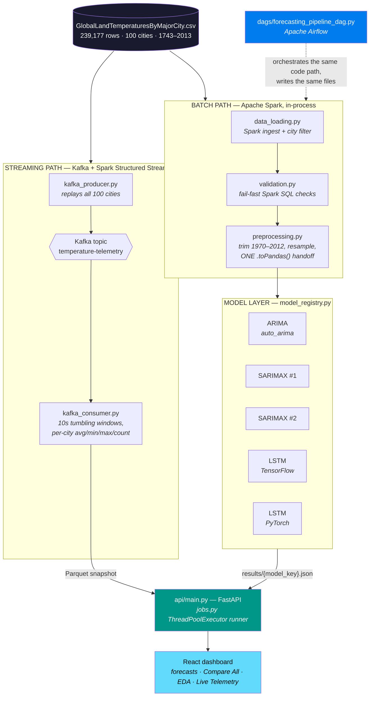
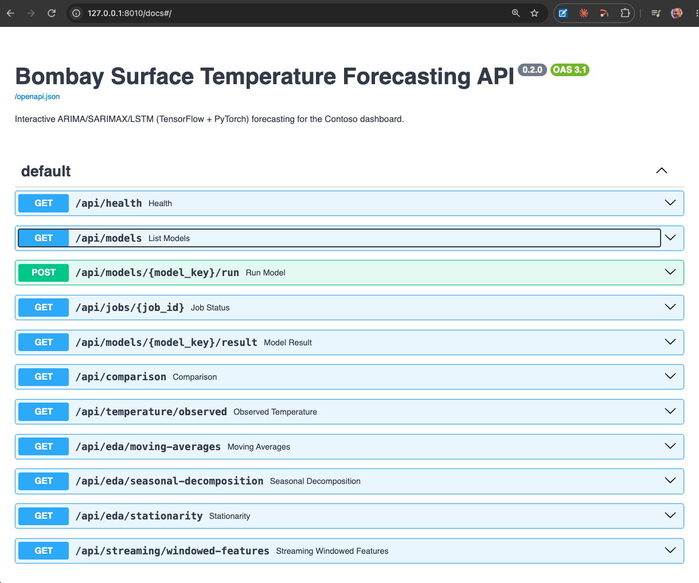
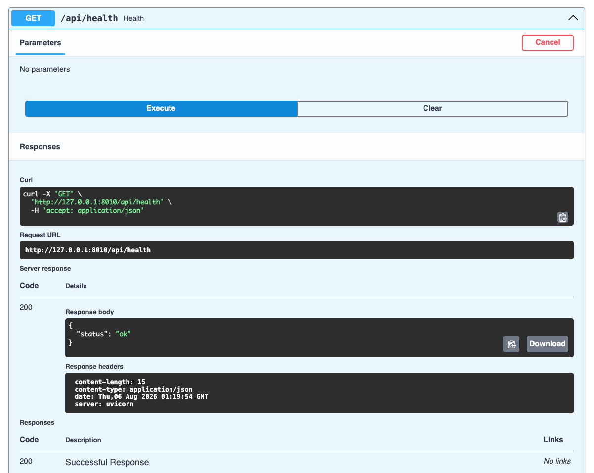
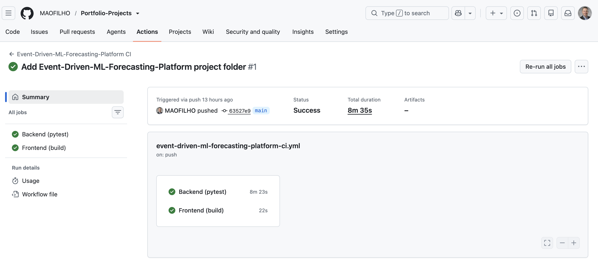
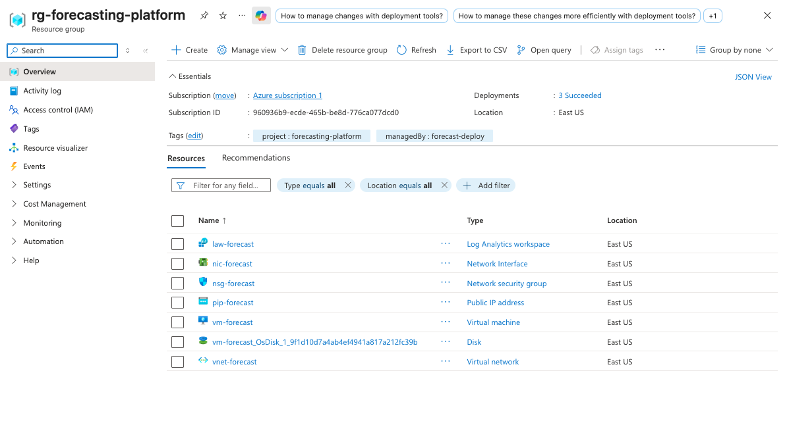

# Event-Driven ML Forecasting Platform
### Time-Series Forecasting on Apache Spark + Kafka + Airflow
### TensorFlow vs. PyTorch — Bombay Surface Temperature, 1970–2012


[](https://github.com/MAOFILHO/Portfolio-Projects/actions/workflows/event-driven-ml-forecasting-platform-ci.yml)


## Project Description

This project forecasts **monthly surface temperature** and, in doing so, demonstrates a complete
event-driven ML platform — built end to end, running entirely on a laptop at **$0 cost**, with an
optional one-command deploy to Azure.

**The dataset** is Berkeley Earth's `GlobalLandTemperaturesByMajorCity` — **239,177 monthly
observations across 100 major world cities, spanning 1743–2013**. The forecasting workload narrows
to a single city (**Bombay/Mumbai, 1970–2012**) to give every model an identical, clean, seasonal
series to compete on; the streaming layer deliberately uses the *full* 100-city dataset, because
that's what makes a streaming pipeline worth having.

**The objective** is a controlled model comparison, not a single prediction: fit **five forecasting
models** — an `auto_arima`-selected ARIMA, two independently-configured SARIMAX models, and the
*same* LSTM architecture implemented **twice, once in TensorFlow/Keras and once in PyTorch** — against
one identical held-out test period, and expose every result through the same API and dashboard shape
so the comparison is apples-to-apples rather than five separate notebooks with five separate charts.

**What's built around that** is the actual engineering substance:

- A **Python backend** — Apache Spark ETL, five model implementations, and a FastAPI service with an
  on-demand job runner, so any model can be re-fit live from the browser rather than replayed from a
  cached result.
- A **React/TypeScript dashboard** (Contoso-placeholder corporate theme) — sidebar model picker,
  live run status, per-model forecast charts, a Compare All overlay, an EDA page, a
  "PyTorch vs. TensorFlow" teaching page, and a Live Telemetry page.
- Three infrastructure layers that make it a *platform* rather than a script: **Apache Spark** as the
  sole ETL engine, **Apache Kafka + Spark Structured Streaming** for live telemetry, and
  **Apache Airflow** for orchestration.
- **Optional Azure deployment** — a resumable CLI (`forecast-deploy`) that stands the entire stack up
  on a single VM, verified end to end, and tears it down with a check that nothing billable is left
  behind.

> **PySpark vs. Apache Spark, for clarity**: PySpark is Apache Spark's official Python API. Apache
> Spark itself is the JVM-based (Scala) distributed processing engine; PySpark is the Python library
> that lets this project's code drive that same engine. So "PySpark" and "Apache Spark" refer to the
> same underlying technology — same meaning, just different framing (the engine vs. the Python
> interface to it). Both terms appear throughout this README depending on whether the sentence is
> about the technology in general or this project's specific Python usage of it.

This folder is fully self-contained — move or rename it anywhere and it will still run, since all
paths are relative and configurable via `.env` files.


## The Business Case: Why This Matters

**Problem:** Temperature — like demand, load, traffic, and price — is a *seasonal time series*, and
organizations plan against it constantly: energy utilities sizing generation capacity, agricultural
operations timing planting and irrigation, retailers positioning seasonal inventory, logistics teams
anticipating weather disruption. The forecast itself is rarely the hard part. Choosing *which model
to trust*, and keeping it running reliably once chosen, is.

**The Challenge:** There is no universally correct forecasting model. Classical statistical models
(ARIMA/SARIMAX) are transparent, cheap, and coefficient-level explainable — but assume structure the
data may not have. Deep learning models (LSTM) are higher-capacity and assumption-light — but slower,
harder to interpret, and prone to underperforming on exactly the small, strongly-seasonal datasets
where they look most impressive on paper. Comparing them honestly requires feeding both *identical*
inputs through *identical* preprocessing and scoring them on an *identical* held-out period — which
is precisely what ad-hoc notebook work fails to guarantee.

**The Consequence:** Teams pick a model class on reputation rather than evidence, and then discover
the second, larger problem: a model that only ever runs when a person opens a notebook and executes
cells top to bottom isn't infrastructure. It has no schedule, no retries, no observability, no
reaction to new data, and no reproducibility. The gap between "a model that works" and "a model that
runs in production" is where most forecasting efforts quietly stall.

**The Solution:** This project closes both gaps at once. It runs **five models through one shared
Apache Spark pipeline** — the same validation, the same preprocessing, the same train/test split —
so the comparison is genuinely controlled and the winner is evidence, not preference. Then it wraps
that comparison in the operational layer a real deployment needs: **Apache Kafka + Spark Structured
Streaming** so the system reacts to arriving data instead of a static CSV, and **Apache Airflow** so
the pipeline is a scheduled, retriable, observable DAG instead of a sequence of manual steps someone
has to remember. Every layer runs locally at $0, with a verified path to the cloud when a live demo
is actually needed.


## Results and Impact

> **Scope note, stated plainly:** this is a **demonstration project on a public dataset**, not a
> system deployed into a business with measured commercial outcomes. The numbers below are real —
> measured from committed run outputs in `backend/outputs/results/*.json` and from verified
> deploy/teardown runs — but they are *engineering and model-accuracy* results. No ROI, cost-savings,
> or hours-saved figures are claimed, because none have been measured.

### Model comparison — measured on the identical 36-month held-out period

| Model | MSE | RMSE (°C) | Seasonal? | Notes |
|---|---|---|---|---|
| **SARIMAX Model 1** | **0.329** | **0.574** | ✅ | **Best overall.** `order=(1,1,2)`, `seasonal_order=(1,0,1,12)` |
| SARIMAX Model 2 | 0.332 | 0.576 | ✅ | `order=(0,0,2)`, `seasonal_order=(1,0,1,12)` — statistically neck-and-neck with Model 1 |
| LSTM (PyTorch) | 0.440 | 0.663 | learned | Best deep-learning result |
| LSTM (TensorFlow/Keras) | 2.059 | 1.435 | learned | Same architecture as the PyTorch LSTM — see finding #2 |
| ARIMA | 2.409 | 1.552 | ❌ | Plain `ARIMA(0,0,2)`, **no seasonal term** — see finding #3 |

**Four findings worth stating outright:**

1. **The right structural assumption beat the bigger model.** SARIMAX beat both LSTMs — roughly
   **13% lower RMSE than the better LSTM** (0.574 vs. 0.663), at a fraction of the compute and with
   full coefficient-level interpretability. Note this is *not* simply "classical beats deep learning":
   plain ARIMA is equally classical and finished **last** (finding #3). What separates the top two
   from the bottom one is an explicit seasonal term on strongly seasonal data. On a small, clean,
   monthly series, matching the model's structure to the data's structure mattered more than model
   capacity — which is exactly why the controlled comparison was worth building rather than assumed.

2. **Same architecture, same data, ~2.2× different RMSE between frameworks.** PyTorch reached 0.663
   RMSE, TensorFlow/Keras 1.435 — and the two runs are matched on every variable this project
   controls: identical 3-layer 100→50→10 LSTM + 64→32→1 dense stack, Adam at default learning rate,
   MSE loss, 10 epochs, `batch_size=1`, fixed random seeds on both sides, and both persisting the
   **best-training-loss** epoch rather than the last one.

   What's left is genuinely framework-internal, and it's mostly **weight initialization**: Keras
   initializes LSTM kernels with `glorot_uniform`, recurrent kernels `orthogonal`, and — critically —
   defaults `unit_forget_bias=True`, seeding the forget gate bias at 1. PyTorch's `nn.LSTM` instead
   draws *every* weight from `uniform(-1/√hidden, 1/√hidden)` with no equivalent forget-gate
   treatment. Setting the same seed *number* in both frameworks also doesn't produce the same draws,
   since the RNG algorithms and consumption order differ entirely.

   *Honest caveat:* this is **one seed pair, not a multi-seed study** — the direction of the result is
   reproducible on this configuration, but treat the exact 2.2× magnitude as a single sample rather
   than a precise framework benchmark. The transferable lesson stands regardless: "same architecture"
   does **not** mean "same result," and framework choice is a real experimental variable rather than
   an implementation detail.

3. **ARIMA finished last, and the reason is instructive.** At 1.552 RMSE it trails even the weaker
   LSTM. The cause isn't the algorithm — it's that this entry fits a **plain, non-seasonal**
   `ARIMA(0,0,2)`, carried over verbatim from the source notebook. Note the irony visible in the code:
   `run_auto_arima()` searches and *correctly identifies* `seasonal_order=(1,0,1,12)`, that result is
   reported in the dashboard, and then `fit_and_forecast_arima()` fits without it. Asking a
   non-seasonal model to predict a strongly seasonal series is the single largest error source in this
   whole comparison — a ~2.7× worse RMSE than the same family *with* the seasonal term (SARIMAX Model
   2 uses the identical `order=(0,0,2)` and reaches 0.576). It's preserved rather than silently
   "fixed" because reproducing the notebook faithfully is a stated goal of this project — but it's
   documented here rather than buried, and it's the most obvious next improvement.

4. **The two SARIMAX configurations are effectively tied** (0.574 vs. 0.576 RMSE) despite quite
   different non-seasonal `order` terms. Combined with finding #3, the conclusion is consistent: on
   this series the seasonal component does essentially all the work, and the non-seasonal terms are
   close to noise.

### Verified engineering outcomes

| Outcome | Evidence |
|---|---|
| Full test suite green | **33 tests passing** — Spark ETL parity, all 5 models end-to-end, Kafka producer/consumer logic, streaming endpoint |
| CI runs on every push | GitHub Actions: backend (pytest + JDK 17 + Spark) and frontend (`npm ci` + build), broker-free and orchestrator-free, **$0 cost** |
| Orchestration verified | `forecasting_pipeline` DAG run **8/8 tasks green**, 5 training tasks executing concurrently under `LocalExecutor` |
| Cloud deploy verified end to end | Entire stack (backend + frontend + Kafka + Airflow) on a single Azure VM; dashboard, API, and Airflow all returning HTTP 200 |
| Teardown verified clean | Post-teardown smoke test confirms **zero** leftover resource groups and **zero** billable resources tagged to the project |
| Local running cost | **$0** — no managed services, no API keys, no cloud credentials required |
| Cloud demo cost | **~$2–4 USD** for a 1–2 day deploy-screenshot-teardown session (per-second billing) |

### What this project demonstrates

❌ A notebook that fits a model once, on one machine, with results that can't be reproduced or rerun

✅ A pipeline where **data validation, ETL, five competing models, streaming ingestion, and
orchestration** are separate, tested, observable components — sharing one code path, deployable to
cloud in one command, and torn down with proof that nothing was left running


## What It Does

Historical monthly surface temperature data for Bombay (Mumbai), 1970–2012, is used to:

1. **Load and clean the raw dataset through Apache Spark** — schema/quality validation, then
   trimming, resampling, and a chronological train/test split, all as Spark DataFrame operations,
   not pandas.
2. **Explore trends, seasonality, and stationarity** — moving averages, seasonal decomposition, and
   ADF/KPSS tests, surfaced explicitly before any model is fit.
3. **Fit an `auto_arima`-selected ARIMA model and two SARIMAX models**, each forecasting 36 months
   ahead with confidence intervals.
4. **Train the same LSTM architecture twice** — once in TensorFlow/Keras, once in PyTorch — to
   produce a rolling forecast over the same test period.
5. **Compare all five models' forecast accuracy (MSE/RMSE) side by side.**

From the dashboard's sidebar you can select any of the 5 models, **run it live** (real
fitting/training happens on the backend, not a canned replay), watch its status update, and see its
forecast chart and metrics as soon as it completes. A **Compare All** view overlays every model
that's been run, and a **Learn: PyTorch vs. TensorFlow** page explains core deep-learning concepts
(tensors, model building, training loops, data loading, regularization, evaluation, hyperparameter
tuning, saving/loading, CNNs vs. RNNs/LSTMs, visualization) using this project's actual code as the
running example.

That model-comparison workflow is the batch half of the project. The other half — **Kafka streaming**
into the dashboard's Live Telemetry page, and this same validate → ETL → train → export sequence run
as an **Airflow DAG** — runs alongside it on identical underlying code. Both are optional: the
dashboard is fully usable without either.


## Architecture

The raw CSV feeds two independent paths — a **batch** path that trains and scores the five models,
and a **streaming** path that maintains live windowed stats — converging at the FastAPI layer the
dashboard reads from:



Three layers sit under the dashboard, each solving a distinct problem:

### 1. Apache Spark — the ETL engine

Every model — statistical or deep learning, TensorFlow or PyTorch — is fed by the same pipeline
(`backend/src/data_loading.py` → `validation.py` → `preprocessing.py`), so data quality is enforced
once, upstream, rather than re-implemented per model. **Spark is the sole ingest/ETL engine here, not
pandas**: `data_loading.py` reads and filters the CSV as a Spark DataFrame, `validation.py` runs its
checks as Spark SQL aggregations, and `preprocessing.py` does date parsing, column selection, and the
1970–2012 trim in Spark before a single `.toPandas()` handoff at the very end — where the pandas
index contract (`DatetimeIndex`, `freq='MS'`) that every downstream model and the EDA stage depend on
is rebuilt.

`validation.py` **fails fast** with a clear `DataValidationError` if the input CSV is missing required
columns, has no rows for the target city, contains unparseable dates, or is too sparse (>50% missing
temperature values) to forecast reliably — surfacing a diagnosable error immediately instead of a
confusing failure several stages later inside statsmodels/Keras/PyTorch.

Building on Spark rather than pandas means the same transformation logic scales past what one
machine can hold in memory, without a rewrite.

### 2. Apache Kafka + Spark Structured Streaming — the live layer

`backend/src/kafka_producer.py` replays the full dataset (**every city**, not just Bombay) onto a
local Kafka topic as simulated real-time telemetry. `kafka_consumer.py` runs a Spark Structured
Streaming consumer maintaining **10-second tumbling windows** of avg/min/max temperature and event
count per city, written to Parquet and surfaced live in the dashboard's **Live Telemetry** page.

Windowing is on **Kafka ingestion time**, not the payload's historical date — the dataset spans
1743–2013, and using those dates as an event-time watermark at replay speed would make every
micro-batch "late" relative to the last.

This closes the gap between "yesterday's forecast" and "what's happening right now" — the same
reactive-to-incoming-data pattern a real deployment needs for live sensor/IoT feeds instead of a
fixed historical file.

### 3. Apache Airflow — the orchestration layer

`dags/forecasting_pipeline_dag.py` runs the same validate → ETL → train-5-models → export sequence
`run_pipeline.py` already runs, as an observable, retriable DAG:

```
validate_raw_data → run_pyspark_etl → train_forecasting_models → export_dashboard_results
                                       ├── train_arima              (5 tasks,
                                       ├── train_sarimax_model1      running
                                       ├── train_sarimax_model2      in
                                       ├── train_lstm_tensorflow     parallel)
                                       └── train_lstm_pytorch
```

Every task is a thin wrapper around the existing pipeline functions — **no model or ETL logic is
duplicated for Airflow**. Results land in `backend/outputs/results/*.json` via a bind mount, the same
files the dashboard already reads, so an Airflow run and a manual run produce identical output.

This turns "run these four scripts in the right order and hope nobody forgets a step" into a
scheduled, retriable, observable DAG — with automatic retries around the one known transient failure
mode (concurrent Spark JVM contention, see [Troubleshooting](#troubleshooting)) and a UI for watching
and re-triggering runs.

### How live model runs work

Model fits/training are blocking, CPU-bound work (seconds for SARIMAX, up to a couple of minutes for
`auto_arima`'s full grid search, tens of seconds for either LSTM's training epochs) — too slow to run
inside a single HTTP request. `POST /api/models/{key}/run` kicks the run off in a background thread
and returns a `job_id` immediately; the frontend polls `GET /api/jobs/{job_id}` every ~1.5s until it
completes, then displays the result. Job state lives in memory (a `ThreadPoolExecutor` + dict in
`backend/api/jobs.py`) — simple and sufficient for a local/single-process app, though a job's status
is lost if the backend restarts mid-run.

Each model's result is also persisted to `backend/outputs/results/{model_key}.json`, so
`GET /api/models/{key}/result` and the Compare All view always show the *last completed* run for that
model, even before you've triggered anything from the UI in this session.

See [`docs/ARCHITECTURE.md`](docs/ARCHITECTURE.md) for the full system design, data pipeline stages,
and framework trade-off discussion.


## Project Structure

```
event-driven-ml-forecasting-platform/
├── backend/
│   ├── api/
│   │   ├── main.py                # FastAPI app entrypoint, CORS config, streaming endpoint
│   │   └── jobs.py                # ThreadPoolExecutor-based background job runner
│   │
│   ├── src/
│   │   ├── spark_session.py       # Process-wide SparkSession singleton (JAVA_HOME auto-detect)
│   │   ├── data_loading.py        # PySpark CSV ingestion
│   │   ├── validation.py          # Fail-fast schema/quality checks (Spark SQL, DataValidationError)
│   │   ├── preprocessing.py       # Spark ETL -> single pandas handoff, index contract rebuild
│   │   ├── kafka_producer.py      # Replays the full dataset onto Kafka as simulated telemetry
│   │   ├── kafka_consumer.py      # Structured Streaming consumer -> windowed Parquet output
│   │   ├── arima_model.py         # auto_arima-selected ARIMA model
│   │   ├── sarimax_model.py       # Two independent SARIMAX models
│   │   ├── lstm_model.py          # LSTM — TensorFlow/Keras implementation
│   │   └── lstm_pytorch_model.py  # LSTM — PyTorch implementation
│   │
│   ├── data/
│   │   └── GlobalLandTemperaturesByMajorCity.csv   # 239,177 rows, 100 cities, 1743–2013
│   │
│   ├── models/
│   │   ├── TemperatureForecastingModel.keras       # TensorFlow LSTM checkpoint
│   │   └── TemperatureForecastingModel_pytorch.pt  # PyTorch LSTM checkpoint
│   │
│   ├── outputs/
│   │   ├── results/                # Per-model JSON results (persisted forecasts, metrics)
│   │   └── streaming/              # Kafka consumer's windowed-features Parquet snapshot
│   │
│   ├── tests/                      # 33 tests, all broker-free and orchestrator-free
│   │   ├── test_smoke.py           # Runs all 5 models + full pipeline seed end-to-end
│   │   ├── test_spark_etl.py       # Spark ETL parity + validation tests
│   │   ├── test_kafka_producer.py  # Producer row-serialization unit tests
│   │   ├── test_kafka_consumer.py  # Windowing/aggregation unit tests
│   │   └── test_streaming_endpoint.py  # Streaming API endpoint tests (fixture Parquet)
│   │
│   ├── run_pipeline.py             # Seeds all 5 models for first dashboard load
│   ├── requirements.txt
│   └── .env.example
│
├── frontend/
│   ├── src/
│   │   ├── pages/                  # Model detail, Compare All, EDA, Learn, Live Telemetry pages
│   │   ├── components/             # Sidebar model picker, charts, status indicators
│   │   └── App.tsx
│   ├── vite.config.ts              # Dev server + /api proxy to backend on :8000
│   ├── package.json
│   └── .env.example
│
├── dags/
│   └── forecasting_pipeline_dag.py # Airflow DAG: validate -> Spark ETL -> 5x train -> export
│
├── airflow/
│   ├── Dockerfile                  # Airflow image + JDK 17 + ML deps (CPU-only torch)
│   ├── requirements-airflow.txt    # Subset of backend/requirements.txt for DAG tasks
│   └── docker-compose.yml          # postgres + airflow-init + webserver + scheduler
│
├── docker-compose.yml              # Local Kafka broker (KRaft mode)
│
├── cloud/                          # Optional: Azure single-VM deploy tooling
│   ├── infra/                      # Bicep (VNet/NSG/PublicIP/VM/Log Analytics)
│   ├── cloud-init/                 # bootstrap.sh -- first-boot provisioning script
│   ├── docker/                     # docker-compose.cloud.yml + backend/frontend Dockerfiles
│   └── deploy/                     # forecast-deploy -- resumable Typer CLI
│
├── docs/
│   ├── ARCHITECTURE.md             # Full system design + framework trade-off discussion
│   └── *.png                       # README screenshots (dashboard, Airflow, cloud deploy)
│
└── README.md
```

CI (`event-driven-ml-forecasting-platform-ci.yml`) and the two cloud deploy/teardown workflows live
at the monorepo root's `.github/workflows/`, not inside this folder — GitHub Actions only discovers
workflow files there, which matters in a monorepo like this one. See
["Publishing to GitHub"](#publishing-to-github) below.


## 🛠️ Tech Stack

| Layer | Technology |
|-------|-----------|
| **Deep learning (TensorFlow)** | TensorFlow / Keras (`tf.keras`, `tf.data`) |
| **Deep learning (PyTorch)** | PyTorch (`torch.nn`, `DataLoader`) |
| **Statistical forecasting** | statsmodels (ARIMA, SARIMAX) + `pmdarima` (`auto_arima`) |
| **Batch ETL engine** | Apache Spark, via PySpark (`pyspark[sql]`, local mode) — sole ingest/clean engine, not just pandas |
| **Streaming ingestion** | Apache Kafka (local, KRaft mode, no Zookeeper) |
| **Stream processing** | Apache Spark Structured Streaming, via PySpark (tumbling windows, per-city aggregates) |
| **Orchestration** | Apache Airflow (local, LocalExecutor, custom Docker image) |
| **Data handling** | pandas, NumPy |
| **Backend framework** | FastAPI |
| **API server** | Uvicorn (ASGI) |
| **Background job execution** | Python `ThreadPoolExecutor` (in-memory job runner) |
| **Frontend framework** | React + TypeScript |
| **Build tool** | Vite |
| **Charting** | Recharts |
| **Routing** | `react-router` |
| **Styling** | Contoso-placeholder corporate theme (custom CSS) |
| **Backend testing** | pytest (33 tests) |
| **Containerization** | Docker / Docker Compose (Kafka broker, Airflow stack, cloud deploy) |
| **Cloud IaC** | Azure Bicep (optional deploy) |
| **Deploy tooling** | Typer CLI (`forecast-deploy`) — resumable, with pre/post/teardown smoke tests |
| **CI/CD** | GitHub Actions |
| **Config management** | `.env` files (`python-dotenv`, Vite env vars) |


## Prerequisites

- **Python 3.12** (backend — data pipeline, FastAPI, both LSTM frameworks)
- **JDK 17** on `PATH` (Spark's ETL engine needs a JVM — `backend/src/spark_session.py` auto-detects
  `JAVA_HOME` from `java` on `PATH`, so any JDK 17 install works)
- **Node.js + npm** (frontend — React/TypeScript dashboard via Vite)
- **Docker + Docker Compose** (only for the optional Kafka streaming layer and Airflow orchestration —
  the core dashboard, models, and Spark ETL run without Docker at all)
- **pip** for Python dependency installation
- **bash** (for running the setup commands below)
- **Azure CLI** — only if using the optional cloud deploy

No API keys, tokens, or cloud credentials are required for local use — everything runs locally
against the committed dataset and pre-trained checkpoints, and the Kafka/Airflow layers are local
Docker containers, not managed cloud services.


## Environment Variables

### backend/.env

| Variable             | Default                                              | Purpose                                                        |
|-----------------------|-------------------------------------------------------|------------------------------------------------------------------|
| `DATA_PATH`           | data/GlobalLandTemperaturesByMajorCity.csv          | Source CSV dataset                                                |
| `MODEL_PATH`          | models/TemperatureForecastingModel.keras            | TensorFlow/Keras LSTM checkpoint save/load location                |
| `MODEL_PATH_PYTORCH`  | models/TemperatureForecastingModel_pytorch.pt       | PyTorch LSTM checkpoint save/load location                         |
| `OUTPUT_DIR`          | outputs                                              | Where per-model results, `eda.json`, and plot PNGs are written      |
| `LSTM_EPOCHS`         | 10                                                    | Training epochs for both LSTMs (10 matches the original notebook)  |
| `LSTM_RETRAIN`        | true                                                  | Retrain LSTMs each run, or reuse the existing checkpoints           |
| `API_CORS_ORIGIN`     | http://localhost:5173                                | Allowed origin for the FastAPI CORS policy                          |
| `SPARK_MASTER`        | local[*]                                              | Spark master URL (in-process engine, all cores; no cluster)         |
| `SPARK_DRIVER_MEMORY` | 2g                                                    | Memory for the Spark driver JVM                                     |
| `KAFKA_BOOTSTRAP_SERVERS` | localhost:9092                                    | Broker address for the producer and consumer                        |
| `KAFKA_TOPIC`         | temperature-telemetry                                 | Topic the producer publishes to / consumer subscribes to            |
| `KAFKA_PRODUCER_RATE` | 500                                                   | Target producer replay rate, messages/second                        |
| `STREAMING_OUTPUT_DIR`| outputs/streaming                                     | Where the consumer's windowed-features Parquet + checkpoint live    |

### frontend/.env

| Variable              | Default (unset)                  | Purpose                                                      |
|-----------------------|------------------------------------|----------------------------------------------------------------|
| `VITE_API_BASE_URL`   | *(empty → uses Vite dev proxy)*    | Base URL of the FastAPI backend, for non-local deployments |

No API keys, tokens, or credentials are required anywhere in this project.


## Setup

### 1. Backend — Set up the Environment

```bash
cd backend
python3.12 -m venv .venv
source .venv/bin/activate
pip install -r requirements.txt
cp .env.example .env          # adjust paths if needed; defaults work out of the box
```


<br>


### 2. Backend — Tests

```bash
cd backend
pytest tests/test_smoke.py
```


<br><br>

Runs every model in the registry (ARIMA, both SARIMAX models, both LSTM variants) directly, plus the
full `run_pipeline.py` seed run end-to-end, against the real dataset and pre-trained checkpoints
(fast — LSTMs reuse their checkpoints instead of retraining in the test).


### 3. Backend — seed initial results

```bash
cd backend
python run_pipeline.py
# seeds all 5 models once, so the dashboard has
# data on first load (a few minutes, mostly the
# auto-ARIMA search and the two LSTMs' training)
```


<br><br>


<br><br>


<br><br>


### 4. Backend — Start the API

```bash
cd backend
python -m uvicorn api.main:app --reload --reload-dir api --reload-dir src --port 8000
```

<br><br>

`--reload-dir` scopes the file watcher to just `api/` and `src/` — without it, `--reload` watches the
whole `backend/` directory including `.venv/`, and package installs/`.pyc` writes inside
`site-packages` can trigger an endless restart loop that makes the API effectively unreachable. If
you don't need auto-reload, just drop `--reload` (and the two `--reload-dir` flags) entirely.

The API is now available at `http://localhost:8000` (interactive docs at
`http://localhost:8000/docs`). From here, every model can also be re-run live from the dashboard
itself — `run_pipeline.py` is just a convenience seed step, not a required one.


<p><em>The auto-generated OpenAPI docs at <code>/docs</code> — every endpoint the dashboard uses:
model listing, <code>POST /api/models/{key}/run</code>, job polling, per-model results, the
Compare All feed, the EDA endpoints, and the streaming windowed-features feed.</em></p>


<br><br>


<p><em>Executing an endpoint straight from the browser — <code>GET /api/health</code> returning
<code>200</code> with <code>{"status": "ok"}</code>, the same check the deploy CLI's post-deploy
smoke test hits.</em></p>

### 5. Frontend — run the dashboard

```bash
cd frontend
npm install
cp .env.example .env            # optional: point at a non-default API URL
npm run dev
```


<br><br>

Open `http://localhost:5173`. The Vite dev server proxies `/api` requests to the backend on port 8000
(see `vite.config.ts`), so no CORS configuration is needed for local development. Pick a model from
the sidebar, click **Run Model**, and watch it fit/train live; open **Compare All** once a few models
have run, **Learn: PyTorch vs. TensorFlow** any time, or **Live Telemetry** once the Kafka layer below
is running.

### 6. Kafka streaming layer (optional)

```bash
# from the repo root
docker compose up -d               # local Kafka broker, KRaft mode, no Zookeeper

# from backend/, in two separate terminals
python src/kafka_consumer.py       # Structured Streaming consumer -- start this first
python src/kafka_producer.py --limit 5000   # quick smoke run; drop --limit for the full ~239k replay
```

The consumer maintains 10-second tumbling windows of avg/min/max temperature and event count per
city, written to `backend/outputs/streaming/windowed_features/` on every micro-batch. The dashboard's
**Live Telemetry** page polls `GET /api/streaming/windowed-features` every 3s and shows a "not started
yet" state with these exact commands if nothing is streaming. `docker compose down` tears the broker
down; the topic is ephemeral (no volume), so a fresh `docker compose up -d` starts clean.

> **Note:** the producer is a one-shot replay — it sends its batch and exits. The Live Telemetry page
> will show that batch's windows and then stop updating, which is expected. Re-run the producer for a
> fresh burst of live-looking activity.

### 7. Airflow orchestration (optional)

```bash
cd airflow
docker compose build               # builds a custom Airflow image (~7GB, first time only)
docker compose up -d
# wait for airflow-init to finish, then open http://localhost:8081 (admin/admin)

docker compose exec airflow-scheduler airflow dags trigger forecasting_pipeline
```

Runs the same validate → Spark ETL → train 5 models → export pipeline as `run_pipeline.py`, but as an
observable, retriable Airflow DAG. Results land in `backend/outputs/results/*.json` via a bind mount,
so the dashboard picks them up immediately. `docker compose down` (from `airflow/`) stops the stack.

### 8. Continuous Integration (CI) — GitHub Actions

[`event-driven-ml-forecasting-platform-ci.yml`](https://github.com/MAOFILHO/Portfolio-Projects/actions/workflows/event-driven-ml-forecasting-platform-ci.yml)
runs on every push and pull request to `main` touching this folder: a `backend` job installs
`requirements.txt`, sets up JDK 17 for Spark, then runs the Spark ETL parity suite, the full model
smoke suite, and the Kafka layer's broker-free unit tests (producer serialization, consumer windowing
logic, streaming endpoint) — all **without a live Kafka broker or Airflow**, keeping CI fast and $0
cost. A `frontend` job installs with `npm ci` and runs `npm run build` (TypeScript + Vite).

Both LSTM checkpoints (TensorFlow and PyTorch) are committed to the repo, so CI loads them directly
rather than retraining from scratch. If either checkpoint is ever missing (e.g. deleted locally, or on
a fresh clone before the first pipeline run), `run_lstm()` / `run_lstm_pytorch()` both fall back to
training automatically — verified by simulating a missing checkpoint locally. Airflow's DAG has no CI
test of its own (it needs a ~7GB image and a live multi-container stack) — it's verified manually, per
step 7 above.


<br><br>


<br><br>


<p><em>A green CI run — <strong>Backend (pytest)</strong> in 8m 23s (Spark ETL parity, all 5 models,
Kafka unit tests, on JDK 17) and <strong>Frontend (build)</strong> in 22s (TypeScript + Vite), both
passing on a push touching this project's folder. No Kafka broker and no Airflow stack are involved,
which is what keeps the run this cheap and this fast.</em></p>


## Cloud Cost Estimate

Everything above runs entirely locally at **$0 cost**. Moving it to AWS or Azure was scoped and
deliberately made *optional* — not because it's technically hard, but because of what it costs to
keep standing, priced out across two architectures:

### 1. Lean self-hosted (single VM running the whole stack, always on)

| Resource | AWS (us-east-1) | Azure (East US) | Purpose |
|---|---|---|---|
| Compute (4 vCPU / 16GB, needed for Spark+TF+PyTorch+Kafka+Airflow together) | EC2 `t3.xlarge` — ~$122/mo on-demand | VM `Standard_B4ms` — ~$121/mo pay-as-you-go | Runs the whole `docker compose` stack, same as local |
| Compute, Spot/discounted | EC2 Spot — ~$40–55/mo (reclaimable anytime) | Azure Spot VM — ~$25–45/mo (reclaimable anytime) | Same, cheaper but can be evicted |
| Disk (30GB, for data/models/Kafka logs/Postgres) | EBS gp3 — ~$2.40/mo | Managed Disk (Standard SSD) — ~$2.40/mo | Data, model checkpoints, Airflow/Postgres storage |
| Static/public IP | Elastic IP — ~$3.60/mo if idle, free while attached | Static Public IP — ~$3/mo | So the dashboard/Airflow UI have a stable address |
| Egress bandwidth (demo-scale traffic) | ~$1–5/mo | ~$1–5/mo | Dashboard API calls, asset loads |
| **Total, on-demand** | **~$125–130/mo** | **~$125–130/mo** | |
| **Total, Spot/discounted** | **~$45–65/mo** | **~$30–55/mo** | |

### 2. Fully-managed services (the "do it right" architecture)

| Resource | AWS | Azure | Purpose |
|---|---|---|---|
| Backend/frontend hosting | ECS Fargate (small, always-on tasks) — ~$30–50/mo | Container Apps (consumption) — ~$10–30/mo | API + dashboard, scales somewhat with use |
| Managed Kafka | **MSK**, smallest 2-broker cluster — ~$130–150/mo minimum, even at zero traffic | **Event Hubs** (Kafka-compatible), Basic tier — ~$11–25/mo | Streaming layer |
| Managed Airflow | **MWAA**, smallest environment — ~$350–400/mo minimum, even fully idle | *(no direct equivalent)* — self-host on AKS: ~$70–150/mo for node pool (control plane is free) | Orchestration |
| Metadata DB (Postgres) | RDS `db.t3.micro` — ~$12–15/mo | Azure DB for PostgreSQL Flexible, B1ms — ~$12–15/mo | Airflow's backing store |
| **Total** | **~$520–615/mo** | **~$100–220/mo** | |

**The AWS number is dominated by one line: MWAA's ~$350–400/mo floor**, charged whether you trigger a
DAG once a month or never — a fixed tax for having *a* managed Airflow environment exist, completely
decoupled from actual usage. Azure comes out much cheaper mainly because it has no managed-Airflow
product to bill you for — you'd self-host it on AKS, which reduces cost but also reduces the "fully
managed, someone else babysits it" benefit you'd be paying for in the first place.

Neither architecture charges only for use — even the lean VM bills 24/7 whether the pipeline is
running or not. **But billing is per-second**: a 1–2 day deploy-screenshot-teardown session on the
lean VM costs **~$2–4 total**, which is what the deploy tooling below is built for.


## Deploy — Azure (Optional)

`cloud/` contains a working, resumable deploy CLI (`forecast-deploy`) that stands the **entire** stack
(backend, frontend, Kafka, Airflow, all via one unified `docker compose` stack) up on a single Azure
VM — verified end to end against a real subscription.

```bash
cd cloud/deploy
pip install -e .

forecast-deploy smoke-test --stage pre   # local tool checks (az CLI, ssh-keygen)
forecast-deploy deploy                   # resumable; prints the dashboard/Airflow URLs and a
                                         # freshly-generated Airflow admin password when done
forecast-deploy smoke-test --stage post  # re-validates the live URLs any time
```

**What it provisions**: a VNet/NSG/Public IP, one VM (`Standard_D4s_v3` by default — see
[Lessons Learned](#lessons-learned) for why v3, not v5), and a Log Analytics workspace, via Bicep
(`cloud/infra/`). The VM builds and starts the whole stack itself on first boot
(`cloud/cloud-init/bootstrap.sh`) — no container registry, no pre-built images to push.

**Handles re-deploys without failing on name collisions**: if a prior deploy is still live under the
default resource group name, `deploy` doesn't stop — it tries the next name
(`rg-forecasting-platform-2`, `-3`, ...) instead. It also proactively recovers any soft-deleted Log
Analytics workspace from a previous run, so a normal deploy → teardown → deploy cycle reuses the same
base name rather than accumulating suffixes forever. See `cloud/deploy/src/forecast_deploy/naming.py`.

**Security, given the VM is open to the internet**: Airflow's admin password and webserver secret key
are randomly generated at boot — never the repo's local-dev `admin/admin` placeholder — printed once
at the end of `deploy` and never committed anywhere. Kafka stays unpublished regardless (nothing
outside the VM's own Docker network needs to reach it directly).

**GitHub Actions**: `event-driven-ml-forecasting-platform-{deploy,teardown}.yml` run the same CLI via
`workflow_dispatch`, using OIDC against a dedicated, narrowly-scoped Azure AD app/custom role
(VM/network/Log Analytics/deployments only — no Storage, Key Vault, or role-assignment access, so a
compromised or misused run can't reach anything outside this project even within the same
subscription).


<p><em>The provisioned resource group in the Azure Portal — Log Analytics workspace, NIC, NSG,
Public IP, VM, OS disk, and VNet, all tagged <code>project: forecasting-platform</code> /
<code>managedBy: forecast-deploy</code>. Those tags are what the post-teardown smoke test queries to
prove nothing was left behind.</em></p>


<br><br>


<p><em>The dashboard, served from a single Azure VM at its public IP —
same app, same code, no changes needed to run in the cloud vs. locally.</em></p>


<br><br>


<p><em>A full <code>forecasting_pipeline</code> DAG run, triggered and
completed on the live cloud deployment — same DAG, same 5-parallel-task
shape, as the local runs.</em></p>


<br><br>


<p><em>Live Telemetry, populated by the same Kafka producer/consumer code
running as containers on the VM instead of bare host processes.</em></p>


## Teardown

**This is billed infrastructure — tear it down when the demo is over.**

```bash
cd cloud/deploy
forecast-deploy teardown -y
forecast-deploy smoke-test --stage teardown   # confirms nothing billable is left
```

`teardown` deletes the resource group and **waits for confirmation that deletion actually completed**
— deliberately not fire-and-forget, so you know it's gone rather than merely requested. Without a
local state file (e.g. a fresh GitHub Actions run), it falls back to matching resource groups by
**name pattern**, so a deploy that landed on an incremented suffix isn't silently missed and left
running.

`smoke-test --stage teardown` then independently verifies:

- **Zero** resource groups matching `rg-forecasting-platform*` remain
- **Zero** resources tagged `project=forecasting-platform` remain anywhere in the subscription
- Any soft-deleted Log Analytics workspace is reported as informational only (Azure doesn't bill
  soft-deleted resources, and the next deploy recovers it automatically)

This post-teardown verification is deliberately included because "I ran teardown" and "nothing is
billing me" are not the same claim — one is an action, the other is evidence.


## Screenshots

### Airflow Orchestration

A manually-triggered `forecasting_pipeline` run, watched end-to-end in the Airflow UI:


<p><em>Triggering a new run from the DAGs list. <code>schedule=None</code> — this
DAG is on-demand only, the same "click a button, don't wait for a timer"
philosophy as the dashboard's own "Run Model" action.</em></p>


<br><br>


<p><em>Graph view after completion: <code>validate_raw_data → run_pyspark_etl →
train_forecasting_models (5 parallel tasks) → export_dashboard_results</code>,
all green.</em></p>


<br><br>


<p><em>Gantt view: the 5 model-training tasks (<code>train_arima</code>,
both SARIMAX configs, both LSTM variants) run concurrently under
<code>LocalExecutor</code> — <code>train_arima</code>'s <code>auto_arima</code>
grid search is the long pole, the other four finish in well under two
minutes.</em></p>


<br><br>


<p><em>Run Duration across attempts — the red bars are earlier runs that hit
the transient Spark JVM contention race <code>forecasting_pipeline_dag.py</code>'s
<code>retries=2</code> exists for; the green bars are clean runs. That fix means
hitting this failure mode costs a 30s retry, not a manual re-trigger.</em></p>

### Web Application


<br><br>


<br><br>


<br><br>


<br><br>


<br><br>


<br><br>


<br><br>

<br><br>


## Troubleshooting

Every issue documented was hit and resolved during real local runs and a real Azure deployment —
Spark JVM contention, Compose silently building the wrong stack, a base image drifting to a Debian
release without JDK 17, container UID mismatches, Azure quota walls across three independent
dimensions, and more.

See [`docs/TROUBLESHOOTING.md`](docs/TROUBLESHOOTING.md) for the full list, each with its symptom,
root cause, and fix.

## Lessons Learned

Twelve things this project actually taught — from "the simpler model can win, and you only find out
by measuring" to "verify teardown, don't assume it" — each one tied to a decision in the codebase
rather than generic advice.

See [`docs/LESSONS_LEARNED.md`](docs/LESSONS_LEARNED.md) for the full write-up.

## Notes on logic carried over from the original notebook

Model architectures, hyperparameters, and window sizes are preserved exactly from the source notebook
(both LSTM implementations use the same 3-layer 100→50→10 LSTM + 64→32→1 Dense architecture, for a
fair comparison).

Two pre-existing quirks in the source notebook are called out here rather than silently fixed:

- **`backend/src/sarimax_model.py`**: the notebook's "zoom in on SARIMAX model 2's forecast" plot
  (cell 93) actually rendered **model 1**'s forecast due to what looks like a copy-paste bug (`pred`
  instead of `pred2`). Now that each SARIMAX model runs independently on demand rather than
  sequentially in one notebook pass, this is resolved by construction — each model's zoom plot
  correctly uses its own forecast. See the module docstring for details.
- Cells 72/74 in the notebook produced two near-identical ARIMA forecast plots; both are still
  preserved as separate output images (`arima_forecast_1.png` / `arima_forecast_2.png`).

## Re-running with fresh data

Replace `backend/data/GlobalLandTemperaturesByMajorCity.csv` and either re-run
`python run_pipeline.py` to reseed everything, or just click **Run Model** on whichever models you
want refreshed from the dashboard.

## Publishing to GitHub

Everything needed to run this project is already inside this folder and committed to the repo,
including the dataset (~14 MB) and both pre-trained model checkpoints — TensorFlow (~1 MB) and PyTorch
(~0.3 MB) — so both frameworks show completed results immediately after cloning, with no training
required to explore the dashboard. All three are well under GitHub's file size limits, so no Git LFS
is required. `.env` files are git-ignored; only `.env.example` files are committed.

## Project history

This project began as `TensorFlow-PyTorch-Forecasting-Dashboard`, a sibling folder in the
[`Portfolio-Projects`](https://github.com/MAOFILHO/Portfolio-Projects) monorepo — the original batch
dashboard: Spark-free, Kafka-free, Airflow-free, just pandas + FastAPI + React. This project is a
separate, self-contained folder in that same monorepo — copied from the original as a starting point,
then built up with the event-driven layers (Spark ETL, Kafka streaming, Airflow orchestration) without
touching the original folder's contents or history. `TensorFlow-PyTorch-Forecasting-Dashboard` remains
unchanged, in place, alongside this one. Everything from there on — the Spark migration, the streaming
layer, the orchestration DAG, the cloud deploy tooling — is new work on top of that starting point.


## Author

**Marcos Oliveira** — [LinkedIn](https://www.linkedin.com/in/mfilho1/) | [GitHub](https://github.com/MAOFILHO)
