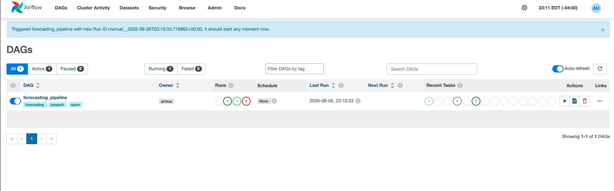
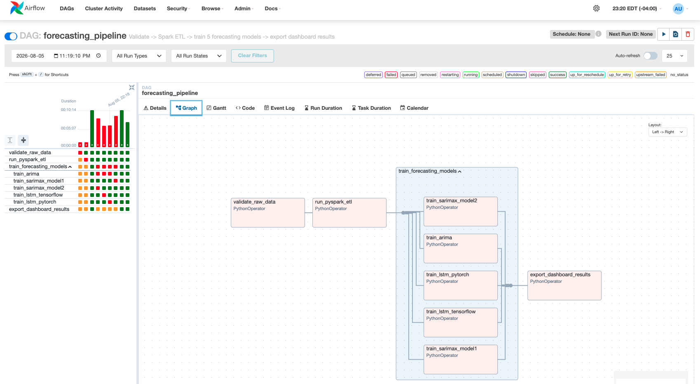
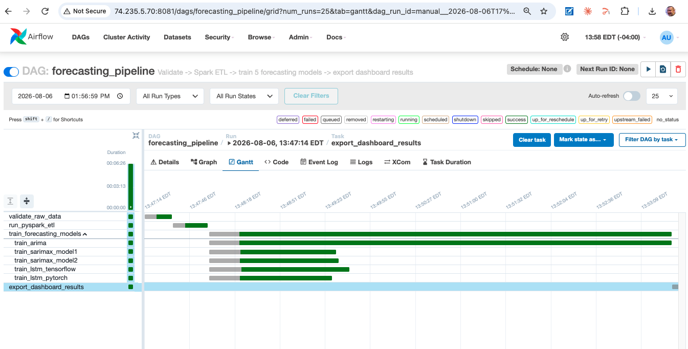
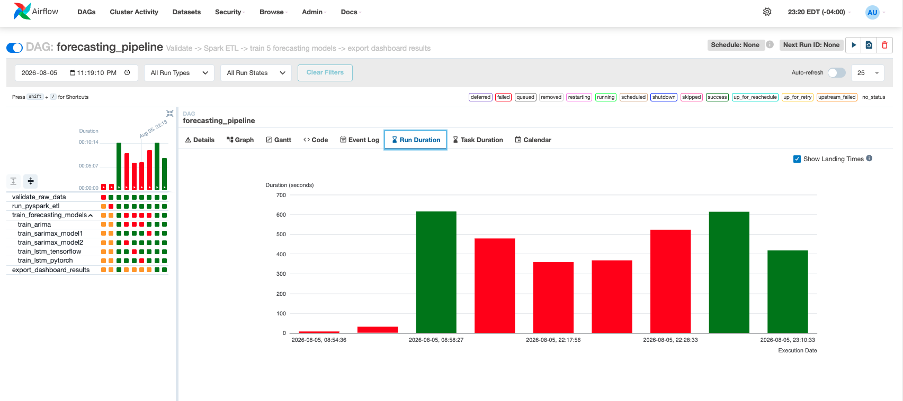
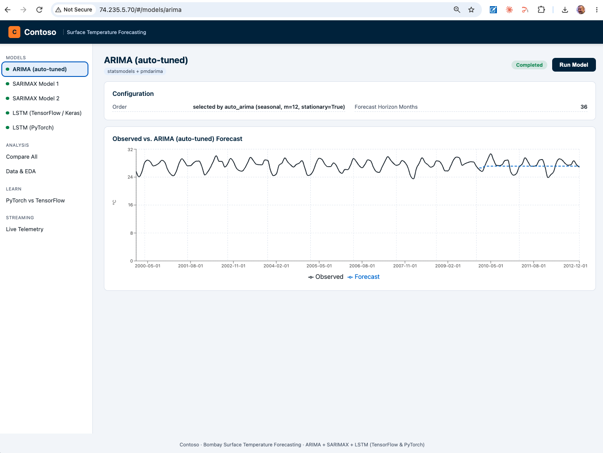
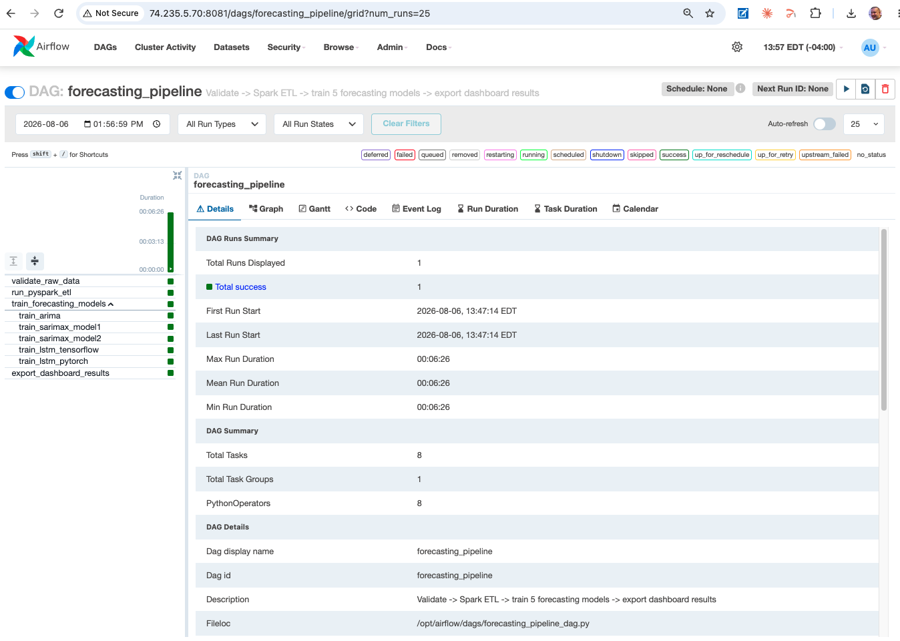
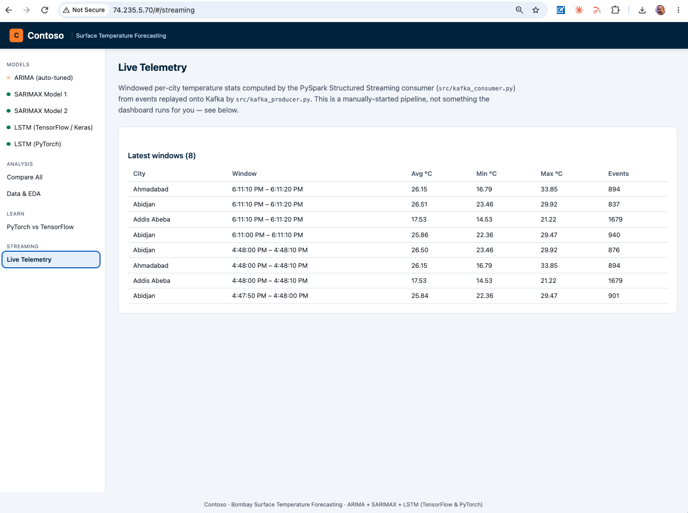

# Event-Driven ML Forecasting Platform
### Bombay Surface Temperature, 1970–2012
### TensorFlow vs. PyTorch, on Spark + Kafka + Airflow


An interactive full-stack showcase of time-series forecasting with
**statistical models (ARIMA/SARIMAX)** and **LSTM neural networks in both
TensorFlow/Keras and PyTorch**, converted from a notebook into a
self-contained, runnable project: a Python backend (data pipeline + FastAPI,
with on-demand live model runs) and a React/TypeScript dashboard styled with
a Contoso-placeholder corporate theme.

Started as a local batch dashboard, then evolved into a small event-driven ML
platform, entirely local and **$0 cost** — no managed cloud services required
to run any of it:

- **PySpark** is the sole ingest/ETL engine (`backend/src/data_loading.py`,
  `preprocessing.py`, `validation.py`), not just pandas.
- **Apache Kafka** (local, KRaft mode) carries simulated real-time telemetry
  from the full dataset (~239k rows, ~100 cities) to a **PySpark Structured
  Streaming** consumer that maintains live windowed per-city stats, surfaced
  in the dashboard's **Live Telemetry** page.
- **Apache Airflow** (local, LocalExecutor) orchestrates the same
  validate → ETL → train-5-models → export pipeline as a DAG, reusing the
  exact same pipeline/model code the API and `run_pipeline.py` already use —
  no logic is duplicated for orchestration.

See [`docs/ARCHITECTURE.md`](docs/ARCHITECTURE.md) for how these three layers
fit together, and the ["Project history"](#project-history) section below for
why this is a separate repo from the original dashboard.

This folder is fully self-contained — move or rename it anywhere and it will
still run, since all paths are relative and configurable via `.env` files.

## Why this project exists

Beyond the modelling itself, the value here is in the pipeline discipline
around it:

- **Translating raw temporal data into structured, model-ready inputs** —
  **PySpark** (not just pandas) is the sole ingest/ETL engine
  (`backend/src/data_loading.py`, `preprocessing.py`, `validation.py`):
  fail-fast schema/quality validation, then consistent scaling and
  rolling-window construction feeding every model, statistical or deep
  learning, identically. Built on Spark specifically so the same
  transformation logic scales past what pandas can hold in memory on one
  machine, without a rewrite.
- **Identifying patterns that inform operational decisions** — trend,
  seasonality, and stationarity are surfaced explicitly (EDA + ADF/KPSS
  tests) before any model is fit, not left implicit in a black box.
- **Comparing model classes to balance interpretability vs. performance** —
  ARIMA/SARIMAX (transparent, coefficient-level explainable) run side by
  side with LSTM in both TensorFlow and PyTorch (higher-capacity, less
  interpretable), evaluated on the identical held-out period.
- **Delivering forecasts that support planning, risk mitigation, and
  resource allocation** — every model's forecast, confidence interval, and
  error metrics are exposed through the same API/dashboard shape, regardless
  of which model produced them.

A real forecasting system, though, is judged as much by how it *operates* as
by what it predicts — a model that's only ever run once by hand against a
static CSV isn't production infrastructure yet. That's what the other two
tools in the title add:

- **Apache Kafka** (+ PySpark Structured Streaming) closes the gap between
  "yesterday's forecast" and "what's happening right now" — a producer
  replays the full dataset onto a topic as simulated real-time telemetry,
  and a streaming consumer maintains live, continuously-updating per-city
  stats, the same reactive-to-incoming-data pattern a real deployment would
  need for live sensor/IoT feeds instead of a fixed historical file.
- **Apache Airflow** turns "run these four scripts in the right order and
  hope nobody forgets a step" into a scheduled, retriable, observable DAG —
  the exact same validate → ETL → train-5-models → export pipeline this
  project already runs, just orchestrated instead of operated by hand, with
  automatic retries around the one known transient failure mode (concurrent
  Spark JVM contention) and a UI for watching and re-triggering runs.

See [`docs/ARCHITECTURE.md`](docs/ARCHITECTURE.md) for the full system
design, data pipeline stages, and framework trade-off discussion.

## What it does

Historical monthly surface temperature data for Bombay (Mumbai), 1970–2012,
is used to:

1. Load and clean the raw dataset through **PySpark** — schema/quality
   validation, then trimming, resampling, and a chronological train/test
   split, all as Spark DataFrame operations, not pandas.
2. Explore trends, seasonality, and stationarity (moving averages, seasonal
   decomposition, ADF/KPSS tests).
3. Fit an `auto_arima`-selected ARIMA model and two SARIMAX models, each
   forecasting 36 months ahead.
4. Train the same LSTM architecture (3 stacked LSTM layers + 2 dense layers)
   **twice** — once in TensorFlow/Keras, once in PyTorch — to produce a
   rolling forecast over the same test period.
5. Compare all five models' forecast accuracy (MSE/RMSE) side by side.

From the dashboard's sidebar you can select any of the 5 models, **run it
live** (real fitting/training happens on the backend, not a canned replay),
watch its status update, and see its forecast chart and metrics as soon as
it completes. A "Compare All" view overlays every model that's been run, and
a "Learn: PyTorch vs. TensorFlow" page explains the core deep-learning
concepts (tensors, model building, training loops, data loading,
regularization, evaluation, hyperparameter tuning, saving/loading, CNNs vs.
RNNs/LSTMs, visualization) using this project's actual code as the running
example.

That model-comparison workflow is the batch half of the project. The other
half runs alongside it, on the same underlying code:

- **Kafka streaming**: a producer replays the full dataset (all ~100
  cities, not just Bombay) onto a Kafka topic as simulated real-time
  telemetry; a PySpark Structured Streaming consumer maintains 10-second
  tumbling windows of per-city temperature stats, surfaced live on the
  dashboard's **Live Telemetry** page — a separate, continuously-updating
  view from the 5-model forecast comparison above.
- **Airflow orchestration**: the exact validate → Spark ETL →
  train-5-models → export sequence above, run as a `forecasting_pipeline`
  DAG instead of a manual script — triggered from the Airflow UI, watched
  task-by-task in the Grid/Graph view, with automatic retries built in for
  the one known transient failure mode. Every task in the DAG calls the
  same pipeline functions the API and `run_pipeline.py` already use, so
  running it via Airflow produces the identical result the dashboard would
  show from a manual run.

## Project layout

```
backend/    Python pipeline (converted from the notebook) + FastAPI service
            with an on-demand job runner for live model execution, PySpark
            ETL, and the Kafka producer/consumer streaming scripts

frontend/   React + TypeScript dashboard (Vite, Recharts, react-router,
            Contoso theme) — sidebar model picker, run/compare/EDA/learn pages

dags/       Airflow DAG (validate -> Spark ETL -> train 5 models -> export),
            reusing backend/'s pipeline code, not reimplementing it

airflow/    Local Airflow stack (custom Docker image + docker-compose.yml)

cloud/      Optional Azure deploy tooling (Bicep + a resumable CLI) for
            standing the whole stack up on a single VM for a demo, then
            tearing it down -- see "Azure Deployment (Cloud)" below

docker-compose.yml   Local Kafka broker (KRaft mode), for the streaming layer
```

## 🛠️ Tech Stack

| Layer | Technology |
|-------|-----------|
| **Deep learning (TensorFlow)** | TensorFlow / Keras (`tf.keras`, `tf.data`) |
| **Deep learning (PyTorch)** | PyTorch (`torch.nn`, `DataLoader`) |
| **Statistical forecasting** | statsmodels (ARIMA, SARIMAX) + `pmdarima` (`auto_arima`) |
| **Batch ETL engine** | PySpark (`pyspark[sql]`, local mode) — sole ingest/clean engine, not just pandas |
| **Streaming ingestion** | Apache Kafka (local, KRaft mode, no Zookeeper) |
| **Stream processing** | PySpark Structured Streaming (tumbling windows, per-city aggregates) |
| **Orchestration** | Apache Airflow (local, LocalExecutor, custom Docker image) |
| **Data handling** | pandas, NumPy |
| **Backend framework** | FastAPI |
| **API server** | Uvicorn (ASGI) |
| **Background job execution** | Python `ThreadPoolExecutor` (in-memory job runner) |
| **Frontend framework** | React + TypeScript |
| **Build tool** | Vite |
| **Charting** | Recharts |
| **Routing** | `react-router` |
| **Styling** | Contoso-placeholder corporate theme (custom CSS) |
| **Backend testing** | pytest |
| **Containerization** | Docker / Docker Compose (Kafka broker, Airflow stack) |
| **CI/CD** | GitHub Actions |
| **Config management** | `.env` files (`python-dotenv`, Vite env vars) |


## Prerequisites

- **Python 3.12** (backend — data pipeline, FastAPI, both LSTM frameworks)
- **JDK 17** on `PATH` (PySpark's ETL engine needs a JVM — `backend/src/spark_session.py`
  auto-detects `JAVA_HOME` from `java` on `PATH`, so any JDK 17 install works)
- **Node.js + npm** (frontend — React/TypeScript dashboard via Vite)
- **Docker + Docker Compose** (only for the optional Kafka streaming layer and Airflow
  orchestration — the core dashboard, models, and Spark ETL run without Docker at all)
- **pip** for Python dependency installation
- **bash** (for running the quickstart commands below)

No API keys, tokens, or cloud credentials are required anywhere in this project — everything runs
locally against the committed dataset and pre-trained checkpoints, and the Kafka/Airflow layers
are local Docker containers, not managed cloud services.


## Project Structure

```
event-driven-ml-forecasting-platform/
├── backend/
│   ├── api/
│   │   ├── main.py                # FastAPI app entrypoint, CORS config, streaming endpoint
│   │   └── jobs.py                # ThreadPoolExecutor-based background job runner
│   │
│   ├── src/
│   │   ├── spark_session.py       # Process-wide SparkSession singleton (JAVA_HOME auto-detect)
│   │   ├── data_loading.py        # PySpark CSV ingestion
│   │   ├── validation.py          # Fail-fast schema/quality checks (Spark SQL, DataValidationError)
│   │   ├── preprocessing.py       # Spark ETL -> single pandas handoff, index contract rebuild
│   │   ├── kafka_producer.py      # Replays the full dataset onto Kafka as simulated telemetry
│   │   ├── kafka_consumer.py      # Structured Streaming consumer -> windowed Parquet output
│   │   ├── arima_model.py         # auto_arima-selected ARIMA model
│   │   ├── sarimax_model.py       # Two independent SARIMAX models
│   │   ├── lstm_model.py          # LSTM — TensorFlow/Keras implementation
│   │   └── lstm_pytorch_model.py  # LSTM — PyTorch implementation
│   │
│   ├── data/
│   │   └── GlobalLandTemperaturesByMajorCity.csv
│   │
│   ├── models/
│   │   ├── TemperatureForecastingModel.keras       # TensorFlow LSTM checkpoint
│   │   └── TemperatureForecastingModel_pytorch.pt  # PyTorch LSTM checkpoint
│   │
│   ├── outputs/
│   │   ├── results/                # Per-model JSON results (persisted forecasts, metrics)
│   │   └── streaming/               # Kafka consumer's windowed-features Parquet snapshot
│   │
│   ├── tests/
│   │   ├── test_smoke.py           # Runs all 5 models + full pipeline seed end-to-end
│   │   ├── test_spark_etl.py       # Spark ETL parity + validation tests (no broker needed)
│   │   ├── test_kafka_producer.py  # Producer row-serialization unit tests (no broker)
│   │   ├── test_kafka_consumer.py  # Windowing/aggregation unit tests (no broker)
│   │   └── test_streaming_endpoint.py  # Streaming API endpoint tests (fixture Parquet)
│   │
│   ├── run_pipeline.py             # Seeds all 5 models for first dashboard load
│   ├── requirements.txt
│   └── .env.example
│
├── frontend/
│   ├── src/
│   │   ├── pages/                  # Model detail, Compare All, EDA, Learn, Live Telemetry pages
│   │   ├── components/             # Sidebar model picker, charts, status indicators
│   │   └── App.tsx
│   ├── vite.config.ts              # Dev server + /api proxy to backend on :8000
│   ├── package.json
│   └── .env.example
│
├── dags/
│   └── forecasting_pipeline_dag.py # Airflow DAG: validate -> Spark ETL -> 5x train -> export
│
├── airflow/
│   ├── Dockerfile                  # Airflow image + JDK 17 + ML deps (CPU-only torch)
│   ├── requirements-airflow.txt    # Subset of backend/requirements.txt for DAG tasks
│   └── docker-compose.yml          # postgres + airflow-init + webserver + scheduler
│
├── docker-compose.yml              # Local Kafka broker (KRaft mode)
│
├── cloud/                          # Optional: Azure single-VM deploy tooling
│   ├── infra/                      # Bicep (VNet/NSG/PublicIP/VM/Log Analytics)
│   ├── cloud-init/                 # bootstrap.sh -- first-boot provisioning script
│   ├── docker/                     # docker-compose.cloud.yml + backend/frontend Dockerfiles
│   └── deploy/                     # forecast-deploy -- resumable Typer CLI (deploy/teardown/smoke-test)
│
├── docs/
│   ├── ARCHITECTURE.md             # Full system design + framework trade-off discussion
│   └── *.png                       # README screenshots (dashboard, Airflow, cloud deploy)
│
└── README.md
```

CI (`event-driven-ml-forecasting-platform-ci.yml`) and the two cloud deploy/
teardown workflows live at the monorepo root's `.github/workflows/`, not
inside this folder — this is one project among several sharing that repo,
see ["Publishing to GitHub"](#publishing-to-github) below.


## Quickstart

### 1. Backend — Set up the Environment

```bash
cd backend
python3.12 -m venv .venv
source .venv/bin/activate
pip install -r requirements.txt
cp .env.example .env          # adjust paths if needed; defaults work out of the box
```


<br>


### 2. Backend — Tests

```bash
cd backend
pytest tests/test_smoke.py
```


<br><br>

Runs every model in the registry (ARIMA, both SARIMAX models, both LSTM
variants) directly, plus the full `run_pipeline.py` seed run end-to-end,
against the real dataset and pre-trained checkpoints (fast — LSTMs reuse
their checkpoints instead of retraining in the test).


### 3. Backend — seed initial results 

```bash
cd backend
python run_pipeline.py                                  
# seeds all 5 models once, so the dashboard has
# data on first load (a few minutes, mostly the
# auto-ARIMA search and the two LSTMs' training)
```


<br><br>


<br><br>


<br><br>


### 4. Backend — Start the API

```bash
cd backend
python -m uvicorn api.main:app --reload --reload-dir api --reload-dir src --port 8000
```

<br><br>

`--reload-dir` scopes the file watcher to just `api/` and `src/` — without it,
`--reload` watches the whole `backend/` directory including `.venv/`, and
package installs/`.pyc` writes inside `site-packages` can trigger an endless
restart loop that makes the API effectively unreachable. If you don't need
auto-reload, just drop `--reload` (and the two `--reload-dir` flags)
entirely.

The API is now available at `http://localhost:8000` (interactive docs at
`http://localhost:8000/docs`). From here, every model can also be re-run live
from the dashboard itself (see below) — `run_pipeline.py` is just a
convenience seed step, not a required one.

### 5. Frontend — run the dashboard

```bash
cd frontend
npm install
cp .env.example .env            # optional: point at a non-default API URL
npm run dev
```


<br><br>

Open `http://localhost:5173`. The Vite dev server proxies `/api` requests to
the backend on port 8000 (see `vite.config.ts`), so no CORS configuration is
needed for local development. Pick a model from the sidebar, click **Run
Model**, and watch it fit/train live; open **Compare All** once a few models
have run, **Learn: PyTorch vs. TensorFlow** any time, or **Live Telemetry**
once the Kafka layer below is running.

### 6. Kafka streaming layer

```bash
# from the repo root
docker compose up -d               # local Kafka broker, KRaft mode, no Zookeeper

# from backend/, in two separate terminals
python src/kafka_consumer.py       # Structured Streaming consumer -- start this first
python src/kafka_producer.py --limit 5000   # quick smoke run; drop --limit for the full ~239k replay
```

The consumer maintains 10-second tumbling windows of avg/min/max temperature
and event count per city, written to `backend/outputs/streaming/windowed_features/`
on every micro-batch. The dashboard's **Live Telemetry** page polls
`GET /api/streaming/windowed-features` every 3s and shows a "not started yet"
state with these exact commands if nothing is streaming. `docker compose down`
tears the broker down; the topic is ephemeral (no volume), so a fresh
`docker compose up -d` starts clean.

### 7. Airflow orchestration

```bash
cd airflow
docker compose build               # builds a custom Airflow image (~7GB, first time only)
docker compose up -d
# wait for airflow-init to finish, then open http://localhost:8081 (admin/admin)

docker compose exec airflow-scheduler airflow dags trigger forecasting_pipeline
```

Runs the same validate → Spark ETL → train 5 models → export pipeline as
`run_pipeline.py`, but as an observable, retriable Airflow DAG
(`dags/forecasting_pipeline_dag.py`). Every task reuses the existing pipeline
code directly — no model or ETL logic is reimplemented for Airflow. Results
land in `backend/outputs/results/*.json` via a bind mount, so the dashboard
picks them up immediately, the same files a manual `run_pipeline.py` run or a
live "Run Model" click would produce. `docker compose down` (from `airflow/`)
stops the stack when you're done.

### 8. Continuous Integration (CI) — GitHub Actions

[](https://github.com/MAOFILHO/Portfolio-Projects/actions/workflows/event-driven-ml-forecasting-platform-ci.yml)

[`ci.yml`](.github/workflows/ci.yml) runs on every push and pull request to
`main`: a `backend` job installs `requirements.txt`, then runs the Spark ETL
parity suite, the full model smoke suite, and the Kafka layer's broker-free
unit tests (producer serialization, consumer windowing logic, streaming
endpoint) — all without a live Kafka broker or Airflow, keeping CI fast and
$0 cost. A `frontend` job installs with `npm ci` and runs `npm run build`
(TypeScript + Vite). Both LSTM checkpoints (TensorFlow and PyTorch) are
committed to the repo, so CI loads them directly rather than retraining from
scratch. If either checkpoint is ever missing (e.g. deleted locally, or on a
fresh clone before the first pipeline run), `run_lstm()` / `run_lstm_pytorch()`
both fall back to training automatically — verified by simulating a missing
checkpoint locally. Airflow's DAG has no CI test of its own (it needs a ~7GB
image and a live multi-container stack) — it's verified manually, per the
commands in step 7 above.


<br><br>

## Data pipeline robustness

Every model — statistical or deep learning, TensorFlow or PyTorch — is fed
by the same pipeline (`backend/src/data_loading.py` →
`backend/src/validation.py` → `backend/src/preprocessing.py`), so data
quality is enforced once, upstream, rather than re-implemented per model.
**PySpark is the sole ingest/ETL engine** here, not pandas — `data_loading.py`
reads and filters the CSV as a Spark DataFrame, `validation.py` runs its
checks as Spark SQL aggregations, and `preprocessing.py` does the date
parsing, column selection, and 1970–2012 trim in Spark before a single
`.toPandas()` handoff at the very end, where the pandas index contract
(`DatetimeIndex`, `freq='MS'`) every downstream model and the EDA stage
depend on is rebuilt. `validation.py` fails fast with a clear
`DataValidationError` if the input CSV is missing required columns, has no
rows for the target city, contains unparseable dates, or is too sparse (>50%
missing temperature values) to forecast reliably — surfacing a diagnosable
error immediately instead of a confusing failure several pipeline stages
later inside statsmodels/Keras/PyTorch.

## Streaming and orchestration layers

Two additional, optional layers sit alongside the core dashboard:

- **Kafka streaming** (`backend/src/kafka_producer.py` /
  `kafka_consumer.py`): a producer replays the full dataset (every city, not
  just Bombay) onto a local Kafka topic as simulated real-time telemetry; a
  PySpark Structured Streaming consumer maintains 10-second tumbling windows
  of per-city temperature stats, written to Parquet and surfaced live in the
  dashboard's **Live Telemetry** page. Windowing is on Kafka ingestion time,
  not the payload's historical date — the dataset spans 1743–2013, and using
  those dates as an event-time watermark at replay speed would make every
  micro-batch "late" relative to the last. See `docker-compose.yml` and
  quickstart step 6.
- **Airflow orchestration** (`dags/forecasting_pipeline_dag.py`): the same
  validate → ETL → train-5-models → export sequence `run_pipeline.py` already
  runs, as an observable, retriable DAG. Every task is a thin wrapper around
  the existing pipeline functions — no model or ETL logic is duplicated for
  Airflow. Results land in `backend/outputs/results/*.json` via a bind mount
  from the Airflow container, the same files the dashboard already reads. See
  `airflow/` and quickstart step 7.

## Airflow Orchestration Screenshots

A manually-triggered `forecasting_pipeline` run, watched end-to-end in the
Airflow UI (`http://localhost:8081`, `admin`/`admin`):


<p><em>Triggering a new run from the DAGs list. <code>schedule=None</code> — this
DAG is on-demand only, the same "click a button, don't wait for a timer"
philosophy as the dashboard's own "Run Model" action.</em></p>


<br><br>


<p><em>Graph view after completion: <code>validate_raw_data → run_pyspark_etl →
train_forecasting_models (5 parallel tasks) → export_dashboard_results</code>,
all green.</em></p>


<br><br>


<p><em>Gantt view: the 5 model-training tasks (<code>train_arima</code>,
both SARIMAX configs, both LSTM variants) run concurrently under
<code>LocalExecutor</code> — <code>train_arima</code>'s <code>auto_arima</code>
grid search is the long pole, the other four finish in well under two
minutes.</em></p>


<br><br>


<p><em>Run Duration across attempts — the red bars are earlier runs that hit
the transient Spark JVM contention race <code>forecasting_pipeline_dag.py</code>'s
<code>retries=2</code> exists for; the green bars are clean runs. That fix means
hitting this failure mode costs a 30s retry, not a manual re-trigger.</em></p>

## How live model runs work

Model fits/training are blocking, CPU-bound work (seconds for SARIMAX, up to
a couple of minutes for `auto_arima`'s full grid search, tens of seconds for
either LSTM's training epochs) — too slow to run inside a single HTTP
request. `POST /api/models/{key}/run` kicks the run off in a background
thread and returns a `job_id` immediately; the frontend polls
`GET /api/jobs/{job_id}` every ~1.5s until it completes, then displays the
result. Job state lives in memory (a `ThreadPoolExecutor` + dict in
`backend/api/jobs.py`) — simple and sufficient for a local/single-process
app, but a job's status is lost if the backend restarts mid-run.

Each model's result is also persisted to
`backend/outputs/results/{model_key}.json`, so `GET /api/models/{key}/result`
and the Compare All view always show the *last completed* run for that
model, even before you've triggered anything from the UI in this session
(as long as `run_pipeline.py` has been run at least once, or you've run that
model live before).

## Environment variables

### backend/.env

| Variable             | Default                                              | Purpose                                                        |
|-----------------------|-------------------------------------------------------|------------------------------------------------------------------|
| `DATA_PATH`           | data/GlobalLandTemperaturesByMajorCity.csv          | Source CSV dataset                                                |
| `MODEL_PATH`          | models/TemperatureForecastingModel.keras            | TensorFlow/Keras LSTM checkpoint save/load location                |
| `MODEL_PATH_PYTORCH`  | models/TemperatureForecastingModel_pytorch.pt       | PyTorch LSTM checkpoint save/load location                         |
| `OUTPUT_DIR`          | outputs                                              | Where per-model results, `eda.json`, and plot PNGs are written      |
| `LSTM_EPOCHS`         | 10                                                    | Training epochs for both LSTMs (10 matches the original notebook)  |
| `LSTM_RETRAIN`        | true                                                  | Retrain LSTMs each run, or reuse the existing checkpoints           |
| `API_CORS_ORIGIN`     | http://localhost:5173                                | Allowed origin for the FastAPI CORS policy                          |
| `SPARK_MASTER`        | local[*]                                              | Spark master URL (in-process engine, all cores; no cluster)         |
| `SPARK_DRIVER_MEMORY` | 2g                                                    | Memory for the Spark driver JVM                                     |
| `KAFKA_BOOTSTRAP_SERVERS` | localhost:9092                                    | Broker address for the producer and consumer                        |
| `KAFKA_TOPIC`         | temperature-telemetry                                 | Topic the producer publishes to / consumer subscribes to            |
| `KAFKA_PRODUCER_RATE` | 500                                                   | Target producer replay rate, messages/second                        |
| `STREAMING_OUTPUT_DIR`| outputs/streaming                                     | Where the consumer's windowed-features Parquet + checkpoint live    |

### frontend/.env

| Variable              | Default (unset)                  | Purpose                                                      |
|-----------------------|------------------------------------|----------------------------------------------------------------|
| `VITE_API_BASE_URL`   | *(empty → uses Vite dev proxy)*    | Base URL of the FastAPI backend, for non-local deployments |

No API keys, tokens, or credentials are required anywhere in this project.

## Notes on logic carried over from the original notebook

Model architectures, hyperparameters, and window sizes are preserved exactly
from the source notebook (both LSTM implementations use the same 3-layer
100→50→10 LSTM + 64→32→1 Dense architecture, for a fair comparison).

Two pre-existing quirks in the source notebook are called out here rather
than silently fixed:

- **`backend/src/sarimax_model.py`**: the notebook's "zoom in on SARIMAX
  model 2's forecast" plot (cell 93) actually rendered **model 1**'s forecast
  due to what looks like a copy-paste bug (`pred` instead of `pred2`). Now
  that each SARIMAX model runs independently on demand rather than
  sequentially in one notebook pass, this is resolved by construction — each
  model's zoom plot correctly uses its own forecast. See the module
  docstring for details.
- Cells 72/74 in the notebook produced two near-identical ARIMA forecasts
  plots; both are still preserved as separate output images
  (`arima_forecast_1.png` / `arima_forecast_2.png`).

## Re-running with fresh data

Replace `backend/data/GlobalLandTemperaturesByMajorCity.csv` and either
re-run `python run_pipeline.py` to reseed everything, or just click **Run
Model** on whichever models you want refreshed from the dashboard.

## Publishing to GitHub

Everything needed to run this project is already inside this folder and
committed to the repo, including the dataset (~14 MB) and both pre-trained
model checkpoints — TensorFlow (~1 MB) and PyTorch (~0.3 MB) — so both
frameworks show completed results immediately after cloning, with no
training required to explore the dashboard. All three are well under
GitHub's file size limits, so no Git LFS is required. `.env` files are
git-ignored; only `.env.example` files are committed.

## Project history

This project began as `TensorFlow-PyTorch-Forecasting-Dashboard`, a sibling
folder in the [`Portfolio-Projects`](https://github.com/MAOFILHO/Portfolio-Projects)
monorepo — the original batch dashboard: PySpark-free, Kafka-free,
Airflow-free, just pandas + FastAPI + React. This project is a separate,
self-contained folder in that same monorepo — copied from the original as a
starting point, then built up with the event-driven layers (PySpark ETL,
Kafka streaming, Airflow orchestration) without touching the original
folder's contents or history. `TensorFlow-PyTorch-Forecasting-Dashboard`
remains unchanged, in place, alongside this one. Everything from here on —
the Spark migration, the streaming layer, the orchestration DAG — is new work
on top of that starting point.

## Cloud Estimated Cost

Everything above runs entirely locally at **$0 cost**. Moving it to AWS or
Azure was scoped and deliberately parked — not because it's technically
hard, but because of what it actually costs to keep standing, priced out
across two architectures:

### 1. Lean self-hosted (single VM running the whole stack, always on)

Same architecture as this README describes, just moved onto a rented VM
instead of your own machine (one box running the whole `docker compose`
stack, 24/7).

| Resource | AWS (us-east-1) | Azure (East US) | Purpose |
|---|---|---|---|
| Compute (4 vCPU / 16GB, needed for Spark+TF+PyTorch+Kafka+Airflow together) | EC2 `t3.xlarge` — ~$122/mo on-demand | VM `Standard_B4ms` — ~$121/mo pay-as-you-go | Runs the whole `docker compose` stack, same as local |
| Compute, Spot/discounted | EC2 Spot — ~$40–55/mo (reclaimable anytime) | Azure Spot VM — ~$25–45/mo (reclaimable anytime) | Same, cheaper but can be evicted |
| Disk (30GB, for data/models/Kafka logs/Postgres) | EBS gp3 — ~$2.40/mo | Managed Disk (Standard SSD) — ~$2.40/mo | Data, model checkpoints, Airflow/Postgres storage |
| Static/public IP | Elastic IP — ~$3.60/mo if idle, free while attached | Static Public IP — ~$3/mo | So the dashboard/Airflow UI have a stable address |
| Egress bandwidth (demo-scale traffic) | ~$1–5/mo | ~$1–5/mo | Dashboard API calls, asset loads |
| **Total, on-demand** | **~$125–130/mo** | **~$125–130/mo** | |
| **Total, Spot/discounted** | **~$45–65/mo** | **~$30–55/mo** | |

### 2. Fully-managed services (the "do it right" architecture)

| Resource | AWS | Azure | Purpose |
|---|---|---|---|
| Backend/frontend hosting | ECS Fargate (small, always-on tasks) — ~$30–50/mo | Container Apps (consumption) — ~$10–30/mo | API + dashboard, scales somewhat with use |
| Managed Kafka | **MSK**, smallest 2-broker cluster — ~$130–150/mo minimum, even at zero traffic | **Event Hubs** (Kafka-compatible), Basic tier — ~$11–25/mo | Streaming layer |
| Managed Airflow | **MWAA**, smallest environment — ~$350–400/mo minimum, even fully idle | *(no direct equivalent)* — self-host on AKS: ~$70–150/mo for node pool (control plane is free) | Orchestration |
| Metadata DB (Postgres) | RDS `db.t3.micro` — ~$12–15/mo | Azure DB for PostgreSQL Flexible, B1ms — ~$12–15/mo | Airflow's backing store |
| **Total** | **~$520–615/mo** | **~$100–220/mo** | |

**The AWS number is dominated by one line: MWAA's ~$350–400/mo floor,
charged whether you trigger a DAG once a month or never.** That's a fixed
tax for having *a* managed Airflow environment exist, completely decoupled
from actual usage. Azure comes out much cheaper here mainly because it has
no managed-Airflow product to bill you for — you'd self-host it on AKS,
which reduces cost but also reduces the "fully managed, someone else
babysits it" benefit you'd be paying for in the first place.

Neither architecture charges only for use — even the lean VM bills 24/7
whether the pipeline is running or not, which doesn't match this project's
actual usage pattern (manually triggered, occasional). That mismatch,
more than the raw dollar figures, is why this stays local by default.

## Azure Deployment (Cloud)

The lean single-VM architecture above isn't just theoretical — `cloud/`
contains a working, resumable deploy CLI (`forecast-deploy`) that stands the
*entire* stack (backend, frontend, Kafka, Airflow, all via one unified
`docker compose` stack) up on a single Azure VM, verified end-to-end against
a real subscription. Meant for exactly the use case the cost section above
describes: a short (1–2 day) demo/screenshot session, then torn down
completely.

```bash
cd cloud/deploy
pip install -e .

forecast-deploy smoke-test --stage pre   # local tool checks (az CLI, ssh-keygen)
forecast-deploy deploy                   # resumable; prints the dashboard/Airflow
                                          # URLs and a freshly-generated Airflow
                                          # admin password when done
forecast-deploy smoke-test --stage post  # re-validates the live URLs any time

# ...take your screenshots, trigger a DAG run, poke around...

forecast-deploy teardown -y
forecast-deploy smoke-test --stage teardown   # confirms nothing billable is left
```

**What it provisions**: a VNet/NSG/Public IP, one VM (`Standard_D4s_v3` by
default — see `cloud/deploy/src/forecast_deploy/config.py` for why v3, not
v5), and a Log Analytics workspace, via Bicep (`cloud/infra/`). The VM
builds and starts the whole stack itself on first boot (`cloud/cloud-init/
bootstrap.sh`) — no container registry, no pre-built images to push.

**Handles re-deploys without failing on name collisions**: if a prior
deploy is still live under the default resource group name, `deploy`
doesn't stop — it tries the next name (`rg-forecasting-platform-2`, `-3`,
...) instead. `teardown` also proactively recovers/frees up any
soft-deleted Log Analytics workspace name from a previous run, so a normal
deploy → teardown → deploy cycle reuses the same base name rather than
accumulating suffixes forever. See `cloud/deploy/src/forecast_deploy/
naming.py`.

**Security, given the VM is open to the internet**: Airflow's admin
password and webserver secret key are randomly generated at boot, never the
repo's local-dev `admin/admin` placeholder — printed once at the end of
`deploy`, never committed anywhere. Kafka stays unpublished regardless
(nothing outside the VM's own Docker network needs to reach it directly).

**GitHub Actions**: `.github/workflows/event-driven-ml-forecasting-platform-
{deploy,teardown}.yml` run the same CLI via `workflow_dispatch`, using OIDC
against a dedicated, narrowly-scoped Azure AD app/custom role (VM/network/
Log Analytics/deployments only — no Storage, Key Vault, or role-assignment
access, so a compromised or misused run here can't reach anything outside
this project even within the same subscription).


<p><em>The dashboard, served from a single Azure VM at its public IP —
same app, same code, no changes needed to run in the cloud vs. locally.</em></p>


<br><br>


<p><em>A full <code>forecasting_pipeline</code> DAG run, triggered and
completed on the live cloud deployment — same DAG, same 5-parallel-task
shape, as the local runs earlier in this README.</em></p>


<br><br>


<p><em>Live Telemetry, populated by the same Kafka producer/consumer code
running as containers on the VM instead of bare host processes.</em></p>

## Web App Screenshots


<br><br>


<br><br>


<br><br>


<br><br>


<br><br>


<br><br>


<br><br>

<br><br>


## Author

**Marcos Oliveira** — [LinkedIn](https://www.linkedin.com/in/mfilho1/) | [GitHub](https://github.com/MAOFILHO)
