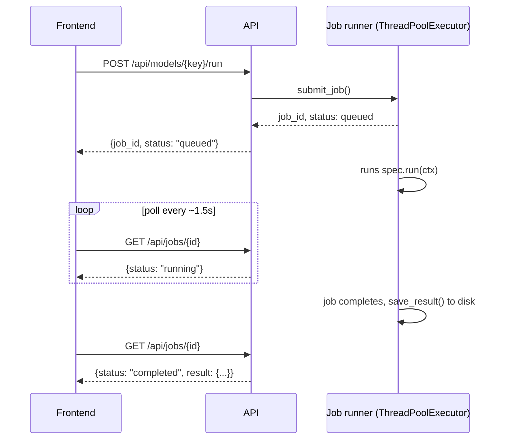

# Architecture

This document describes how the Event-Driven ML Forecasting Platform is put
together: the batch data pipeline (now PySpark-based), the streaming
ingestion layer (Kafka + Structured Streaming), the orchestration layer
(Airflow), the model layer (statistical and deep learning, across two
frameworks: TensorFlow/Keras and PyTorch), the API/job-execution layer, and
the frontend — and the design decisions behind each. See the root
[`README.md`](../README.md)'s ["Project history"](../README.md#project-history)
for why this is a fork of a simpler, pandas-only, Spark/Kafka/Airflow-free
dashboard.

## System overview

Two independent entry points feed the same model/API/dashboard layer: the
on-demand batch path (API-triggered or `run_pipeline.py`) and the Airflow DAG
(scheduled/observable orchestration of the identical pipeline). The Kafka
streaming layer is a separate, parallel path that never touches the
batch/model layer at all — it has its own consumer-side Parquet output and
its own API endpoint.

```
            ┌──────────────────────────────┐
            │  GlobalLandTemperaturesBy    │
            │  MajorCity.csv (raw dataset) │
            └───────────────┬──────────────┘
                            │
              ┌─────────────┴──────────────┐
              ▼                             ▼
┌───────────────────────────────┐  ┌──────────────────────────────────┐
│  BATCH ETL (backend/src/)     │  │  STREAMING (backend/src/)        │
│  Spark, in-process             │  │  Kafka + Spark Structured        │
│                                 │  │  Streaming                       │
│  data_loading.py → validation  │  │                                   │
│  .py → preprocessing.py        │  │  kafka_producer.py -> Kafka topic│
│  → eda.py                      │  │  'temperature-telemetry' (all     │
│  (Spark ingest/clean/trim,     │  │  cities) -> kafka_consumer.py     │
│   ONE .toPandas() handoff      │  │  (tumbling windows, per-city      │
│   at the end)                  │  │  avg/min/max/count) -> Parquet    │
└───────────────┬─────────────────┘  └──────────────┬────────────────────┘
                │  preprocessed DataFrame              │  windowed features
                │  (recomputed per entry point)         │  (Parquet snapshot)
                ▼                                        ▼
┌──────────────────────────────────────────────────┐   ┌─────────────────────┐
│  MODEL LAYER — model_registry.py (dispatch table) │   │  api/main.py:       │
│                                                    │   │  GET /api/streaming/│
│  ARIMA · SARIMAX #1 · SARIMAX #2 ·                │   │  windowed-features   │
│  LSTM (TensorFlow) · LSTM (PyTorch)                │   │  (reads Parquet     │
└───────────────┬────────────────────────────────────┘   │  with pandas)       │
                │  RunContext in / ModelResult out         └──────────┬──────────┘
                ▼                                                     │
┌───────────────────────────────────────────────────────────────┐    │
│  EXECUTION + PERSISTENCE (backend/api/)                        │    │
│                                                                 │    │
│  jobs.py — ThreadPoolExecutor job runner (async, non-blocking)│    │
│  results_store.py — outputs/results/{model_key}.json           │    │
│  main.py — FastAPI: /api/models, /api/models/{k}/run,          │    │
│            /api/jobs/{id}, /api/comparison, /api/eda/*         │    │
│                                                                 │    │
│  ▲ also written to directly by dags/forecasting_pipeline_dag.py│    │
│    (Airflow) via a bind-mounted outputs/ directory              │    │
└───────────────────────────┬────────────────────────────────────┘    │
                            │ REST/JSON                                │
                            ▼                                          ▼
┌────────────────────────────────────────────────────────────────────────┐
│  FRONTEND (frontend/src/) — React + TypeScript + Vite                  │
│                                                                        │
│  Sidebar (model picker, live status) → ModelPage (run + view)          │
│  ComparePage · EdaPage · LearnPage · StreamingPage (Live Telemetry)     │
└────────────────────────────────────────────────────────────────────────┘

┌──────────────────────────────────────────────────────────────────┐
│  ORCHESTRATION (dags/, airflow/) — Airflow, LocalExecutor         │
│                                                                    │
│  forecasting_pipeline DAG: validate_raw_data → run_pyspark_etl →  │
│  train_forecasting_models (5 parallel tasks, one per registry     │
│  entry) → export_dashboard_results                                │
│                                                                    │
│  Every task wraps the SAME functions the batch path above calls   │
│  directly -- no model/ETL logic is reimplemented for Airflow.     │
└──────────────────────────────────────────────────────────────────┘
```

## Data pipeline design

The pipeline is deliberately staged so every model — statistical or deep
learning, TensorFlow or PyTorch — consumes the exact same validated,
structured input. This is what "robust across frameworks" means in practice:
correctness is enforced once, upstream, not re-implemented per model.

| Stage | Module | Responsibility |
|---|---|---|
| Ingestion | `data_loading.py` | **Spark**: read CSV with an explicit schema, filter to the target country/city |
| Validation | `validation.py` | **Spark SQL**: fail fast on missing columns, empty slices, unparseable dates, or excessive missing values — before any model ever sees the data |
| Cleaning | `preprocessing.py` | **Spark** for date parsing/column selection/period trim, then the single `.toPandas()` handoff, then pandas rebuilds the `DatetimeIndex(freq='MS')` contract every downstream consumer needs |
| Feature preparation | `lstm_model.py` / `lstm_pytorch_model.py` | Scaling (`StandardScaler`) and rolling-window construction (`TimeseriesGenerator` / a custom `Dataset`) — turning a 1-D time series into model-ready supervised-learning tensors |
| Split | `run_pipeline.py` / `api/main.py` (`_build_context`) / `dags/forecasting_pipeline_dag.py` | Deterministic train (≤2009) / test (2010+) split, shared by every model and every entry point for a fair, apples-to-apples comparison |
| Modeling | `model_registry.py` + per-model modules | Uniform `RunContext → dict` interface across all 5 models |
| Evaluation | each model module's `evaluate()` | MSE/RMSE on the held-out test period, computed identically everywhere |
| Serving | `results_store.py`, `api/main.py` | Per-model JSON persistence + REST API |

Validation is intentionally a separate module (not inlined into
`data_loading.py`) so it can be unit-tested independently and reused if a new
data source or city is ever added — even now that it's Spark SQL rather than
pandas, that separation still holds (see `backend/tests/test_spark_etl.py`).

Every entry point that needs preprocessed data (`run_pipeline.py`,
`api/main.py`, the test suite, and each of the Airflow DAG's tasks)
independently re-runs `load_bombay_data()` + `preprocess()` rather than
passing the DataFrame around — it's fast (a few seconds via Spark), and
avoids serializing a pandas object with a `DatetimeIndex` through mechanisms
like Airflow's XCom, which are meant for small values, not DataFrames.

## Statistical vs. deep learning: why both

The project runs two model *classes* side by side rather than picking one,
because they answer different operational questions:

| Model class | Interpretability | Captures | Best for |
|---|---|---|---|
| **ARIMA** (auto-tuned) | High — coefficients map directly to lag/trend effects | Autocorrelation, trend | Quick baseline, explainable to non-technical stakeholders |
| **SARIMAX** (×2 configurations) | High | Trend **and** explicit seasonality (`m=12`) | Planning cycles with known seasonal structure (e.g. monsoon-driven temperature swings) |
| **LSTM** (TensorFlow *and* PyTorch) | Low — a black-box function approximator | Nonlinear, longer-range temporal dependencies beyond what a fixed seasonal order can express | Maximizing raw predictive accuracy when interpretability is secondary |

Running SARIMAX and LSTM against the same test period, with the same
metrics, lets you see the interpretability-vs-performance trade-off
numerically (see the **Compare All** view) instead of assuming one approach
is strictly better.

## Why two deep learning frameworks

The LSTM is implemented twice — identical architecture (3 stacked LSTM
layers, 100→50→10 units, plus Dense 64→32→1), different framework — so the
dashboard doubles as a working comparison of TensorFlow/Keras and PyTorch:

- **TensorFlow/Keras** (`lstm_model.py`): declarative `Sequential` model,
  `model.fit()` handles the training loop, `ModelCheckpoint` handles
  best-weights saving, `TimeseriesGenerator` handles windowing. Faster to
  write, more implicit.
- **PyTorch** (`lstm_pytorch_model.py`): explicit `nn.Module`, a hand-written
  training loop (`loss.backward()` / `optimizer.step()`), a custom
  `Dataset`/`DataLoader` for windowing, manual best-checkpoint logic. More
  code, more control and transparency over exactly what happens each step.

Neither is "better" in the abstract — the trade-off is development speed and
implicit conventions (TensorFlow/Keras) versus explicit control and
debuggability (PyTorch). See the in-app **Learn: PyTorch vs. TensorFlow**
page for a concept-by-concept breakdown grounded in this project's code.

**The takeaway:** understanding the trade-offs between frameworks like
TensorFlow and PyTorch is not just a technical decision — it's a business
lever. It shapes how quickly teams can experiment, how reliably they can
deploy, and how effectively they can translate data into decisions.

## Live execution model

Model fitting/training is CPU-bound and too slow to run inside a single HTTP
request (seconds for SARIMAX, up to ~2 minutes for ARIMA's full grid search,
tens of seconds for either LSTM). The API layer runs each model run as a
background job rather than blocking:



This keeps the API responsive regardless of how long a given model takes,
and persists every completed run to `outputs/results/{model_key}.json` so
results survive across page reloads (though not backend restarts — the job
*queue* itself is in-memory, a deliberate scope decision for this
single-process local app rather than pulling in Redis/Celery).

## Streaming ingestion layer

The batch pipeline above answers "what does the historical record show."
The streaming layer answers a different question — "what does a live feed of
this data look like arriving in real time" — using the full dataset (every
city, not just Bombay) as a stand-in for telemetry that would, in a real
deployment, come from actual sensors.

```
kafka_producer.py --------> Kafka topic ----------> kafka_consumer.py
(replays CSV rows as        'temperature-           (Spark Structured
 JSON, confluent_kafka       telemetry'               Streaming, own
 Producer, configurable                                SparkSession)
 rate)                                                      |
                                                              v
                                              tumbling window (10s) x City
                                              avg / min / max / count
                                                              |
                                                              v
                                          outputs/streaming/windowed_features/
                                          (Parquet, outputMode="complete",
                                           overwritten each micro-batch)
                                                              |
                                                              v
                                    api/main.py: GET /api/streaming/windowed-features
                                    (plain pandas.read_parquet -- no Spark in the API process)
                                                              |
                                                              v
                                        StreamingPage.tsx (polls every 3s)
```

**Windowing is on Kafka ingestion time, not the payload's historical `dt`.**
The dataset's dates span 1743–2013; replayed at demo speed, using `dt` as
Spark's event-time watermark would mean every micro-batch jumps centuries,
which breaks watermarking outright (each batch would arrive "late" relative
to the last). Windowing on when messages actually arrive instead measures
what a real telemetry pipeline monitors: live throughput and per-source
stats over wall-clock time. `dt` is still carried through as a payload field
for display — it's just not what the window boundaries are based on.

**Two separate SparkSessions exist in this project, deliberately.** The
batch ETL singleton (`spark_session.py`, used by the API and
`run_pipeline.py`) and the streaming consumer's own session
(`kafka_consumer.py`) are different — the streaming session needs the
`spark-sql-kafka-0-10` connector package (resolved via Maven on first use,
~10-20s), and adding that to the batch singleton would slow down every
ordinary dashboard request for a capability most requests never use.

**The API never runs Spark to serve streaming data.** The consumer writes
its complete current windowed state to a fixed Parquet path on every
trigger; the API just reads that file with `pandas.read_parquet()` — no JVM
in the FastAPI process, no live connection between the API and the streaming
job. If the Parquet directory doesn't exist yet (nothing started) or a read
catches it mid-write, the endpoint returns an empty, `streaming_active: false`
response rather than an error — a normal "not running yet" state, not a
failure.

## Orchestration layer

`run_pipeline.py` and the API's on-demand model runs are both fine for local,
interactive use, but neither is observable, retriable, or schedulable in the
way a real production pipeline needs to be. The Airflow DAG
(`dags/forecasting_pipeline_dag.py`) adds that layer on top of the exact same
pipeline, without changing it:

```
validate_raw_data -> run_pyspark_etl -> train_forecasting_models -> export_dashboard_results
                                          (5 parallel tasks, one per
                                           model_registry.py entry)
```

Every task is a thin `PythonOperator` wrapper around functions that already
exist and are already tested elsewhere in this project — `load_raw_data()`,
`load_bombay_data()` + `preprocess()`, `MODEL_REGISTRY[key].run(ctx)`,
`results_store.save_result()`. No model, ETL, or result-shape logic is
reimplemented for Airflow; the DAG only sequences and observes it.

**LocalExecutor, not CeleryExecutor.** The tutorial-standard "official"
Airflow compose (postgres + redis + webserver + scheduler + worker +
triggerer + flower) is built for horizontal scaling across multiple worker
machines — irrelevant on one laptop. LocalExecutor runs tasks as subprocesses
of the scheduler in the same container: three services total (`postgres`,
`airflow-init`, and a combined webserver+scheduler pair off one image),
same official image, same official-style compose, just the executor mode
suited to a single machine.

**Code, data, models, and outputs are bind-mounted into the Airflow
container, not baked into the image.** Only the Python/JVM dependency layer
(TensorFlow, PyTorch — CPU-only wheel, PySpark, JDK 17) is in the custom
`airflow/Dockerfile`. This means editing DAG or pipeline code never requires
an image rebuild, and — because `outputs/` is a bind mount from the host —
a DAG run's `export_dashboard_results` task writes to the *same*
`outputs/results/*.json` files the dashboard already reads: the DAG and the
API are integrated with zero new glue code, just by writing to the same path.

## From data to decisions

Beyond the modelling mechanics, the pipeline is structured around what a
forecast is actually *for*:

- **Structured, model-ready inputs**: raw daily-noise temperature readings
  become scaled, windowed tensors — the same transformation every model
  needs, done once, correctly, upstream (see `validation.py`,
  `preprocessing.py`, and the scaling/windowing steps in both LSTM modules).
- **Pattern identification**: the EDA stage (moving averages, seasonal
  decomposition, ADF/KPSS stationarity tests) surfaces the trend and
  seasonal structure that operational planning depends on, before any model
  is fit.
- **Model-class comparison**: running interpretable statistical models and
  higher-capacity deep learning models against the same test period makes
  the interpretability-vs-performance trade-off is explicit and measurable,
  rather than a one-off modelling choice.
- **Decision-ready output**: every model's forecast, confidence interval
  (where applicable), and error metrics are exposed identically through the
  API and dashboard — the same shape as planning, risk, or resource allocation
  process would consume regardless of which model produced it.
- **Operational readiness**: the same forecasting logic that runs on demand
  from the dashboard also runs as an observable, retriable Airflow DAG, and
  the same historical dataset that trains the models also demonstrates a
  live telemetry path via Kafka — the gap between "a model that works" and
  "a pipeline that could run in production" is architectural, not a rewrite.
