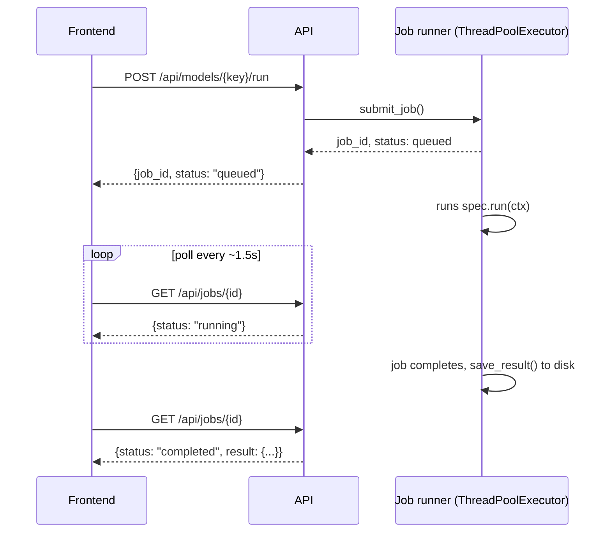

# Architecture

This document describes how the Bombay Surface Temperature Forecasting
project is put together: the data pipeline, the model layer (statistical and
deep learning, across two frameworks), the API/job-execution layer, and the
frontend — and the design decisions behind each.

## System overview

```
            ┌──────────────────────────────┐
            │  GlobalLandTemperaturesBy    │
            │  MajorCity.csv (raw dataset) │
            └───────────────┬──────────────┘
                            │
                            ▼
┌───────────────────────────────────────────────────────────────┐
│  DATA PIPELINE (backend/src/)                                 │
│                                                               │
│  data_loading.py → validation.py → preprocessing.py → eda.py  │
│  (ingest)          (schema/quality  (clean, index,   (trend,  │
│                      fail-fast)      resample, trim)  season, │
│                                                        tests) │
└───────────────────────────┬───────────────────────────────────┘
                            │  preprocessed DataFrame (cached)
                            ▼
┌──────────────────────────────────────────────────────────────────────┐
│  MODEL LAYER — model_registry.py (single dispatch table)             │
│                                                                      │
│  ┌────────────┐  ┌──────────────┐  ┌──────────────┐  ┌────────────┐  │
│  │   ARIMA    │  │  SARIMAX #1  │  │  SARIMAX #2  │  │    LSTM    │  │
│  │ (pmdarima  │  │ (statsmodels)│  │ (statsmodels)│  │ TensorFlow │  │
│  │ auto_arima)│  │              │  │              │  │   /Keras   │  │
│  └────────────┘  └──────────────┘  └──────────────┘  └────────────┘  │
│                                                        ┌────────────┐│
│                                                        │    LSTM    ││
│                                                        │  PyTorch   ││
│                                                        └────────────┘│
└───────────────────────────┬──────────────────────────────────────────┘
                            │  RunContext(train, test, y, ...) in
                            │  ModelResult(forecast, metrics, ...) out
                            ▼
┌───────────────────────────────────────────────────────────────┐
│  EXECUTION + PERSISTENCE (backend/api/)                       │
│                                                               │
│  jobs.py — ThreadPoolExecutor job runner (async, non-blocking)│
│  results_store.py — outputs/results/{model_key}.json          │
│  main.py — FastAPI: /api/models, /api/models/{k}/run,         │
│            /api/jobs/{id}, /api/comparison, /api/eda/*        │
└───────────────────────────┬───────────────────────────────────┘
                            │ REST/JSON
                            ▼
┌────────────────────────────────────────────────────────────────┐
│  FRONTEND (frontend/src/) — React + TypeScript + Vite          │
│                                                                │
│  Sidebar (model picker, live status) → ModelPage (run + view)  │
│  ComparePage (overlay all run models) · EdaPage · LearnPage    │
└────────────────────────────────────────────────────────────────┘
```

## Data pipeline design

The pipeline is deliberately staged so every model — statistical or deep
learning, TensorFlow or PyTorch — consumes the exact same validated,
structured input. This is what "robust across frameworks" means in practice:
correctness is enforced once, upstream, not re-implemented per model.

| Stage | Module | Responsibility |
|---|---|---|
| Ingestion | `data_loading.py` | Read CSV, filter to the target country/city |
| Validation | `validation.py` | Fail fast on missing columns, empty slices, unparseable dates, or excessive missing values — before any model ever sees the data |
| Cleaning | `preprocessing.py` | Datetime indexing, explicit monthly frequency, column selection, trim to the reliable measurement period, missing-value reporting |
| Feature preparation | `lstm_model.py` / `lstm_pytorch_model.py` | Scaling (`StandardScaler`) and rolling-window construction (`TimeseriesGenerator` / a custom `Dataset`) — turning a 1-D time series into model-ready supervised-learning tensors |
| Split | `run_pipeline.py` / `api/main.py` (`_build_context`) | Deterministic train (≤2009) / test (2010+) split, shared by every model for a fair, apples-to-apples comparison |
| Modeling | `model_registry.py` + per-model modules | Uniform `RunContext → dict` interface across all 5 models |
| Evaluation | each model module's `evaluate()` | MSE/RMSE on the held-out test period, computed identically everywhere |
| Serving | `results_store.py`, `api/main.py` | Per-model JSON persistence + REST API |

Validation is intentionally a separate module (not inlined into
`data_loading.py`) so it can be unit-tested independently and reused if a new
data source or city is ever added.

## Statistical vs. deep learning: why both

The project runs two model *classes* side by side rather than picking one,
because they answer different operational questions:

| Model class | Interpretability | Captures | Best for |
|---|---|---|---|
| **ARIMA** (auto-tuned) | High — coefficients map directly to lag/trend effects | Autocorrelation, trend | Quick baseline, explainable to non-technical stakeholders |
| **SARIMAX** (×2 configurations) | High | Trend **and** explicit seasonality (`m=12`) | Planning cycles with known seasonal structure (e.g. monsoon-driven temperature swings) |
| **LSTM** (TensorFlow *and* PyTorch) | Low — a black-box function approximator | Nonlinear, longer-range temporal dependencies beyond what a fixed seasonal order can express | Maximizing raw predictive accuracy when interpretability is secondary |

Running SARIMAX and LSTM against the same test period, with the same
metrics, lets you see the interpretability-vs-performance trade-off
numerically (see the **Compare All** view) instead of assuming one approach
is strictly better.

## Why two deep learning frameworks

The LSTM is implemented twice — identical architecture (3 stacked LSTM
layers, 100→50→10 units, plus Dense 64→32→1), different framework — so the
dashboard doubles as a working comparison of TensorFlow/Keras and PyTorch:

- **TensorFlow/Keras** (`lstm_model.py`): declarative `Sequential` model,
  `model.fit()` handles the training loop, `ModelCheckpoint` handles
  best-weights saving, `TimeseriesGenerator` handles windowing. Faster to
  write, more implicit.
- **PyTorch** (`lstm_pytorch_model.py`): explicit `nn.Module`, a hand-written
  training loop (`loss.backward()` / `optimizer.step()`), a custom
  `Dataset`/`DataLoader` for windowing, manual best-checkpoint logic. More
  code, more control and transparency over exactly what happens each step.

Neither is "better" in the abstract — the trade-off is development speed and
implicit conventions (TensorFlow/Keras) versus explicit control and
debuggability (PyTorch). See the in-app **Learn: PyTorch vs. TensorFlow**
page for a concept-by-concept breakdown grounded in this project's code.

**The takeaway:** understanding the trade-offs between frameworks like
TensorFlow and PyTorch is not just a technical decision — it's a business
lever. It shapes how quickly teams can experiment, how reliably they can
deploy, and how effectively they can translate data into decisions.

## Live execution model

Model fitting/training is CPU-bound and too slow to run inside a single HTTP
request (seconds for SARIMAX, up to ~2 minutes for ARIMA's full grid search,
tens of seconds for either LSTM). The API layer runs each model run as a
background job rather than blocking:



This keeps the API responsive regardless of how long a given model takes,
and persists every completed run to `outputs/results/{model_key}.json` so
results survive across page reloads (though not backend restarts — the job
*queue* itself is in-memory, a deliberate scope decision for this
single-process local app rather than pulling in Redis/Celery).

## From data to decisions

Beyond the modelling mechanics, the pipeline is structured around what a
forecast is actually *for*:

- **Structured, model-ready inputs**: raw daily-noise temperature readings
  become scaled, windowed tensors — the same transformation every model
  needs, done once, correctly, upstream (see `validation.py`,
  `preprocessing.py`, and the scaling/windowing steps in both LSTM modules).
- **Pattern identification**: the EDA stage (moving averages, seasonal
  decomposition, ADF/KPSS stationarity tests) surfaces the trend and
  seasonal structure that operational planning depends on, before any model
  is fit.
- **Model-class comparison**: running interpretable statistical models and
  higher-capacity deep learning models against the same test period makes
  the interpretability-vs-performance trade-off is explicit and measurable,
  rather than a one-off modelling choice.
- **Decision-ready output**: every model's forecast, confidence interval
  (where applicable), and error metrics are exposed identically through the
  API and dashboard — the same shape as planning, risk, or resource allocation
  process would consume regardless of which model produced it.
